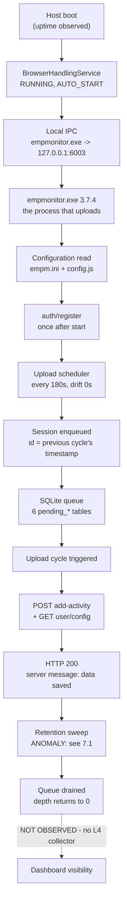

# Synchronization Architecture Report

> **Scope of authority.** Every claim below is labelled with its verification status. **Verified** means directly observed on a live installation. **Partially Verified** means observed once, from a single layer, or inferred from a strong signal. **Hypothesis** means not observed at all. Nothing here is asserted because it seemed likely, and the gaps are stated as plainly as the findings.
>
> **Observed:** 2026-07-30 · EmpMonitor agent **3.7.4** (service component **3.7.3**) · Windows 10 Pro build 10.0.19045 x64 · single host, single tenant.

## 1. What This Report Establishes

The synchronization pipeline was reconstructed from passive observation. **13 of 16 declared lifecycle stages were observed**; the 3 that were not are named in §8 with the reason.

The headline finding is that EmpMonitor's synchronization is **regular, server-acknowledged, and locally drained** — and that three genuine product anomalies sit alongside that healthy core (§7).

## 2. How Synchronization Works (Verified)

### 2.1 The upload cycle — Verified

| Property | Observation | Status |
|---|---|---|
| Cadence | **180 s**, six consecutive cycles, spread ≤ 1 s | **Verified** |
| Configured interval | `appSettings/dataSendingPeriodSec = 180` | **Verified** |
| Scheduler drift | **≈0 s** against configured interval | **Verified** |
| Which process uploads | `empmonitor.exe` (the GUI process), **not** the service | **Verified** |
| Session packaging | Each cycle enqueues a session stamped with the *previous* cycle's timestamp, then sends | **Verified** |
| Server outcome | **12 of 12** observed API replies were HTTP **200** | **Verified** |

This is the clearest corroboration the framework has yet produced: Layer 1 states the interval, Layer 3 shows the agent honouring it, and Layer 2 confirms the process doing so is alive. Three independent artifacts, one conclusion.

### 2.2 API surface actually exercised — Verified

| API | Method / kind | Reply | Status |
|---|---|---|---|
| `add-activity` | periodic, every cycle | 200 "data saved" | **Verified** |
| `user/config?orgid=…` | periodic, every cycle | 200 | **Verified** |
| `save-email-monitoring-log` | event-driven, multipart | upload succeeded per item | **Verified** |
| `auth/register` | one-time, after start | permitted, then called | **Verified** |

Endpoint hosts and paths are deliberately **not reproduced here** — they are deployment-specific and are discovered from configuration at runtime, never hardcoded. The observed deployment points at a **non-production host**, which is worth confirming before these figures are read as production behaviour.

**Request classification** (answering the brief directly):

- **Periodic:** `add-activity`, `user/config` — once per 180 s cycle.
- **Event-driven:** `save-email-monitoring-log` — fired when mail activity is captured.
- **One-time:** `auth/register` — observed once, after agent start.

### 2.3 Queue mechanics — Verified / Partially Verified

| Property | Observation | Status |
|---|---|---|
| Queue medium | SQLite, **6** tables discovered by the `pending_` prefix convention | **Verified** |
| Queue depth at rest | **0** in five of six tables | **Verified** |
| Drain | Depth returns to zero after cycles complete | **Verified** |
| `pending_aduserproperties6` holding 1 row | Explained by `ADUserInfoSendPerSec = 21600` (6-hourly) — a row awaiting its window, not a stall | **Partially Verified** |
| `pending_*` tables *are* the upload queue | Names and drain behaviour are consistent with it; no row was traced end to end | **Partially Verified** |

That last row matters: it closes a question open since the earliest documentation — where upload-queue state lives — but closes it to *Partially Verified*, because the tables' behaviour was observed while an individual row's lifecycle was not.

### 2.4 Network topology — Verified

| Observation | Status |
|---|---|
| `empmonitor.exe` holds established TLS connections to the tracking server | **Verified** |
| `emp_psa_service.exe` listens on **three loopback ports**; `empmonitor.exe` connects to one of them — the agent↔service IPC channel | **Verified** |
| `EmailMonitorSvc.exe` listens on **six mail-protocol ports** and holds many established connections to mail providers — it operates as a local mail proxy | **Verified** |
| The service itself holds **no** connection to the tracking server | **Verified** |
| Request/response payloads | **Not observable** — TLS | n/a |

The IPC discovery is architecturally significant: the uploading process and the service are separate participants that communicate over local TCP, so a service that is running does not by itself imply that uploads are happening.

### 2.5 Authentication — Partially Verified

`auth/register` was permitted and called once shortly after agent start. That is the whole of what is observable.

**Token issuance, lifetime, and refresh are Hypothesis.** No artifact records them. Determining them would require request-payload visibility, which the design spike rejected obtaining by interception (§3). This is recorded as an open question rather than guessed at.

### 2.6 WebSocket — Partially Verified

`config.js` declares a `wss://` endpoint, and `Qt5WebSockets.dll` ships with the agent. Together these establish that **a WebSocket channel exists**. No frame was observed, and at connection level WebSocket traffic is indistinguishable from HTTPS (both port 443), so **its use remains unverified**.

## 3. How Layer 3 Is Observed — the Resolved Decision

The Synchronization Monitor design left the observation strategy as an explicit open decision. It is now resolved, and the resolution is recorded in [the design document §6](design/Synchronization_Monitor.md).

| Strategy | Estimated fidelity | **Measured** | Adopted |
|---|---|---|---|
| Log-derived | Low–Med | **High** | **Yes — primary** |
| Queue-state-derived | Medium | Medium–High | Yes |
| Network observation | High | **Medium** (TLS) | Yes |
| Proxy interception | Highest | — | **No** |

**The estimate was wrong in a useful direction.** Log-derived observation was ranked lowest and turned out to be the richest: the agent logs request URLs, API names, HTTP reply codes, server messages, and per-item upload outcomes. That is precisely the data interception was being considered for — so the intrusive option was not merely rejected on principle, it proved **unnecessary**. The framework observes without perturbing, and loses nothing that any defined validation requires.

**The standing risk of this choice:** log-derived fidelity depends on what the agent chooses to log, which can change between versions without notice. Patterns therefore live in configuration, and a pattern that stops matching degrades to `INCONCLUSIVE` — never to a false negative.

## 4. Answers to the Reverse-Engineering Questions

| Question | Answer | Status |
|---|---|---|
| What starts synchronization? | A 180 s timer in `empmonitor.exe`; each cycle logs a trigger | **Verified** |
| What starts authentication? | `auth/register`, once after agent start | **Verified** |
| When is the token refreshed? | Unknown — no observable artifact | **Hypothesis** |
| How often is sync attempted? | Every 180 s, matching configuration | **Verified** |
| Does the scheduler drift? | **No** — ≈0 s drift, ≤1 s spread over six cycles | **Verified** |
| How is retry implemented? | One retry event observed (clipboard); policy and backoff unknown | **Partially Verified** |
| How are failures stored? | `tbl_exception_log2` exists and is empty; no failure occurred to store | **Partially Verified** |
| When is SQLite updated? | On capture (enqueue) and after cycles (drain) | **Verified** |
| When are pending tables cleared? | After successful upload, plus a per-cycle retention sweep — **the sweep is broken, see §7.1** | **Verified** |
| How is offline mode detected? | Not observed — no connectivity loss occurred | **Hypothesis** |
| How is reconnect detected? | Not observed | **Hypothesis** |
| How does queue recovery work? | Not observed | **Hypothesis** |
| How are failed uploads retried? | Not observed — nothing failed | **Hypothesis** |
| How is WebSocket used? | Channel configured; use unobserved | **Partially Verified** |
| How are recordings uploaded? | Not observed in this window (`esr.exe` running, no recording upload logged) | **Hypothesis** |
| How are screenshots uploaded? | Not observed in this window; `pending_screenshots6` was empty | **Hypothesis** |
| What APIs are used? | Four, listed in §2.2 | **Verified** |
| Which requests are periodic / event-driven / one-time? | Classified in §2.2 | **Verified** |

Nine questions answered as Verified, four Partially Verified, six left explicitly open. **The six open ones are the honest result of a passive observation window in which nothing failed** — you cannot verify failure handling on a system that is not failing.

## 5. Evidence Layers Used

| Layer | Sources | Contribution |
|---|---|---|
| **L1** Configuration | EV-001 `config.js`, EV-002 `empm.ini` | Configured interval, endpoints, auth key presence |
| **L2** Runtime | EV-005 service, EV-011 processes, EV-012 OS, EV-013 executable metadata | Which process uploads, which build, is it alive |
| **L3** Synchronization | EV-007 log + queue, EV-017 connection state | Cadence, API outcomes, queue drain, connections |
| **L4** Dashboard | — | **None. No collector exists; no dashboard claim is made.** |

## 6. What Healthy Looks Like

| Area | Verdict | Basis |
|---|---|---|
| Scheduler | **HEALTHY** | Configured 180 s honoured with ≈0 drift, corroborated across L1+L2+L3 |
| Upload | **HEALTHY** core, **DEGRADED** overall | All 12 replies 200; one alternate channel skipped (§7.3) |
| Queue | **HEALTHY** drain, **DEGRADED** overall | Drains to zero; retention sweep broken (§7.1) |
| Authentication | **INCONCLUSIVE** | Occurred; scheme and refresh unobservable |
| Retry | **DEGRADED** | Exercised once; policy unknown |
| Recovery | **INCONCLUSIVE** | No offline period occurred |
| Latency | **INCONCLUSIVE** | Not derivable from these strategies (§8.2) |

## 7. Product Anomalies Observed

These were **found, not looked for** — which is the argument for reverse engineering before validating. All three are reported `DEGRADED`: the primary path succeeds and no data loss was evidenced.

### 7.1 Retention sweep never deletes anything — DEGRADED

Every cycle logs a retention sweep whose retention period is the **literal unsubstituted placeholder** `NUMBER_OF_DAYS_TO_KEEP_DATA`, and whose result is **`-1` records deleted** — observed 8 times out of 8.

Two independent signals agree: a placeholder where a number belongs would explain a delete that matches nothing. **Assessment:** local data plausibly grows without bound. No growth was measured in this window, so the *consequence* is Hypothesis while the *defect* is Verified.

### 7.2 Agent cannot inspect some processes — DEGRADED

54 occurrences of access-denied while opening processes. Capture coverage may be incomplete for those processes; whether any monitored feature depends on them is unknown.

### 7.3 An alternate upload channel is non-functional — DEGRADED

14 occurrences of an SFTP send path skipped because a username is not valid. The primary HTTPS channel succeeds throughout, so no data loss is evidenced — but a configured channel is silently unusable, and whether anything requires it is unknown.

## 8. What Could Not Be Determined, and Why

Naming these precisely is part of the deliverable.

### 8.1 Offline behaviour, reconnect, and queue recovery
No connectivity loss occurred. Verifying these requires inducing one, and the framework is a passive observer that must not perturb the system it validates. **These remain open until observed naturally, or exercised by a separately authorised test.**

### 8.2 Latency
The agent log timestamps *events* to one-second resolution and does not pair a request with its response. No per-request duration exists to measure. Measuring it would need payload-level correlation — rejected as non-passive. **Cycle cadence is measurable and is reported instead**; it is a different quantity and is not presented as a substitute.

### 8.3 Dashboard visibility
Layer 4 has no collector. Asserting that data appeared on the dashboard without observing the dashboard would be inventing behaviour.

### 8.4 Screenshot and recording upload
Neither occurred in the observation window. `esr.exe` was running and `pending_screenshots6` was empty — consistent with "nothing to upload", not evidence of a working upload path.

## 9. Recommendations

1. **Report the retention-sweep defect (§7.1) to the product team.** Two corroborating signals, reproduced every cycle, plausible unbounded-growth consequence.
2. **Confirm the observed deployment is intended.** The endpoints point at a non-production host; these figures should not be read as production behaviour until that is settled.
3. **Measure whether local data actually grows**, to convert §7.1's consequence from Hypothesis to Verified. A repeat run days apart would settle it.
4. **To close the offline/recovery gaps**, a deliberate connectivity-interruption test is needed. That is a perturbing action and needs explicit authorisation, separate from this framework's passive remit.
5. **Do not pursue payload interception.** The spike showed it is unnecessary for every validation the standard defines, and it would forfeit the passive guarantee.

## 10. Cross References

- [Synchronization Monitor Design](design/Synchronization_Monitor.md) — §6 records the resolved observation decision
- [Validation Standard v1.0](ADS/validation_standard.md) · [Evidence Catalog](Evidence_Catalog.md)
- [Knowledge Base Update](Knowledge_Base_Update.md) — the promotions this run proposes
- [RE-004](../knowledge_base/RE-004_Upload_Pipeline.md) · [RE-006](../knowledge_base/RE-006_API_Flow.md) · [RE-012](../knowledge_base/RE-012_Offline_Synchronization.md)
- [Phase 3 Implementation Review](IMPLEMENTATION_REVIEW_PHASE_3.md)

---
**Document Status:** Final for the 2026-07-30 observation window; supersedes nothing
**Owner:** TODO
**Last Updated:** 2026-07-30
