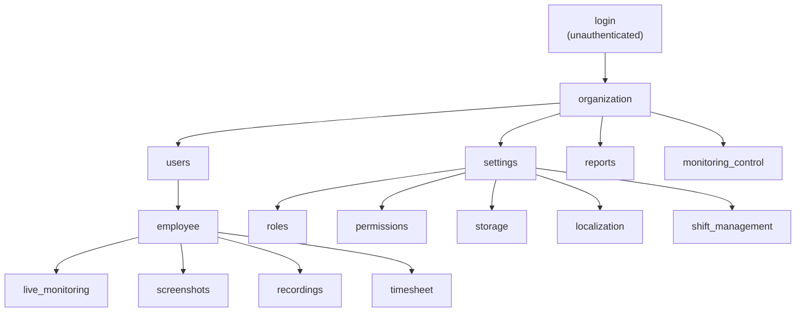

# Dashboard Navigation Specification

> ## ⚠ Nothing in this document has been observed
>
> **The framework has never opened the EmpMonitor dashboard.** No page here has been visited, no navigation path walked, no permission confirmed. Every entry is **`Hypothesis`** — derived from the page names the sprint brief supplied and from what Layers 1–3 evidence implies *should* be visible somewhere.
>
> This is a **template to be filled by observation**, not a description of a real product. Read it as a list of questions, not answers.
>
> It would have been easy to write a confident-looking dashboard model here. The reason not to is that a future reader could not tell the invention from the observation — and would then build assertions on top of it. Where a fact is unknown, this document says so.

**Status:** all pages `Hypothesis` · **Observed pages: 0 of 17** · No collector exists (see [`framework/validators/dashboard.py`](../../framework/validators/dashboard.py))

## 1. Purpose

Defines the navigation model a future Layer 4 collector will implement: which pages exist, how they are reached, what each takes in and puts out, and what permission each needs.

It exists now, before any collector, so that:

- feature profiles can reference dashboard pages by a stable identifier (`config/features.json` does);
- the correlation engine can ask Layer 4 questions today and receive `INDETERMINATE` instead of failing;
- when a collector is built, the specification is already written and can be *corrected* by observation rather than invented under time pressure.

## 2. Scope and Constraints

**In scope:** page identity, hierarchy, navigation paths, inputs, outputs, required permissions.

**Out of scope, deliberately:** selectors, waits, browser automation, any executable code. No Playwright, Selenium, or UI automation appears here or anywhere in this phase.

**Binding constraint on any future collector:** it must be **read-only**. It may navigate and read; it must never create, modify, or delete organisation data. The framework observes the product ([Manifest §14](../FRAMEWORK_MANIFEST.md)); a collector that changed dashboard state would corrupt the very evidence every other layer is compared against.

**Second binding constraint:** the collector must never enter credentials. Authentication is out of bounds for automated components; a session must be supplied to it.

## 3. Navigation Model

> **The hierarchy above is assumed.** Parent–child relationships were inferred from the page names, not observed. A page may sit elsewhere, may not exist in this build, or may be reachable by several routes.

## 4. Page Register

Identifiers are the contract: `config/features.json` and any future collector reference these strings. Names may be corrected by observation; **identifiers should be treated as stable** so that correcting a page's title does not break every profile pointing at it.

| # | Identifier | Assumed parent | Inputs (assumed) | Outputs (assumed) | Permission (assumed) | Status |
|---|---|---|---|---|---|---|
| 1 | `login` | — | credentials *(supplied, never entered by the framework)* | authenticated session | none | Hypothesis |
| 2 | `organization` | `login` | organisation selection | organisation context | member | Hypothesis |
| 3 | `users` | `organization` | search, filter, paging | user list, status per user | user read | Hypothesis |
| 4 | `employee` | `users` | employee identifier | per-employee detail and activity | user read | Hypothesis |
| 5 | `live_monitoring` | `employee` | employee identifier | live or near-live view, connection state | live view | Hypothesis |
| 6 | `screenshots` | `employee` | employee, date range | screenshot list with timestamps | screenshot read | Hypothesis |
| 7 | `recordings` | `employee` | employee, date range | recording list with durations | recording read | Hypothesis |
| 8 | `timesheet` | `employee` | employee, date range | worked, idle, and break totals | timesheet read | Hypothesis |
| 9 | `reports` | `organization` | report type, range, scope | aggregated activity data | report read | Hypothesis |
| 10 | `settings` | `organization` | — | configuration surface | admin | Hypothesis |
| 11 | `monitoring_control` | `organization` | feature toggles, schedule | monitoring state per feature | admin | Hypothesis |
| 12 | `localization` | `settings` | locale, timezone | display formatting | admin | Hypothesis |
| 13 | `shift_management` | `settings` | shift definitions | shift assignment | admin | Hypothesis |
| 14 | `roles` | `settings` | role definitions | role list and capabilities | admin | Hypothesis |
| 15 | `permissions` | `settings` | role, capability | effective permissions | admin | Hypothesis |
| 16 | `storage` | `settings` | retention settings | storage usage, retention policy | admin | Hypothesis |
| 17 | `dashboard_home` | `organization` | — | organisation-level overview | member | Hypothesis |

## 5. Pages That Matter Most for Validation

Not all 17 pages carry equal weight. Layer 4 exists in this framework for exactly one purpose: to close the end-to-end chain and separate a **synchronization defect** from a **surfacing defect**. These four pages are what that requires, and they should be built first:

| Page | Closes the chain for | Corroborates |
|---|---|---|
| `screenshots` | EM010 | `pending_screenshots6` drain → visible screenshot |
| `timesheet` | EM013, EM014 | `clock_data6` rows → displayed worked/idle time |
| `reports` | EM017, EM018, EM019, EM023 | `usagedata6` / `usbdata6` / mail tables → displayed activity |
| `monitoring_control` | every feature | **the authoritative Layer 1 intent** (EV-008) |

`monitoring_control` deserves particular note. Local `empm.ini` keys carry a `from_remote\` prefix, which suggests the dashboard is the *origin* of feature configuration and the local file merely a cache. If that holds, `monitoring_control` is the real Layer 1 source and local configuration is a downstream copy — making **divergence between them** a defect class the framework cannot currently detect at all. That is a strong argument for building this page early.

## 6. Timestamp Semantics — an Unresolved Question

Every planned Layer 4 correlation compares a *displayed* timestamp against a *locally observed* one. Three things must be established by observation before any such comparison can be trusted:

1. **Timezone.** Does the dashboard render in UTC, the viewer's timezone, or the organisation's configured locale? The reference host runs India Standard Time (UTC+5:30), so a naive comparison could be wrong by hours while looking plausible.
2. **Rounding.** Are times shown to the second, minute, or "3 minutes ago"?
3. **Propagation delay.** How long after an upload does a record appear? Without this, a fresh-but-not-yet-displayed record is indistinguishable from a lost one.

Until all three are known, timestamp correlation must report `INDETERMINATE`. The tolerance-based comparison in `framework.shared.utils.datetime_utils.is_within_tolerance` exists for this, but the tolerance itself must be *measured*, not guessed.

## 7. How to Fill This In

The specification is designed to be corrected, not rewritten:

1. Observe one page. Record what is actually there.
2. Promote that page's row from `Hypothesis` to `Verified`, with the six metadata fields the [verification workflow](../../knowledge_base/README.md) requires.
3. Correct its entry in [Dashboard Page Specifications](Dashboard_Page_Specifications.md).
4. If the page's identifier proves wrong, update it *and* every profile in `config/features.json` referencing it — the drift check for the Evidence Catalog has no equivalent here yet, so this step is manual.

Do not promote a page because its existence seems obvious. `screenshots` almost certainly exists; the framework still has not seen it.

## 8. Cross References

- [Dashboard Page Specifications](Dashboard_Page_Specifications.md) — per-page elements, actions, assertions, evidence
- [`framework/validators/dashboard.py`](../../framework/validators/dashboard.py) — the collector contract
- [Feature Validation Standard](../ADS/feature_validation_standard.md) · [Evidence Catalog](../Evidence_Catalog.md) (EV-006, EV-008)
- [Validation Standard §3](../ADS/validation_standard.md) — why Layer 4 matters

---
**Document Status:** Hypothesis throughout — 0 of 17 pages observed
**Owner:** TODO
**Last Updated:** 2026-07-30
