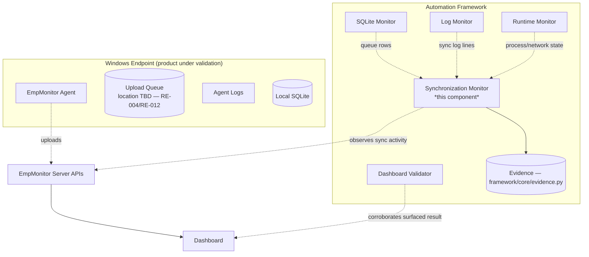
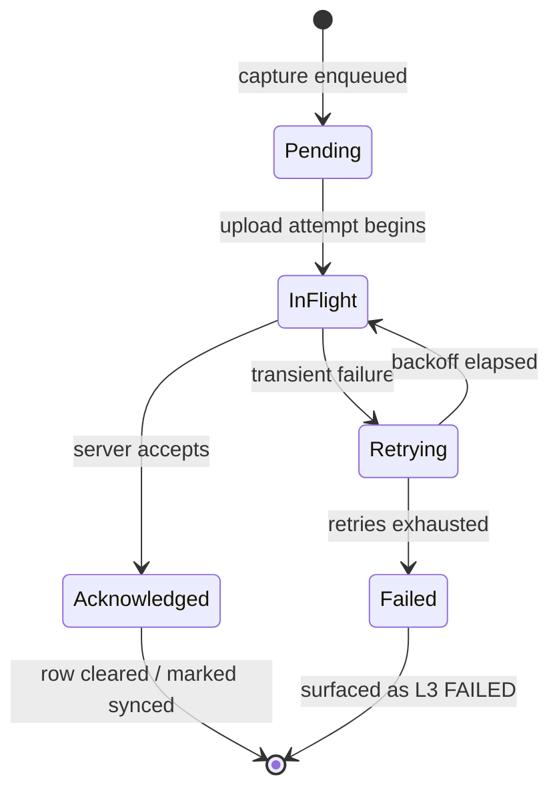

# Design — Synchronization Monitor (Layer 3 Collector)

> **Status: DESIGN ONLY.** This document specifies a framework component that does **not** yet exist in the scaffold. No implementation, no code. It closes the Layer 3 evidence gap identified in [Architecture Review §4.2](../ARCHITECTURE_REVIEW.md) and recorded in [Validation Standard §12](../ADS/validation_standard.md). Implementation is scheduled in the [Implementation Plan](../roadmap/implementation_plan.md); this design is the architectural reference that implementation must satisfy.

## 1. Purpose

The Synchronization Monitor is the framework's **Layer 3 (Synchronization) evidence collector**. Layers 1, 2, and 4 already have assigned collectors in the scaffold (`framework/monitors/*`, `framework/validators/*`); Layer 3 has none. Without it, no validation can satisfy the corroboration rule ([Validation Standard §5](../ADS/validation_standard.md)) for any synchronization claim, and sync defects are misattributed to L2 or L4.

Its job is to produce independent, catalog-registered evidence that captured endpoint data **is (or is not) reaching the EmpMonitor server correctly**, and to characterize *how* it is reaching the server (latency, retries, offline queueing) so that `DEGRADED` can be distinguished from `HEALTHY` and from `FAILED`.

## 2. Position in the Architecture

> **TODO — verify before implementation:** every dotted edge touching the product (how the agent uploads, where the queue lives, what sync activity is externally observable) depends on facts still marked TODO in [RE-004](../../knowledge_base/RE-004_Upload_Pipeline.md), [RE-006](../../knowledge_base/RE-006_API_Flow.md), and [RE-012](../../knowledge_base/RE-012_Offline_Synchronization.md). This design is structured so those facts can be filled in without changing the component's shape.

## 3. Responsibilities

**In scope:**
- Observe and record synchronization activity between the endpoint agent and the server.
- Measure sync characteristics: latency, retry counts, queue depth over time, offline→online transitions.
- Classify sync outcomes into evidence supporting an L3 verdict per the [Validation Standard](../ADS/validation_standard.md).
- Register all evidence it produces under its [Evidence Catalog](../Evidence_Catalog.md) IDs.

**Explicitly out of scope:**
- Judging the overall feature verdict (that is the plugin/validator's job — this component *collects*, it does not *conclude*).
- Collecting L1/L2/L4 evidence (owned by other collectors).
- Modifying, replaying, or injecting traffic — the monitor is **passive/observational**; it must not alter product behavior.
- Server-side validation beyond what the agent↔server contract exposes to an observer.

## 4. Inputs

| Input | Source | Status |
|---|---|---|
| Observed sync activity (requests/responses or their observable proxy) | The endpoint↔server channel | **TODO** — observation mechanism unverified (see §6, §14) |
| Upload queue state | SQLite Monitor and/or Folder Monitor | Depends on where queue lives — [RE-012](../../knowledge_base/RE-012_Offline_Synchronization.md) |
| Sync-related log lines | Log Monitor | [RE-008](../../knowledge_base/RE-008_Logging_System.md) |
| Process/network runtime state | Runtime Monitor | [RE-009](../../knowledge_base/RE-009_Runtime_Components.md) |
| Expected API contract | [RE-006](../../knowledge_base/RE-006_API_Flow.md) | **TODO** — contract not yet documented |
| Configuration (endpoints, retry/queue tunables) | Product config via Configuration collector | [RE-005](../../knowledge_base/RE-005_Configuration_Loading.md) |

## 5. Outputs

The monitor emits **evidence records only** (never verdicts), each conforming to the evidence-reference contract in [Validation Standard §10](../ADS/validation_standard.md) and carrying an [Evidence Catalog](../Evidence_Catalog.md) ID. Output categories:

| Output | Feeds | Catalog ID |
|---|---|---|
| Sync attempt record (outcome, timestamp, target) | L3 verdict | EV-007 (see [Evidence Catalog](../Evidence_Catalog.md)) |
| Latency measurement | `DEGRADED` vs `HEALTHY` discrimination | EV-007 (sub-metric) |
| Retry/backoff observation | `DEGRADED` detection | EV-007 (sub-metric) |
| Queue-depth-over-time series | Offline/backlog detection | corroborated with EV-003 (SQLite) / EV-010 (folder) |
| Offline→online transition event | Recovery verification | EV-007 (sub-metric) |

## 6. Evidence Sources and Observation Strategy

> **DECISION RESOLVED — spike completed 2026-07-30 against a live EmpMonitor 3.7.4 installation.** The three passive strategies are adopted; proxy interception is **formally rejected** and, as the spike established, is also unnecessary. Measured fidelity against the original estimates:

| Strategy | Estimated | **Measured** | What it actually sees | What it cannot see |
|---|---|---|---|---|
| Log-derived | Low–Med | **High** | Request URLs, API names, HTTP reply codes, server messages, per-item upload outcomes, cycle timing, queue-cleanup operations, authentication events | Request/response bodies, token values, retry backoff internals, WebSocket frames |
| Queue-state-derived | Medium | **Medium–High** | Per-type queue depth, drain between cycles, accumulation while pending | Server-side outcome of any individual item |
| Network observation | High | **Medium** | Which process connects to which remote endpoint, connection states, local IPC topology, listening proxy ports | Payload (TLS), and mapping a connection to a specific request |
| Proxy interception | Highest | **Rejected** | — | Violates the passive constraint (§3); see below |

**Why interception is not merely rejected but unnecessary.** It was considered only because it was assumed to be the sole route to HTTP outcomes. The spike disproved that assumption: the agent itself logs request URLs, HTTP reply codes, and server messages, so the outcome data is obtainable **passively and at higher fidelity than a TLS-limited capture would give**. The intrusive option would have bought payload bodies at the cost of altering the path under observation — and payload bodies are not required by any validation the Validation Standard defines.

**Adopted design:** compose all three passive strategies and corroborate across them. Log-derived is the **primary** strategy (contrary to the original estimate that ranked it lowest), with queue-state and network observation as independent corroboration. A single strategy remains a single source and cannot alone satisfy §5.1.

**Standing constraint:** log-derived observation depends on what the agent chooses to log, which is a product behaviour that may change between versions without notice. Log patterns are therefore configuration, never code (§7), and a pattern that stops matching must degrade to `INCONCLUSIVE` rather than to a false negative.

## 7. Supported APIs

> **TODO:** The set of EmpMonitor endpoints (authentication, upload/sync, dashboard-data) is undocumented — see [RE-006 — API Flow](../../knowledge_base/RE-006_API_Flow.md) and the API inventory in [HB-005 §8](../handbook/HB-005_Component_Inventory.md), all currently TODO. The monitor must treat the API contract as **injected configuration**, not hardcoded, so that documenting RE-006 later requires no code change. This is a hard design constraint, not a preference.

## 8. Authentication

> **TODO:** Whether/how the agent authenticates to the server (token, session, mutual TLS) is unverified ([RE-006](../../knowledge_base/RE-006_API_Flow.md)). Design constraints regardless of mechanism:
> - The monitor **observes** authentication outcomes; it never **performs** authentication or handles agent credentials. Per the framework's boundaries, credential entry is out of bounds for automated components.
> - Auth failure is a distinct, first-class L3 finding (it is the "first diverging layer" for an otherwise-healthy capture), not folded into a generic "sync failed."

## 9. Retry Behaviour

The monitor must characterize the agent's retry behavior as evidence, because retries are the primary signal separating `HEALTHY` from `DEGRADED`:

| Observation | Verdict implication |
|---|---|
| First-attempt success | Supports `HEALTHY` |
| Success after bounded retries | Supports `DEGRADED` (functioning, with anomaly) |
| Retries exhausted without success | Supports `FAILED` (L3 divergence) |

> **TODO:** Actual retry policy (count, backoff curve, ceiling) is unverified — [RE-004 §Recovery](../../knowledge_base/RE-004_Upload_Pipeline.md). The monitor must read expected policy from configuration and compare observed to expected, rather than assuming a policy.

## 10. Offline Queue

> **TODO:** Queue mechanism and location unverified — [RE-012](../../knowledge_base/RE-012_Offline_Synchronization.md). The monitor's role:
> - Observe queue depth as a time series (rising while offline, draining on reconnect).
> - Detect the failure classes named in RE-012 §12: not queued (data loss), unbounded growth, not drained on reconnect, partial drain, duplicate-on-resume.
> - Because queue state physically lives in SQLite and/or the file system, this observation is **delegated** to the SQLite/Folder monitors and *composed* here — the Synchronization Monitor does not re-read the disk itself (avoids duplicate collectors for one artifact, per [Validation Standard §4.1 independence rule](../ADS/validation_standard.md)).

## 11. Upload Cycle

The monitor models one upload cycle as an observable state progression, to locate exactly where a cycle stalls:

> **TODO:** Confirm the real cycle against RE-004 once verified; states above are the *design's* model of the cycle, explicitly labeled assumed until RE-004 has Verified content.

## 12. WebSocket Monitoring

> **TODO — conditional on existence.** It is **not established** that EmpMonitor uses WebSockets (e.g., for `EM012_LiveMonitoring`, formerly `EM004`). This section is a *placeholder capability*, not an assertion that WebSockets are in use.
> - **If** a persistent/streaming channel is confirmed (candidate: live monitoring — [HB-006 §4](../handbook/HB-006_Feature_Specifications.md#4-em012_livemonitoring--live-monitoring)), the monitor must observe connection lifecycle (connect, heartbeat, drop, reconnect) and message flow as L3 evidence.
> - Confirming whether such a channel exists is an [RE-006](../../knowledge_base/RE-006_API_Flow.md) open question. Until confirmed, no WebSocket observation is implemented.

## 13. Latency Measurement

- Measure elapsed time from an observable "send" signal to an observable "acknowledged" signal per upload cycle.
- Emit latency as a metric on the sync evidence record; compare against a *(configurable)* threshold to drive the `HEALTHY`/`DEGRADED` boundary.

> **TODO:** The precise start/stop signals depend on the chosen observation strategy (§6) — e.g., log timestamps vs. captured request/response times — and on what timestamps the agent/API actually expose. Latency semantics must be defined once §6 is decided, since a log-derived measurement and a network-derived measurement mean different things.

## 14. Failure Detection

The monitor detects and classifies the L3 failure class (Synchronization Defect) per [Validation Standard §9](../ADS/validation_standard.md), distinguishing at minimum:

| Detected condition | Evidence basis |
|---|---|
| Authentication failure | §8 observation |
| Transmission failure (network/server error) | §6 sync record |
| Retry exhaustion | §9 |
| Queue not draining on reconnect | §10 |
| Data loss (captured, never queued) | Corroboration with L2 (SQLite/folder) showing capture without a matching queue entry |
| Duplicate upload on resume | §10 / §11 |

Each is emitted as evidence with a candidate classification; the **verdict** is still assigned downstream by the validator/plugin, not here.

## 15. Interfaces

> **Design intent only — no signatures, no code.** The monitor must conform to whatever the common monitor interface becomes in Phase 1 ("Base Interfaces" / "Plugin Registry", per the [Implementation Plan](../roadmap/implementation_plan.md)); it must **not** invent a parallel interface. Required conceptual capabilities:

| Capability | Description |
|---|---|
| Registration | Discoverable via `framework/core/registry.py` like every other monitor |
| Configuration intake | Receives API contract, endpoints, thresholds, retry policy from the Configuration source — nothing hardcoded |
| Evidence emission | Produces catalog-registered evidence records via `framework/core/evidence.py` |
| Composition | Consumes SQLite/Log/Runtime monitor outputs rather than re-collecting them |
| Lifecycle | Honors the same start/observe/stop lifecycle as other monitors (per Phase 1 base interface) |

## 16. Required Validators

The monitor collects; a companion **Synchronization Validator** (under `framework/validators/`, not yet in scaffold) applies the [Validation Standard](../ADS/validation_standard.md) rules to the monitor's evidence to assign an L3 verdict.

> **TODO:** Decide whether Layer 3 validation lives in a new `framework/validators/synchronization.py` or extends an existing validator. Recommendation: a dedicated validator, mirroring the one-collector-one-concern shape of the existing scaffold. This is an open item for the Phase 1/Phase 3 boundary.

## 17. Integration With Existing Collectors

| Collector | Integration | Rationale |
|---|---|---|
| **Runtime Monitor** (`runtime_monitor.py`) | Supplies process/network runtime state; the Sync Monitor corroborates "agent process alive" (L2) against "agent is actually syncing" (L3) to distinguish *not running* from *running but not syncing* | Prevents misattributing an L3 defect to L2 |
| **SQLite Monitor** (`sqlite_monitor.py`) | Supplies queue/row state if the queue lives in SQLite; Sync Monitor consumes it rather than re-reading | Independence rule ([Validation Standard §4.1](../ADS/validation_standard.md)) — one artifact, one collector |
| **Log Monitor** (`log_monitor.py`) | Supplies sync-related log lines as one (lowest-fidelity) evidence strategy | Composed with other strategies, never sole source |
| **Dashboard Validator** (`validators/dashboard.py`) | Downstream corroboration: the Sync Monitor establishes data *reached* the server (L3); the Dashboard Validator establishes it *surfaced* correctly (L4). Agreement across L3→L4 is what separates a Surfacing Defect from a Synchronization Defect | Closes the loop end-to-end |

## 18. Open Decisions (Must Resolve Before Implementation)

1. **Observation strategy (§6)** — the blocking spike. Everything else depends on it.
2. **Latency signal semantics (§13)** — follows from #1.
3. **WebSocket existence (§12)** — an RE-006 verification, not a design choice.
4. **Dedicated vs. extended validator (§16)**.
5. **Queue location (§10)** — an RE-012 verification that determines which collector the Sync Monitor composes.

## 19. Cross References

- [Validation Standard](../ADS/validation_standard.md) — the contract this component serves
- [Evidence Catalog](../Evidence_Catalog.md) — where EV-007 (Synchronization) is registered
- [RE-004 — Upload Pipeline](../../knowledge_base/RE-004_Upload_Pipeline.md)
- [RE-006 — API Flow](../../knowledge_base/RE-006_API_Flow.md)
- [RE-012 — Offline Synchronization](../../knowledge_base/RE-012_Offline_Synchronization.md)
- [HB-004 — Agent Ecosystem](../handbook/HB-004_Agent_Ecosystem.md)
- [Architecture Review §4.2](../ARCHITECTURE_REVIEW.md)
- [Implementation Plan](../roadmap/implementation_plan.md)

---
**Document Status:** Design ratified as the architectural reference; product-behavior TODOs and the §6 observation-strategy spike must close before implementation.
**Owner:** TODO
**Last Updated:** 2026-07-30
