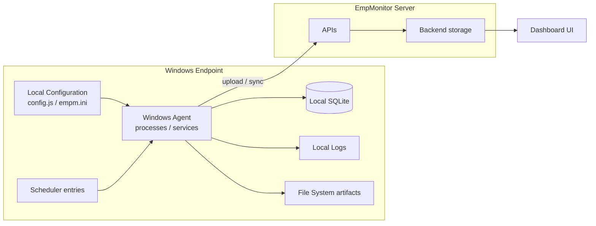

# HB-002 — EmpMonitor Product Architecture

## 1. Purpose

This chapter describes the architecture of the EmpMonitor ecosystem as understood for validation purposes: its components, how data flows between them, and which validation surfaces each exposes. It is the architectural backbone the [reverse engineering knowledge base](../../knowledge_base/README.md) hangs off.

## 2. Scope

Covers the ecosystem end to end: endpoint agent → local storage/config/logs → synchronization → server APIs → dashboard. Does **not** cover the automation framework's own architecture (see [ADS Architecture Standard](../ADS/architecture.md)).

## 3. Ecosystem Topology (Conceptual)

> **TODO:** This topology is the *assumed* shape from the project charter. Verify each edge (what actually talks to what, and how) and update. Component-internal detail belongs in the RE documents, not here.

## 4. Component Summary

| Component | Role | Validation Surface | RE Document |
|---|---|---|---|
| Windows Agent | Captures endpoint activity | Processes, services, CPU/RAM | [RE-001](../../knowledge_base/RE-001_Agent_Startup.md), [RE-009](../../knowledge_base/RE-009_Runtime_Components.md) |
| Watchdog (suspected) | Agent self-recovery | Process/service observation | [RE-002](../../knowledge_base/RE-002_Watchdog_Behaviour.md) |
| Local Configuration | Governs agent behavior | `config.js`, `empm.ini`, dashboard settings | [RE-005](../../knowledge_base/RE-005_Configuration_Loading.md) |
| Local SQLite | Local persistence | DB file, schema, row contents | [RE-007](../../knowledge_base/RE-007_SQLite_Database.md) |
| Local Logs | Agent diagnostics | Log files/content | [RE-008](../../knowledge_base/RE-008_Logging_System.md) |
| File System | Capture/config/log artifacts | Folder structure, files | [RE-010](../../knowledge_base/RE-010_Folder_Structure.md) |
| Scheduler | Timed agent behavior | Scheduled task entries | [RE-003](../../knowledge_base/RE-003_Scheduler.md) |
| Upload Pipeline | Moves captures to server | Queue state, retries, API traffic | [RE-004](../../knowledge_base/RE-004_Upload_Pipeline.md), [RE-012](../../knowledge_base/RE-012_Offline_Synchronization.md) |
| APIs | Agent↔server and dashboard↔server contract | Requests/responses, auth | [RE-006](../../knowledge_base/RE-006_API_Flow.md) |
| Dashboard | Management and reporting UI | UI state, timestamps, feature visibility, user status | — (validated via Layer 4) |

## 5. Data Flow: Capture to Dashboard (Assumed)

The end-to-end path every feature ultimately depends on:

1. **Configure** — behavior is set via local config and/or dashboard settings.
2. **Capture** — the agent produces data on the endpoint.
3. **Persist** — data lands in local storage (SQLite / file system).
4. **Synchronize** — the upload pipeline transmits data to the server (with authentication, retries, and offline queuing).
5. **Surface** — the dashboard displays the result.

> **TODO:** Verify this path per feature area; some features may bypass stages or add stages. Record per-feature deviations in [HB-006](HB-006_Feature_Specifications.md).

## 6. Validation Surfaces by Evidence Layer

Each component maps onto the four-layer evidence model defined in the [Validation Standard](../ADS/validation_standard.md):

| Layer | Name | Product Surfaces |
|---|---|---|
| 1 | Configuration | `config.js`, `empm.ini`, dashboard settings |
| 2 | Runtime | Processes, Windows services, scheduler, CPU, RAM, SQLite, logs |
| 3 | Synchronization | Authentication, upload queue, APIs, retry logic, offline sync |
| 4 | Dashboard | UI validation, timestamp validation, feature visibility, user status |

## 7. Failure Modes (Ecosystem Level)

> **TODO:** Populate as failure modes are observed/verified. Candidate classes to investigate: agent not running, agent running but not capturing, capturing but not persisting, persisting but not uploading, uploading but not surfacing, configuration divergence between local and dashboard.

## 8. Recovery

> **TODO:** Document how the product recovers from each failure class (self-recovery via watchdog, service restart, scheduler-driven restart, etc.). See [RE-011](../../knowledge_base/RE-011_Recovery_Behaviour.md).

## 9. Evidence Sources

Every claim in this chapter must ultimately be verifiable via at least one of: configuration artifacts, runtime observation, API traffic, SQLite inspection, log content, or dashboard state. See [Validation Standard](../ADS/validation_standard.md) §4 for the source catalog.

## 10. Version Notes

> **TODO:** Record product versions against which this architecture was verified.

## 11. Cross References

- [HB-001 — Product Overview](HB-001_Product_Overview.md)
- [HB-003 — Agent Architecture](HB-003_Agent_Architecture.md)
- [HB-004 — Agent Ecosystem](HB-004_Agent_Ecosystem.md)
- [Reverse Engineering Knowledge Base](../../knowledge_base/README.md)

---
**Document Status:** Draft — assumed topology recorded; verification pending
**Owner:** TODO
**Last Updated:** 2026-07-30
