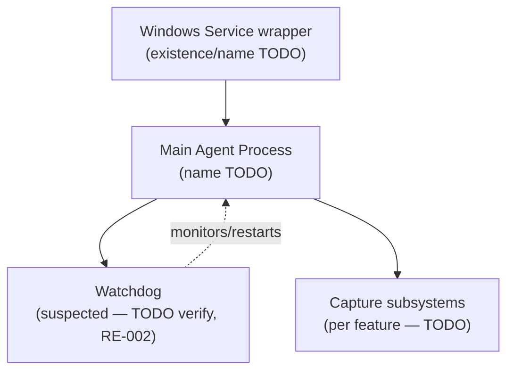

# HB-003 — EmpMonitor Agent Architecture

## 1. Purpose

This chapter describes the **Windows Agent's own internal architecture**: the processes and services that make it up, how it starts, and how it is believed to keep itself running (watchdog). It does not describe the wider ecosystem the Agent sits in (Dashboard, APIs, sync — see [HB-002](HB-002_Product_Architecture.md)) or the external things the Agent depends on (configuration sources, scheduler, upload pipeline, APIs, offline sync — see [HB-004](HB-004_Agent_Ecosystem.md)).

## 2. Scope

**In scope:** the Agent's internal process/service composition, startup sequence, and the internal relationship between the main agent workload and its suspected watchdog.

**Out of scope (see elsewhere):**

| Topic | Owning Chapter |
|---|---|
| Ecosystem-wide topology (Agent + Dashboard + APIs + sync) | [HB-002](HB-002_Product_Architecture.md) |
| Configuration sources the Agent reads | [HB-004 §5](HB-004_Agent_Ecosystem.md) |
| Scheduler entries that invoke/restart the Agent | [HB-004 §10](HB-004_Agent_Ecosystem.md) |
| Upload pipeline / API / offline sync | [HB-004 §8–§13](HB-004_Agent_Ecosystem.md) |
| Per-feature (plugin) behavior | [HB-006](HB-006_Feature_Specifications.md) |

## 3. Architecture

> **TODO — assumed shape, not verified.** No internal architecture has been confirmed on a real installation yet. The diagram below is a conceptual placeholder only, using generic labels, to be replaced once RE-001/RE-009 establish real process/service names.

> **TODO:** Confirm whether the Agent runs as a single process, multiple cooperating processes, or a service-hosted process; confirm whether the watchdog is a separate process, a service recovery setting, or part of the main process. See [RE-001](../../knowledge_base/RE-001_Agent_Startup.md), [RE-002](../../knowledge_base/RE-002_Watchdog_Behaviour.md), [RE-009](../../knowledge_base/RE-009_Runtime_Components.md).

## 4. Runtime

The Agent's runtime footprint (which processes/services exist, their expected state, CPU/RAM) is a Layer 2 validation surface per the [Validation Standard](../ADS/validation_standard.md) §3.

> **TODO:** No runtime facts are established yet. Populate once [RE-009](../../knowledge_base/RE-009_Runtime_Components.md) records verified process/service names and expected running state.

## 5. Configuration

The Agent is understood to consult local configuration at/near startup (see [HB-001 §6](HB-001_Product_Overview.md) terminology and [HB-002 §3](HB-002_Product_Architecture.md)). This chapter does not own configuration *sources* — that dependency graph, including precedence between `config.js`, `empm.ini`, and dashboard-authored settings, belongs to [HB-004 §5](HB-004_Agent_Ecosystem.md) and [RE-005](../../knowledge_base/RE-005_Configuration_Loading.md).

> **TODO:** Confirm at what point in the Agent's own startup sequence configuration is read, and what happens internally if it is missing/invalid.

## 6. Components

> **TODO — nothing verified.** Suspected internal components (Known only, per [HB-001 §2](HB-001_Product_Overview.md) provenance rules), pending confirmation:

| Suspected Component | Status |
|---|---|
| Main agent workload | TODO — existence/name unverified |
| Windows Service wrapper | TODO — existence unverified |
| Watchdog | TODO — existence/mechanism unverified ([RE-002](../../knowledge_base/RE-002_Watchdog_Behaviour.md)) |
| Per-feature capture components | TODO — see [HB-006](HB-006_Feature_Specifications.md) |

## 7. Processes

> **TODO:** Process inventory (names, PID behavior, parent/child relationships) is not yet established. See [RE-009 — Runtime Components](../../knowledge_base/RE-009_Runtime_Components.md) for the authoritative source once populated.

## 8. Known APIs

Not applicable to this chapter's scope — the Agent's own internal architecture does not include the API contract itself; that is an ecosystem dependency. See [HB-004 §8](HB-004_Agent_Ecosystem.md) and [RE-006 — API Flow](../../knowledge_base/RE-006_API_Flow.md).

## 9. Known Files

> **TODO:** Executable/binary files directly involved in Agent startup are not yet identified. Full on-disk layout is owned by [RE-010 — Folder Structure](../../knowledge_base/RE-010_Folder_Structure.md); this section should, once populated, list only the subset of files directly relevant to process/service startup (e.g., the service binary, if one exists).

## 10. Scheduler

Not applicable to this chapter's scope — scheduled tasks that invoke or restart the Agent are an external dependency, not part of the Agent's own architecture. See [HB-004 §10](HB-004_Agent_Ecosystem.md) and [RE-003 — Scheduler](../../knowledge_base/RE-003_Scheduler.md).

## 11. Storage

Not applicable to this chapter's scope in detail — persistent storage locations are covered as a dependency in [HB-004 §11](HB-004_Agent_Ecosystem.md), with specifics in [RE-010](../../knowledge_base/RE-010_Folder_Structure.md).

> **TODO:** If any storage is owned/managed directly by the main process lifecycle (e.g., a lock file, PID file), record it here once verified.

## 12. SQLite

Not applicable to this chapter's scope in detail — the local database's schema/contents are covered in [RE-007 — SQLite Database](../../knowledge_base/RE-007_SQLite_Database.md) and referenced from [HB-004 §12](HB-004_Agent_Ecosystem.md).

> **TODO:** Confirm whether the SQLite connection is opened/owned by the same process that handles startup/watchdog, or by a separate component.

## 13. Logs

> **TODO:** Confirm what the Agent logs about its own startup sequence and watchdog activity (if any), and where those logs live. See [RE-008 — Logging System](../../knowledge_base/RE-008_Logging_System.md).

## 14. Failure Modes

> **TODO — candidate classes to investigate, none verified:**
> - Main process fails to start
> - Service fails to start / is disabled
> - Main process crashes post-startup
> - Watchdog fails to detect or fails to restart
>
> See [RE-002](../../knowledge_base/RE-002_Watchdog_Behaviour.md) and [RE-011](../../knowledge_base/RE-011_Recovery_Behaviour.md) once populated.

## 15. Recovery

> **TODO:** Document how the Agent recovers internally from each failure class in §14 (watchdog-driven restart, Windows service recovery options, manual intervention required, etc.). See [RE-002](../../knowledge_base/RE-002_Watchdog_Behaviour.md) and [RE-011 — Recovery Behaviour](../../knowledge_base/RE-011_Recovery_Behaviour.md).

## 16. Troubleshooting

> **TODO:** No troubleshooting guidance exists yet. Populate once startup/watchdog behavior is verified.

## 17. Evidence Sources

Claims in this chapter are Layer 2 (Runtime) surfaces per the [Validation Standard](../ADS/validation_standard.md) §3–§4: process presence/state, Windows service state, and resource usage, collected via `framework/monitors/runtime_monitor.py` per that standard's evidence catalog (framework-side implementation, not covered here).

## 18. Version Notes

> **TODO:** Record the EmpMonitor Agent version(s) against which this chapter's claims are verified. Currently unversioned.

## 19. Cross References

- [HB-001 — Product Overview](HB-001_Product_Overview.md)
- [HB-002 — Product Architecture](HB-002_Product_Architecture.md)
- [HB-004 — Agent Ecosystem](HB-004_Agent_Ecosystem.md)
- [RE-001 — Agent Startup](../../knowledge_base/RE-001_Agent_Startup.md)
- [RE-002 — Watchdog Behaviour](../../knowledge_base/RE-002_Watchdog_Behaviour.md)
- [RE-009 — Runtime Components](../../knowledge_base/RE-009_Runtime_Components.md)
- [RE-010 — Folder Structure](../../knowledge_base/RE-010_Folder_Structure.md)
- [RE-011 — Recovery Behaviour](../../knowledge_base/RE-011_Recovery_Behaviour.md)

---
**Document Status:** Draft — structure established; Agent internal architecture facts pending verification
**Owner:** TODO
**Last Updated:** 2026-07-30
