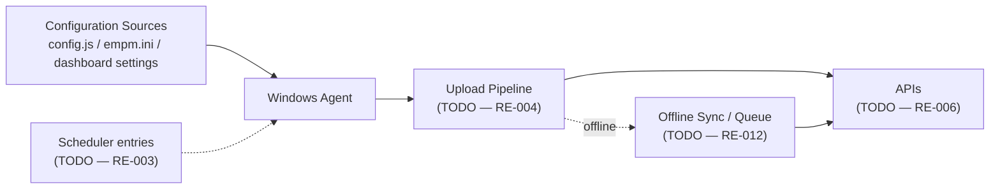

# HB-004 — EmpMonitor Agent Ecosystem

## 1. Purpose

This chapter documents everything the Windows Agent **depends on or talks to**: configuration sources, the scheduler, the upload pipeline, the APIs, and offline synchronization. It is the Agent's dependency/interaction graph, at more depth than the ecosystem-wide overview in [HB-002](HB-002_Product_Architecture.md), and complements [HB-003](HB-003_Agent_Architecture.md), which covers the Agent's own internal process/service architecture.

## 2. Scope

**In scope:** configuration sources feeding the Agent, scheduler entries interacting with it, the upload pipeline, the API contract, and offline/sync behavior — i.e., what surrounds and feeds the Agent.

**Out of scope (see elsewhere):**

| Topic | Owning Chapter |
|---|---|
| Agent's own internal processes/services/watchdog | [HB-003](HB-003_Agent_Architecture.md) |
| Ecosystem-wide topology (Agent + Dashboard + APIs + sync) | [HB-002](HB-002_Product_Architecture.md) |
| Per-feature (plugin) behavior | [HB-006](HB-006_Feature_Specifications.md) |
| Consolidated component inventory | [HB-005](HB-005_Component_Inventory.md) |

## 3. Architecture

> **TODO — assumed shape, not verified.** Conceptual dependency graph only; edges are unconfirmed.

> **TODO:** Confirm each edge — does the scheduler invoke the Agent, restart it, or merely trigger a sub-task? Does the upload pipeline run inside the Agent process or separately? See [RE-003](../../knowledge_base/RE-003_Scheduler.md), [RE-004](../../knowledge_base/RE-004_Upload_Pipeline.md), [RE-012](../../knowledge_base/RE-012_Offline_Synchronization.md).

## 4. Runtime

Not applicable to this chapter's scope — the Agent's own runtime processes/services are covered in [HB-003 §4 and §7](HB-003_Agent_Architecture.md). This chapter addresses only the runtime *behavior of dependencies* as they interact with the Agent (e.g., scheduler firing, upload pipeline activity), covered under §10 and §14 below.

## 5. Configuration

The Agent is fed by local configuration artifacts and, potentially, dashboard-authored settings synced down to the endpoint (per [HB-001 §3](HB-001_Product_Overview.md) and [HB-002 §6](HB-002_Product_Architecture.md), Layer 1 of the [Validation Standard](../ADS/validation_standard.md)).

**Known** (stated in existing project docs, not independently verified): configuration artifacts include `config.js` and `empm.ini`.

> **TODO:** Confirm the full set of configuration sources, load order/precedence, how dashboard settings reach the endpoint, reload behavior (on change vs. on restart only), and failure behavior when configuration is missing or malformed. See [RE-005 — Configuration Loading](../../knowledge_base/RE-005_Configuration_Loading.md).

## 6. Components

Dependency-side components the Agent interacts with:

| Component | Role (assumed) | Status | RE Document |
|---|---|---|---|
| Configuration Loader | Reads local/dashboard config into the Agent | TODO | [RE-005](../../knowledge_base/RE-005_Configuration_Loading.md) |
| Scheduler | Triggers timed Agent behavior | TODO | [RE-003](../../knowledge_base/RE-003_Scheduler.md) |
| Upload Pipeline | Moves captures from endpoint to server | TODO | [RE-004](../../knowledge_base/RE-004_Upload_Pipeline.md) |
| APIs | Agent↔server contract | TODO | [RE-006](../../knowledge_base/RE-006_API_Flow.md) |
| Offline Sync / Queue | Behavior without connectivity | TODO | [RE-012](../../knowledge_base/RE-012_Offline_Synchronization.md) |

## 7. Processes

Not applicable to this chapter's scope — process inventory belongs to [HB-003 §7](HB-003_Agent_Architecture.md) and [RE-009](../../knowledge_base/RE-009_Runtime_Components.md).

> **TODO:** If the scheduler or upload pipeline are confirmed to run as separate processes (rather than within the main Agent process), note that fact here as a dependency-graph detail, cross-referencing HB-003.

## 8. Known APIs

> **TODO:** No endpoints, methods, request/response shapes, or authentication mechanisms are established yet. This is also a flagged gap in the [Validation Standard](../ADS/validation_standard.md) §12: the Layer 3 API/network evidence collector is now designed (see [Synchronization Monitor Design](../design/Synchronization_Monitor.md)) but not yet implemented, so API specifics remain unverified. See [RE-006 — API Flow](../../knowledge_base/RE-006_API_Flow.md) for the authoritative source once populated.

## 9. Known Files

> **TODO:** Configuration files (`config.js`, `empm.ini` — Known per §5 above) and any queue/state files used by the upload pipeline or offline sync are not yet fully cataloged. See [RE-005](../../knowledge_base/RE-005_Configuration_Loading.md) and [RE-010 — Folder Structure](../../knowledge_base/RE-010_Folder_Structure.md).

## 10. Scheduler

> **TODO:** No scheduled task entries, names, triggers, or frequencies are established yet. Candidate questions: does a scheduled task restart the Agent, trigger uploads, or drive feature-specific captures? See [RE-003 — Scheduler](../../knowledge_base/RE-003_Scheduler.md).

## 11. Storage

> **TODO:** Where upload-pending captures and offline-queue state are persisted (file system, SQLite, or both) is not yet established. See [RE-010 — Folder Structure](../../knowledge_base/RE-010_Folder_Structure.md), [RE-007 — SQLite Database](../../knowledge_base/RE-007_SQLite_Database.md), and [RE-012 — Offline Synchronization](../../knowledge_base/RE-012_Offline_Synchronization.md).

## 12. SQLite

> **TODO:** Confirm whether the local SQLite database is used to hold upload-queue/sync state, and if so, which tables. See [RE-007 — SQLite Database](../../knowledge_base/RE-007_SQLite_Database.md).

## 13. Logs

> **TODO:** Confirm what is logged for configuration loads, scheduler firings, upload attempts/retries, API calls, and offline-sync transitions, and where those logs live. See [RE-008 — Logging System](../../knowledge_base/RE-008_Logging_System.md).

## 14. Failure Modes

> **TODO — candidate classes to investigate, none verified:**
> - Configuration missing, malformed, or diverged between local and dashboard
> - Scheduled task fails to fire or misfires
> - Upload pipeline fails to transmit (network, auth, server error)
> - API authentication failure
> - Offline sync fails to queue, fails to drain once connectivity returns, or drops data
>
> These map to the "capturing but not persisting / persisting but not uploading / uploading but not surfacing" candidate classes named in [HB-002 §7](HB-002_Product_Architecture.md).

## 15. Recovery

> **TODO:** Document retry logic, backoff behavior, and offline-queue draining once connectivity is restored. See [RE-004 — Upload Pipeline](../../knowledge_base/RE-004_Upload_Pipeline.md), [RE-011 — Recovery Behaviour](../../knowledge_base/RE-011_Recovery_Behaviour.md), and [RE-012 — Offline Synchronization](../../knowledge_base/RE-012_Offline_Synchronization.md).

## 16. Troubleshooting

> **TODO:** No troubleshooting guidance exists yet for configuration, scheduler, upload, API, or sync issues. Populate as each RE document matures.

## 17. Evidence Sources

Claims in this chapter span multiple Layers per the [Validation Standard](../ADS/validation_standard.md) §3–§4:

| Dependency | Primary Layer(s) |
|---|---|
| Configuration | 1 |
| Scheduler | 2 |
| Upload Pipeline | 3 |
| APIs | 3 |
| Offline Sync | 3 |

Note the standard's §12 known gap: the Layer 3 API/network evidence collector is now designed (see [Synchronization Monitor Design](../design/Synchronization_Monitor.md)) but not yet implemented, so Layer 3 claims about APIs cannot yet be independently evidenced by the framework.

## 18. Version Notes

> **TODO:** Record the EmpMonitor version(s) and API contract version(s) against which this chapter's claims are verified. Currently unversioned.

## 19. Cross References

- [HB-001 — Product Overview](HB-001_Product_Overview.md)
- [HB-002 — Product Architecture](HB-002_Product_Architecture.md)
- [HB-003 — Agent Architecture](HB-003_Agent_Architecture.md)
- [RE-003 — Scheduler](../../knowledge_base/RE-003_Scheduler.md)
- [RE-004 — Upload Pipeline](../../knowledge_base/RE-004_Upload_Pipeline.md)
- [RE-005 — Configuration Loading](../../knowledge_base/RE-005_Configuration_Loading.md)
- [RE-006 — API Flow](../../knowledge_base/RE-006_API_Flow.md)
- [RE-012 — Offline Synchronization](../../knowledge_base/RE-012_Offline_Synchronization.md)

---
**Document Status:** Draft — assumed dependency graph recorded; verification pending
**Owner:** TODO
**Last Updated:** 2026-07-30
