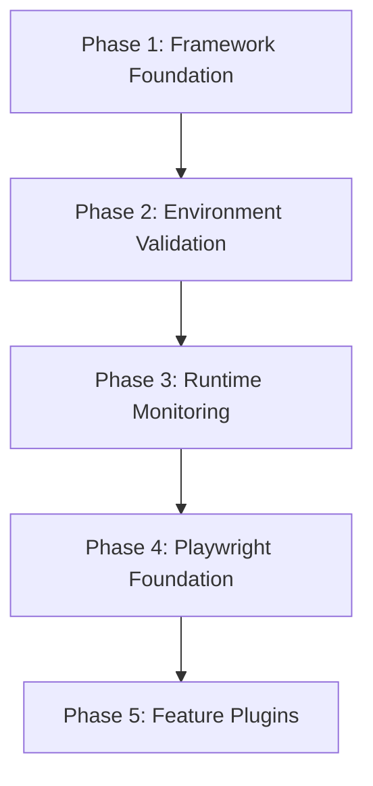

# Implementation Plan — Phased Roadmap

## 1. Purpose

This document sequences how the framework will be built. It is deliberately ordered so that **architecture and observability exist before any feature-specific automation is written**. No phase below is to begin before the documentation and architecture review gating it is accepted — see [Architecture Review](../ARCHITECTURE_REVIEW.md).

This document is the detailed companion to [`SPRINT_ROADMAP.md`](SPRINT_ROADMAP.md) (which sequences phases into sprints) and [`milestones.md`](milestones.md) (which tracks longer-range milestones) and [`backlog.md`](backlog.md) (candidate work not yet sequenced).

## 2. Sequencing Principle

Each phase produces the foundation the next phase depends on. A phase must not be started while its prerequisite phase has open architectural gaps flagged in the [Architecture Review](../ARCHITECTURE_REVIEW.md).

## 3. Phase 1 — Framework Foundation

Establishes the shared core that every later phase depends on.

| Deliverable | Target Module | Standard(s) |
|---|---|---|
| Configuration Manager | `framework/shared/config.py` | [Configuration Standard](../ADS/configuration_standard.md) |
| Logger | `framework/shared/logger.py` | [Logging Standard](../ADS/logging_standard.md) |
| Context | `framework/core/context.py` | [Framework Architecture Standard](../ADS/architecture.md) |
| Event Bus | `framework/core/event_bus.py` | [Framework Architecture Standard](../ADS/architecture.md) |
| Plugin Registry | `framework/core/registry.py` | [Plugin Development Guide](../ADS/plugin_standard.md) |
| Scheduler Interface | `framework/core/scheduler.py` | [Framework Architecture Standard](../ADS/architecture.md) |
| Base Models | > **TODO:** location not yet scaffolded | [Validation Standard](../ADS/validation_standard.md) §7 (Finding structure) |
| Base Interfaces | > **TODO:** location not yet scaffolded | [Framework Architecture Standard](../ADS/architecture.md) |

**Exit criteria:** > **TODO** — define what "done" means for this phase (e.g., every Phase 1 module has a defined interface, is logged, is configuration-driven, and has no plugin dependency).

## 4. Phase 2 — Environment Validation

Confirms the target endpoint is in a state where validation is even meaningful, before any runtime monitoring begins.

| Deliverable | Target Module | Notes |
|---|---|---|
| Windows Service check | `framework/validators/environment.py` | |
| Process check | `framework/validators/environment.py` | |
| Version Detection | > **TODO:** target module not yet scaffolded | Needed to attach a product version to any Verified claim — see [knowledge_base/README.md §2](../../knowledge_base/README.md) |
| Build Detection | > **TODO:** target module not yet scaffolded | |
| Folder Validation | `framework/validators/environment.py` or dedicated module | See [RE-010](../../knowledge_base/RE-010_Folder_Structure.md) |
| SQLite Validation | `framework/validators/configuration.py` or dedicated module | See [RE-007](../../knowledge_base/RE-007_SQLite_Database.md) |
| Configuration Validation | `framework/validators/configuration.py` | See [RE-005](../../knowledge_base/RE-005_Configuration_Loading.md) |

**Exit criteria:** > **TODO**

## 5. Phase 3 — Runtime Monitoring

Implements passive observation — Layer 2 of the [Validation Standard](../ADS/validation_standard.md).

| Deliverable | Target Module |
|---|---|
| Runtime Monitor | `framework/monitors/runtime_monitor.py` |
| Log Monitor | `framework/monitors/log_monitor.py` |
| Folder Monitor | `framework/monitors/folder_monitor.py` |
| SQLite Monitor | `framework/monitors/sqlite_monitor.py` |
| Scheduler Monitor | `framework/monitors/scheduler_monitor.py` |

**Exit criteria:** > **TODO** — note that Layer 3 (Synchronization) has no monitor assigned in this phase; see the gap recorded in [Validation Standard §12](../ADS/validation_standard.md) and the [Architecture Review](../ARCHITECTURE_REVIEW.md). The Layer 3 collector is now designed (see [Synchronization Monitor Design](../design/Synchronization_Monitor.md)); its implementation should be scheduled as an explicit deliverable in this roadmap (addresses Architecture Review §4.2).

## 6. Phase 4 — Playwright Foundation

> Per project instruction, no automation tooling code is written during the documentation/architecture phase. This phase remains a planning placeholder until architecture review is complete.

| Deliverable | Notes |
|---|---|
| Browser Manager | > **TODO** |
| Page Objects | > **TODO** |
| Locator Helpers | > **TODO** |
| Assertion Helpers | Should assert in terms of the [Validation Standard](../ADS/validation_standard.md) verdict model, not raw booleans |
| Retry Logic | Should align with [Error Handling Standard](../ADS/error_handling_standard.md) §6 |

**Exit criteria:** > **TODO**

## 7. Phase 5 — Feature Plugins

Implements the plugin catalog per the [Plugin Development Guide](../ADS/plugin_standard.md). Each plugin composes evidence from Phases 1–4 across all four evidence layers.

The catalog is the **fourteen feature profiles in `config/features.json`**. Statuses below are copied from that file — it is authoritative, and where this table disagrees with it the file is correct. The vocabulary is the four-status model of [knowledge_base README §6](../../knowledge_base/README.md) (**Hypothesis**, **Partially Verified**, **Verified**, **Deprecated**); no feature is currently Deprecated. A status describes how well the *feature's mechanism* is established, not how complete its plugin is.

| ID | Plugin | Feature Status | Feature Specification |
|---|---|---|---|
| `EM010` | Screenshots | Partially Verified | [HB-006 §2](../handbook/HB-006_Feature_Specifications.md#2-em010_screenshots--screenshots) |
| `EM011` | Screen Recording | Partially Verified | [HB-006 §3](../handbook/HB-006_Feature_Specifications.md#3-em011_screenrecording--screen-recording) |
| `EM012` | Live Monitoring | Partially Verified | [HB-006 §4](../handbook/HB-006_Feature_Specifications.md#4-em012_livemonitoring--live-monitoring) |
| `EM013` | Attendance | Partially Verified | [HB-006 §5](../handbook/HB-006_Feature_Specifications.md#5-em013_attendance--attendance) |
| `EM014` | Idle Time | Partially Verified | [HB-006 §6](../handbook/HB-006_Feature_Specifications.md#6-em014_idletime--idle-time) |
| `EM015` | Timesheet | Hypothesis | [HB-006 §7](../handbook/HB-006_Feature_Specifications.md#7-em015_timesheet--timesheet) |
| `EM016` | Keystrokes | Hypothesis | [HB-006 §8](../handbook/HB-006_Feature_Specifications.md#8-em016_keystrokes--keystrokes) |
| `EM017` | Application Usage | Partially Verified | [HB-006 §9](../handbook/HB-006_Feature_Specifications.md#9-em017_applicationusage--application-usage) |
| `EM018` | Website Usage | Partially Verified | [HB-006 §10](../handbook/HB-006_Feature_Specifications.md#10-em018_websiteusage--website-usage) |
| `EM019` | USB Detection | Partially Verified | [HB-006 §11](../handbook/HB-006_Feature_Specifications.md#11-em019_usbdetection--usb-detection) |
| `EM020` | Webcam | Hypothesis | [HB-006 §12](../handbook/HB-006_Feature_Specifications.md#12-em020_webcam--webcam) |
| `EM021` | Face Detection | Hypothesis | [HB-006 §13](../handbook/HB-006_Feature_Specifications.md#13-em021_facedetection--face-detection) |
| `EM022` | Productivity | Hypothesis | [HB-006 §14](../handbook/HB-006_Feature_Specifications.md#14-em022_productivity--productivity) |
| `EM023` | Email Monitoring | Verified | [HB-006 §15](../handbook/HB-006_Feature_Specifications.md#15-em023_emailmonitoring--email-monitoring) |

Future plugins follow the same standard and are appended to this table, not inserted out of sequence.

### 7.1 Not in This Phase — `EM001_Login`, `EM002_UserManagement`

The `EM001`–`EM006` scaffold this table previously listed is retired. `EM003`–`EM006` are superseded by `EM013`, `EM012`, `EM010` and `EM011` respectively, and their numbers are not reissued ([HB-001 §4.2](../handbook/HB-001_Product_Overview.md)).

`EM001_Login` and `EM002_UserManagement` have **no profile in `config/features.json` and no HB-006 section**. They are dashboard-side concerns — the dashboard has never been observed and no Layer 4 collector exists — so there is nothing for a plugin in this phase to assert on, and neither is a Phase 5 deliverable ([HB-006 §1.1](../handbook/HB-006_Feature_Specifications.md#11-feature-id-migration-map-inbound-links)). They are unscheduled by design, not omitted by oversight.

Feature plugins start at `EM010` because `EM001` is double-booked between the retired `EM001_Login` scaffold and the implemented `EM001_Synchronization` plugin; `EM002`–`EM009` are a deliberate gap ([Architecture Review — Phase 4 §5](../ARCHITECTURE_REVIEW_PHASE_4.md)).

**Exit criteria:** > **TODO**

## 8. Explicit Non-Goals for This Roadmap

- No implementation begins before the current documentation/architecture-review pass concludes.
- No phase skips ahead of an unresolved gap flagged in the [Architecture Review](../ARCHITECTURE_REVIEW.md).

## 9. Cross References

- [Sprint Roadmap](SPRINT_ROADMAP.md)
- [Milestones](milestones.md)
- [Backlog](backlog.md)
- [Validation Standard](../ADS/validation_standard.md)
- [Architecture Review](../ARCHITECTURE_REVIEW.md)

---
**Document Status:** Draft — phase sequencing recorded; exit criteria pending. Phase 5 catalog repointed to the fourteen `EM010`–`EM023` feature profiles with statuses copied from `config/features.json`; `EM001_Login` and `EM002_UserManagement` recorded as unprofiled and unscheduled.
**Owner:** TODO
**Last Updated:** 2026-07-31
