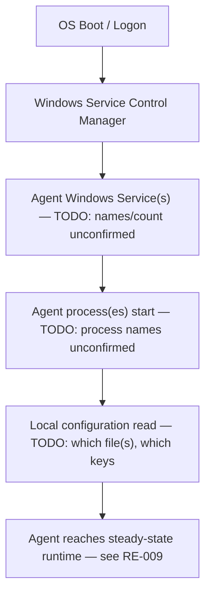

# RE-001 — Agent Startup

## 1. Purpose

This document records what is understood about how the **EmpMonitor Windows Agent initializes**: the boot sequence, Windows service start order, and the distinction (if any) between first-run and subsequent-run behavior. It exists so that automation developers validating startup behavior (Evidence Layer 2 — Runtime) know what is actually established versus assumed.

## 2. Scope

Covers only the initialization phase of the Agent on a Windows endpoint — from OS/service start through the point the Agent reaches steady-state runtime operation. It does **not** cover:

- Ongoing runtime process/service behavior after startup — see [RE-009](RE-009_Runtime_Components.md)
- Self-recovery or restart behavior — see [RE-002](RE-002_Watchdog_Behaviour.md) and [RE-011](RE-011_Recovery_Behaviour.md)
- Scheduled/periodic behavior — see [RE-003](RE-003_Scheduler.md)
- How configuration values are parsed/applied once loaded — see [RE-005](RE-005_Configuration_Loading.md)

## 3. Architecture

> **TODO:** No verified architecture diagram exists for the startup path specifically. Per [HB-002 §4](../docs/handbook/HB-002_Product_Architecture.md), the Windows Agent is backed by Windows Service(s) and reads Local Configuration; the exact service topology, process tree, and startup dependency order are unconfirmed.

## 4. Sequence / Flow

The sequence below is a **conceptual placeholder only** — it is not verified and must not be treated as documented product behavior. It reflects the generic startup shape implied by "Windows Agent" + "Windows Services" + "Local Configuration" in [HB-001 §3](../docs/handbook/HB-001_Product_Overview.md) and [HB-002 §3](../docs/handbook/HB-002_Product_Architecture.md), not an observed one.

> **TODO:** Verify whether this sequence is accurate, whether there are additional stages (e.g., driver/hook loading, license/registration check, first-run provisioning), and whether first-run differs from subsequent-run startup.

## 5. Known Behaviour (unverified)

The following is stated in existing project documentation and is **not independently confirmed**:

- The Agent is endpoint software installed on monitored Windows machines ([HB-001 §3](../docs/handbook/HB-001_Product_Overview.md)).
- The Agent's behavior is governed by local configuration artifacts referenced elsewhere as `config.js` and `empm.ini` ([HB-001 §3](../docs/handbook/HB-001_Product_Overview.md)).
- One or more Windows Services back the Agent ([HB-002 §4](../docs/handbook/HB-002_Product_Architecture.md)).

No other startup-specific detail (first-run vs. subsequent-run distinction, exact service/process names, startup ordering, provisioning/registration steps) is currently known.

## 6. Verified Behaviour (with evidence + version)

> **TODO:** Empty — no startup behavior has been directly observed on a real installation yet.

| Claim | Evidence Reference | Product Version | Verified By | Date |
|---|---|---|---|---|
| — | — | — | — | — |

## 7. Configuration Inputs

| Input | Status | Notes |
|---|---|---|
| `config.js` | Known (unverified) | Referenced in [HB-001 §3](../docs/handbook/HB-001_Product_Overview.md); role at startup unconfirmed |
| `empm.ini` | Known (unverified) | Referenced in [HB-001 §3](../docs/handbook/HB-001_Product_Overview.md); role at startup unconfirmed |
| Dashboard-authored settings | TODO | Whether/how these affect startup is unknown — see [RE-005](RE-005_Configuration_Loading.md) |

## 8. Known Files

> **TODO:** No specific startup-related file paths, executables, or service binary names are confirmed. See [RE-010](RE-010_Folder_Structure.md) once the on-disk layout is documented.

## 9. Known APIs

> **TODO:** Unknown whether the Agent contacts the server as part of startup (e.g., registration/handshake). See [RE-006](RE-006_API_Flow.md).

## 10. Storage / SQLite

> **TODO:** Unknown whether the local SQLite database is created, opened, or migrated during startup. See [RE-007](RE-007_SQLite_Database.md).

## 11. Logs

> **TODO:** Unknown what, if anything, the Agent logs during startup, and where. See [RE-008](RE-008_Logging_System.md).

## 12. Failure Modes

> **TODO:** No startup failure modes have been observed. Candidate classes to investigate (unverified, for future evidence-gathering only): service fails to start, process starts then exits immediately, configuration missing or malformed at startup, startup succeeds but Agent never reaches steady-state runtime.

## 13. Recovery

> **TODO:** Whether/how a failed startup is retried or recovered is unknown. See [RE-002](RE-002_Watchdog_Behaviour.md) and [RE-011](RE-011_Recovery_Behaviour.md).

## 14. Troubleshooting

> **TODO:** No troubleshooting guidance exists yet. Populate once Known/Verified Behaviour sections above are filled in.

## 15. Evidence Sources for Automation

Primary Evidence Layer for this document: **Layer 2 — Runtime** (per [Validation Standard §3](../docs/ADS/validation_standard.md)).

| Evidence Source | Layer | Collector | Notes |
|---|---|---|---|
| Process presence/state | 2 | `framework/monitors/runtime_monitor.py` | Intended observation point for Agent process(es) at/after startup |
| Windows service state | 2 | `framework/monitors/runtime_monitor.py` | Intended observation point for backing service(s) |
| Log content | 2 | `framework/monitors/log_monitor.py` | Pending confirmation of what is logged at startup |

## 16. Open Questions / TODO

- What Windows Service(s) and process(es) actually implement the Agent, and in what order do they start?
- Is there a documented difference between first-run (post-install) and subsequent-run (reboot/service-restart) startup?
- Does startup include any registration, license check, or server handshake?
- What configuration is read at startup, and does startup fail or degrade if configuration is missing/invalid?
- Is the SQLite database created/opened at startup, or lazily on first capture?
- What, if anything, is logged during startup, and to where?

## 17. Future Expansion

> **TODO:** To be defined once initial startup behavior is verified and a first automation pass over Layer 2 evidence exists.

## 18. Version Notes

> **TODO:** No EmpMonitor version has been verified against this document. All content above is unversioned.

## 19. Cross References

- [Reverse Engineering Knowledge Base — Index](README.md)
- [HB-001 — Product Overview](../docs/handbook/HB-001_Product_Overview.md)
- [HB-002 — Product Architecture](../docs/handbook/HB-002_Product_Architecture.md)
- [HB-003 — Agent Architecture](../docs/handbook/HB-003_Agent_Architecture.md)
- [Validation Standard](../docs/ADS/validation_standard.md)
- [RE-002 — Watchdog Behaviour](RE-002_Watchdog_Behaviour.md)
- [RE-003 — Scheduler](RE-003_Scheduler.md)
- [RE-005 — Configuration Loading](RE-005_Configuration_Loading.md)
- [RE-009 — Runtime Components](RE-009_Runtime_Components.md)
- [RE-011 — Recovery Behaviour](RE-011_Recovery_Behaviour.md)

---
**Document Status:** Draft — structure established; startup behavior not yet verified
**Owner:** TODO
**Last Updated:** 2026-07-30
