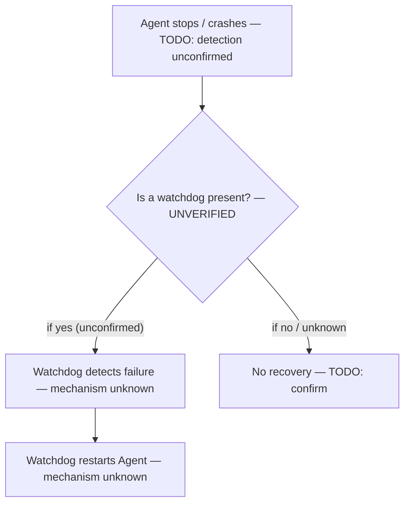

# RE-002 — Watchdog Behaviour

## 1. Purpose

This document records what is understood about a **suspected self-recovery/watchdog mechanism** that may keep the EmpMonitor Agent alive or restart it after failure. Given the sensitivity of this topic to over-claiming, the single most important fact in this document is stated up front: **the existence of a watchdog mechanism is itself unverified.**

## 2. Scope

Covers any mechanism — process, service, scheduled task, or other — whose purpose would be to detect that the Agent is not running/functioning and restart or repair it. Does **not** cover:

- Normal (non-recovery) startup — see [RE-001](RE-001_Agent_Startup.md)
- Scheduler entries whose purpose is periodic capture/sync rather than recovery — see [RE-003](RE-003_Scheduler.md), though the two may overlap and are currently indistinguishable without evidence
- Broader recovery behavior across all failure classes (e.g., server-side recovery, sync retry) — see [RE-011](RE-011_Recovery_Behaviour.md)

## 3. Architecture

> **TODO:** No architecture is known. If a watchdog exists, it is not established whether it is a separate process, a separate Windows service, a scheduled task, or logic embedded within the main Agent process.

## 4. Sequence / Flow

> **Not applicable in verified form.** No flow can be diagrammed because no watchdog behavior has been observed. A conceptual flow is included only to frame what would need to be verified, not as a claim of actual behavior:

## 5. Known Behaviour (unverified)

The only established fact is terminological, from [HB-001 §6](../docs/handbook/HB-001_Product_Overview.md):

> "Watchdog — Suspected agent self-recovery mechanism — **TODO: verify existence and behavior**"

[HB-002 §4](../docs/handbook/HB-002_Product_Architecture.md) lists a "Watchdog (suspected)" row with Validation Surface "Process/service observation" and no further detail. No other stakeholder statement about *how* such a mechanism would work has been recorded anywhere in the repository at the time of writing.

**This remains the position after the 2026-07-30 observation pass.** That pass enumerated the agent's full runtime footprint and found **no component identifying itself as a watchdog**. It did record two *adjacent* observations — a continuously-running updater process and Windows service recovery actions — which are documented in §6 precisely so they are not mistaken for confirmation. See §6.0.

## 6. Verified Behaviour (with evidence + version)

### 6.0 The Headline Has Not Changed

**Watchdog existence remains Hypothesis.** A real installation was enumerated on 2026-07-30 — processes, services, service recovery configuration, install tree, data tree, database schema — and **nothing observed confirms that a watchdog mechanism exists**. Equally, nothing rules one out: the pass was a point-in-time snapshot of a healthy system, and **no agent failure was induced**, which is the only experiment that could settle the question (§17).

What follows is therefore split deliberately. §6.1 records facts that are **Verified** — but they are verified facts *about other components*, and they are logged here because a future reader will otherwise rediscover them and be tempted to read them as watchdog evidence. §6.2 states explicitly what they do **not** establish.

All claims derive from a single observation pass on **2026-07-30**. The [README §6.1](README.md) metadata fields common to every claim are stated once here:

| Field | Value |
|---|---|
| `Verified On` | 2026-07-30 |
| `Verified Against Version` | EmpMonitor `gui` components **3.7.4** / `service` component **3.7.3**; host Windows 10 Pro build 10.0.19045 x64 |
| `Verification Method` | Observed by `EM000_EnvironmentValidator` plugin run plus direct filesystem inspection |
| `Reviewer` | TODO — reviewer sign-off ([README §7](README.md) step 4) not yet performed |
| `Last Review Date` | 2026-07-30 |

### 6.1 Adjacent Observations (Verified facts, NOT watchdog confirmation)

| # | Claim | Status | Evidence Source |
|---|---|---|---|
| 2-V1 | **`UpdateMgr_Emp.exe` exists** at `<install root>\gui\UpdateMgr_Emp.exe`, file version 3.7.4, Authenticode signature Valid. It was **not previously documented anywhere in this repository**. | **Verified** | EV-010, EV-013 |
| 2-V2 | `UpdateMgr_Emp.exe` was **observed running** (~16 MB working set, 2 threads) on a system with no update in progress — i.e. it runs **continuously**, not only during an update. | **Verified** | EV-011 |
| 2-V3 | `<install root>\service\UpdateProgress.txt` exists — an update-progress status file. | **Verified** (presence) | EV-010 |
| 2-V4 | The Windows service **`BrowserHandlingService`** (display name `Browser Handling Service`, hosting `emp_psa_service.exe`) was **RUNNING** with start type **AUTO_START (2)**. | **Verified** | EV-005 |
| 2-V5 | **Windows failure/recovery actions ARE configured** on that service, and are readable via `sc qfailure`. The *content* of those actions — whether they restart, after what delay, with what reset period, or run a program — was **not recorded**. | **Verified** (that actions are configured) | EV-005 |
| 2-V6 | No process, service, scheduled task or binary observed anywhere carries a watchdog-suggestive name. The full observed runtime set was `empmonitor.exe`, `emp_psa_service.exe`, `esr.exe`, `UpdateMgr_Emp.exe`, plus `EmailMonitorSvc.exe` present on disk but not running. See [RE-009](RE-009_Runtime_Components.md). | **Verified** (as an observation of absence at that moment) | EV-005, EV-010, EV-011 |

### 6.2 What §6.1 Does NOT Establish

This subsection exists to prevent the misreading that §6.1 invites.

| # | Claim | Status | Why |
|---|---|---|---|
| 2-V7 | That `UpdateMgr_Emp.exe` is, or acts as, a watchdog. | **Hypothesis** | A continuously-resident updater is a *plausible* host for supervision logic — it is already long-lived and already privileged enough to replace binaries. But its name, `UpdateProgress.txt`, and the absence of any observed restart make **software updating** the simpler explanation. No monitoring or restart behaviour was observed. Both readings are live; neither is evidenced. |
| 2-V8 | That the service's Windows recovery actions constitute a watchdog. | **Hypothesis** (and arguably a category error) | These are an **operating-system** facility, not an agent mechanism. They demonstrate an OS-driven restart path is *configured* for `emp_psa_service.exe`; they say nothing about agent self-recovery, cover **none** of the three non-service processes (`empmonitor.exe`, `esr.exe`, `UpdateMgr_Emp.exe`), and were never seen to fire. HB-001's "agent self-recovery mechanism" is not the same thing as `sc failure`. |
| 2-V9 | That the recovery actions actually restore working state when triggered. | **Hypothesis** | No failure was induced; the actions' content was not even read (2-V5). |
| 2-V10 | That no watchdog exists (the negative conclusion). | **Hypothesis** | 2-V6 records that nothing *named* like a watchdog was seen. Watchdog logic embedded inside `empmonitor.exe`, `emp_psa_service.exe`, or `UpdateMgr_Emp.exe` would be **invisible to process enumeration**. Absence of a distinct process is weak evidence — admissible only as corroboration ([Validation Standard §7 rule 4](../docs/ADS/validation_standard.md)) — and no scheduled-task enumeration is recorded either (see [RE-003](RE-003_Scheduler.md)). |
| 2-V11 | Which of the four candidate implementations (separate process, separate service, scheduled task, embedded logic) is in play. | **Hypothesis** | Two of four are now *less* likely: no watchdog-named **process** and no watchdog-named **service** were found (2-V6). **Embedded logic** and **scheduled task** remain wholly untested. |

## 7. Configuration Inputs

**Partially Verified — negative result.** No configuration key relating to supervision, restart, heartbeat, or watchdog behaviour was observed:

- The verified sections of the root `empm.ini` (`[General]`, `[appSettings]`, `[auth]` — see [RE-005](RE-005_Configuration_Loading.md)) contain **no** such key.
- `config.js` is 324 bytes of endpoint configuration only.
- The **~4.7 KB tenant-level `empm.ini` was not fully enumerated** — a watchdog/heartbeat key could exist there. This is the place to look.

The one configuration surface that *is* known to carry restart behaviour is **outside the product's own files**: the Windows service failure/recovery actions on `BrowserHandlingService` (2-V5), configured in the service control manager rather than in `config.js` or `empm.ini`.

## 8. Known Files

No file is **confirmed** to be associated with a watchdog. Recorded below are the artifacts a future investigation should examine first, with their actual status:

| Path | Why it is listed | Status as watchdog evidence |
|---|---|---|
| `<install root>\gui\UpdateMgr_Emp.exe` | Long-lived resident process, version 3.7.4, signature Valid (2-V1, 2-V2) | **Hypothesis** — updater is the simpler reading (2-V7) |
| `<install root>\service\UpdateProgress.txt` | Update-progress state file (2-V3) | **Hypothesis** — supports the updater reading, not a watchdog one |
| `<install root>\service\CurrentStatus.txt` | Named as a current-state snapshot; if it records agent health it could be a heartbeat artifact. **Contents not read** | **Hypothesis** — worth reading early ([RE-008](RE-008_Logging_System.md) 8-V11) |
| `<install root>\service\EMP_SERVICE.log`, `EMP_SERVICE2.txt` | Would record service-side restart activity if any is logged. **Contents not read** | **Hypothesis** |
| `%APPDATA%\screen\empm\logs\<date>.txt` | Agent-side log. **Contents not read** | **Hypothesis** |

Install root is `C:\Program Files\EmpMonitor\EmpMonitor` — **double-nested**, correcting an earlier hypothesis ([RE-010](RE-010_Folder_Structure.md)).

## 9. Known APIs

> **Not applicable / TODO.** No evidence suggests a watchdog mechanism (if any) communicates with the server directly, and this is unconfirmed either way. One adjacent fact is now on record: `config.js` configures 4 endpoints over `https` and **`wss`** ([RE-006](RE-006_API_Flow.md)). A persistent WebSocket could in principle carry heartbeat or server-initiated restart signalling — but **no traffic was observed**, and this is pure speculation flagged only so it is not later mistaken for a finding.

## 10. Storage / SQLite

**Partially Verified — negative result.** The 28-table schema of `local_db20.db` was enumerated ([RE-007](RE-007_SQLite_Database.md)) and **no table name suggests watchdog, heartbeat, restart, or supervision state**. The nearest relevant table is `tbl_exception_log2`, an apparent agent-side error log — if a watchdog logged restart events anywhere in the database, that is the likeliest table.

This is a **negative inference from table names only**: no columns and no row contents were read (privacy — [RE-007 §6.0](RE-007_SQLite_Database.md)), so restart records inside an existing table cannot be ruled out.

## 11. Logs

> **TODO / Hypothesis:** whether watchdog activity is logged is **still unknown** — **no log contents were read**. What is now known is **where to look** ([RE-008](RE-008_Logging_System.md)): the per-user `%APPDATA%\screen\empm\logs\<date>.txt`; the service-side `EMP_SERVICE.log`, `EMP_SERVICE2.txt` and `CurrentStatus.txt` in the install tree; and the database-resident `tbl_exception_log2`. A restart or supervision event, if logged at all, would most plausibly appear in the service-side files or `tbl_exception_log2`. **The Windows System event log** is a further source not yet examined, and would independently record service-recovery restarts triggered via 2-V5.

## 12. Failure Modes

> **TODO:** still cannot be populated meaningfully — a failure mode of a mechanism whose existence is unconfirmed is not a failure mode. Candidates remain speculative: watchdog itself fails to run; watchdog restarts the Agent in a loop; watchdog restart does not restore prior state.

Two **framework** failure modes, by contrast, are concrete and worth guarding against now:

- **Reporting a watchdog as confirmed** on the strength of `UpdateMgr_Emp.exe` running or `sc qfailure` returning actions. Both are Verified observations of *other* things (§6.2); neither confirms a watchdog.
- **Reporting definitively that no watchdog exists** because no watchdog-named process appeared. Embedded supervision logic would be invisible to process enumeration (2-V10).

## 13. Recovery

This section remains the subject of the whole document (§16), with one qualification now recorded: **an OS-level recovery path exists for exactly one of four processes.** `BrowserHandlingService` has Windows failure/recovery actions configured (2-V5), covering `emp_psa_service.exe`. The other three observed processes — `empmonitor.exe`, `esr.exe`, `UpdateMgr_Emp.exe` — are **not** services and have **no known recovery path at all**.

That asymmetry is itself the most interesting recovery-related finding: if the agent has self-recovery, it must come from somewhere other than the service control manager for three of its four processes. Whether it does is unknown. Cross-reference [RE-011](RE-011_Recovery_Behaviour.md) and [RE-009 §13](RE-009_Runtime_Components.md).

## 14. Troubleshooting

No guidance can be given for *diagnosing a watchdog*, since its existence is unconfirmed. What can be given is guidance for **investigating the question without over-claiming** — which is the actual task facing anyone opening this document:

1. **Enumerate the runtime set** and compare against the five binaries recorded in [RE-009](RE-009_Runtime_Components.md). A process appearing that is not in that list is genuinely new information.
2. **Read the service recovery actions' content:** `sc qfailure BrowserHandlingService`. That actions exist is Verified (2-V5); *what they are* was never recorded, and reading them is cheap.
3. **Enumerate scheduled tasks** — never yet done for EmpMonitor (see [RE-003](RE-003_Scheduler.md)). This is the one candidate implementation (2-V11) that remains completely unexamined and is trivially checkable.
4. **Read `CurrentStatus.txt`** — small, named as a state snapshot, and a plausible heartbeat artifact ([RE-008](RE-008_Logging_System.md) 8-V11).
5. **Check the Windows System event log** for service-restart entries; it records SCM-driven restarts independently of the product's own logs.
6. **Check `tbl_exception_log2`'s row count** for evidence of internal errors preceding any restart (count only — never row contents).
7. **State findings at the right status.** "An updater process runs continuously" and "the service has recovery actions configured" are Verified. "A watchdog exists" is not, and must not be reported as such regardless of how suggestive the former two feel.

The decisive test is not in this list because it is not an inspection: it requires **inducing a failure** (§17).

## 15. Evidence Sources for Automation

Primary Evidence Layer for this document: **Layer 2 — Runtime** (per [Validation Standard §3](../docs/ADS/validation_standard.md)).

| Evidence Source | Layer | Collector | Notes |
|---|---|---|---|
| Process presence/state | 2 | `framework/monitors/runtime_monitor.py` | Would be the observation point for detecting an additional watchdog process, if one exists |
| Windows service state | 2 | `framework/monitors/runtime_monitor.py` | Would be the observation point for a watchdog implemented as a service |
| Scheduled task state | 2 | `framework/monitors/scheduler_monitor.py` | Would be the observation point if recovery is scheduler-driven; note this monitor is currently empty/unimplemented — see [RE-003 §9](RE-003_Scheduler.md) |
| Log content | 2 | `framework/monitors/log_monitor.py` | Would be the observation point if watchdog activity is logged. Four log locations are now known ([RE-008](RE-008_Logging_System.md)); **contents unread** |
| Executable file metadata | 2 | EV-013 — see [Evidence Catalog](../docs/Evidence_Catalog.md) | How `UpdateMgr_Emp.exe`'s version and signature were established (2-V1) |
| Windows System event log | 2 | **No collector assigned** | Would independently record SCM-driven service restarts (2-V5). Not registered in the [Evidence Catalog](../docs/Evidence_Catalog.md) and not examined |

The 2026-07-30 observations in §6 came from the `EM000_EnvironmentValidator` plugin plus direct filesystem inspection, not from these monitors, all of which remain empty scaffolds.

## 16. Open Questions / TODO

**Not answered by the 2026-07-30 pass — stated first, because the pass produced adjacent facts that could be mistaken for an answer:**

- **Does a watchdog mechanism exist at all?** **Still Hypothesis.** Unverified, and must not be assumed either way. Neither `UpdateMgr_Emp.exe` (2-V7) nor the service recovery actions (2-V8) confirm one.

**Partially informed by the pass:**

- If it exists, is it a separate process, a separate service, a scheduled task, or logic inside the main Agent process? → Two of four candidates are now *less* likely: no watchdog-named process and no watchdog-named service were observed (2-V6, 2-V11). **Embedded logic** and **scheduled task** remain wholly untested — and scheduled tasks have never been enumerated at all ([RE-003](RE-003_Scheduler.md)).
- Is there any observable artifact that would let automation detect a watchdog exists? → **Three candidates identified, none read:** `CurrentStatus.txt`, the service-side logs, and `tbl_exception_log2`. Plus the Windows System event log, which no collector currently covers.

**Still entirely open:**

- What conditions would trigger it (process exit, crash, missed heartbeat, hang)?
- What does it do on trigger (restart process, restart service, reinstall, notify server)?
- Is its behaviour configurable, and if so from where? No such key was observed (§7), but the ~4.7 KB tenant `empm.ini` is unenumerated.
- **What is `UpdateMgr_Emp.exe` actually doing** while resident with no update in progress (2-V2)? This is the single most direct route to resolving 2-V7.
- **What are the service's recovery actions?** That they exist is Verified; their content was never read (2-V5). Cheap to obtain.
- **What recovers the three non-service processes** — `empmonitor.exe`, `esr.exe`, `UpdateMgr_Emp.exe` — if anything (§13)?
- Does the agent reinstall or repair itself, as distinct from restarting?

## 17. Future Expansion

The 2026-07-30 pass was an inspection of a *healthy* system, which is structurally incapable of answering this document's question. The required work is unchanged in kind but now much better specified:

**Cheap, do first (no failure induced):**

1. `sc qfailure BrowserHandlingService` — read the actual recovery actions (2-V5).
2. **Enumerate scheduled tasks** — the last unexamined candidate implementation (2-V11), and never once checked.
3. Read `CurrentStatus.txt` and the service-side logs for heartbeat or supervision traces.
4. Establish what `UpdateMgr_Emp.exe` does while resident (2-V7).

**The decisive experiment (induced failure, disposable environment):**

Terminate each of the four observed processes **individually** and observe, for each: whether it restarts, how quickly, what restarted it, and whether any log or `tbl_exception_log2` row records the event. Run it for `emp_psa_service.exe` (where SCM recovery is configured and should fire) *and* for the three non-service processes (where no recovery path is known). The contrast between those two groups is what distinguishes an agent-level watchdog from plain OS service recovery — and it is the only test that can promote watchdog existence out of **Hypothesis**.

Until that experiment is run, no further content should be added to this document beyond adjacent observations of the kind in §6.1, clearly labelled as such.

## 18. Version Notes

| Version observed | Date | Notes |
|---|---|---|
| `gui` components **3.7.4**, `service` component **3.7.3** | 2026-07-30 | First version against which an observation pass was made for this subject. Host: Windows 10 Pro build 10.0.19045 x64. **The pass did not resolve watchdog existence** — it recorded adjacent facts (`UpdateMgr_Emp.exe` resident; service recovery actions configured) and confirmed no watchdog-named process or service was present. No failure was induced. |

All §6 claims are scoped to the row above. **Watchdog existence remains Hypothesis at this version.**

## 19. Cross References

- [Reverse Engineering Knowledge Base — Index](README.md)
- [HB-001 — Product Overview](../docs/handbook/HB-001_Product_Overview.md)
- [HB-002 — Product Architecture](../docs/handbook/HB-002_Product_Architecture.md)
- [Validation Standard](../docs/ADS/validation_standard.md)
- [RE-001 — Agent Startup](RE-001_Agent_Startup.md)
- [RE-003 — Scheduler](RE-003_Scheduler.md)
- [RE-009 — Runtime Components](RE-009_Runtime_Components.md)
- [RE-011 — Recovery Behaviour](RE-011_Recovery_Behaviour.md)
- [RE-007 — SQLite Database](RE-007_SQLite_Database.md) — no watchdog/heartbeat table observed
- [RE-008 — Logging System](RE-008_Logging_System.md) — the four log locations to search, and `CurrentStatus.txt`
- [RE-010 — Folder Structure](RE-010_Folder_Structure.md) — where `UpdateMgr_Emp.exe` and `UpdateProgress.txt` live
- [Evidence Catalog](../docs/Evidence_Catalog.md) — EV-005, EV-010, EV-011, EV-013
- [HB-005 — Component Inventory](../docs/handbook/HB-005_Component_Inventory.md)

---
**Document Status:** Draft — **existence of subject mechanism remains unverified (Hypothesis)** after the 2026-07-30 observation pass. Two adjacent facts recorded as **Verified**: `UpdateMgr_Emp.exe` exists (v3.7.4, signed) and runs continuously, and `BrowserHandlingService` has Windows failure/recovery actions configured. **Neither confirms a watchdog** — see §6.2. No agent failure was induced; that experiment (§17) is still the prerequisite for any further content. Reviewer sign-off outstanding.
**Owner:** TODO
**Last Updated:** 2026-07-30
