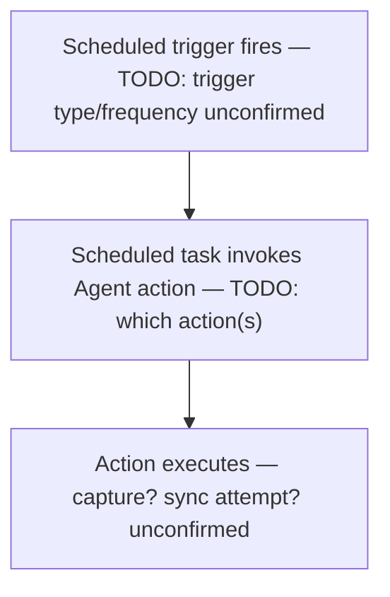

# RE-003 — Scheduler

## 1. Purpose

This document records what is understood about **scheduled task entries believed to govern timed Agent behavior** — for example, periodic capture or periodic sync attempts. It is written for automation developers who will need to observe scheduler state as Layer 2 (Runtime) evidence.

## 2. Scope

Covers Windows-scheduler-driven (or equivalent timed) behavior of the Agent. Does **not** cover:

- Startup itself (see [RE-001](RE-001_Agent_Startup.md)), even though a scheduled task could theoretically be a startup trigger
- Whether a scheduler entry is actually the mechanism behind suspected watchdog/self-recovery behavior — that overlap is unresolved (see [RE-002](RE-002_Watchdog_Behaviour.md))
- The upload/sync logic itself once triggered — see [RE-004](RE-004_Upload_Pipeline.md)

## 3. Architecture

> **TODO:** No scheduled task names, triggers, or actions are confirmed. [HB-002 §4](../docs/handbook/HB-002_Product_Architecture.md) lists "Scheduler" as a component with Validation Surface "Scheduled task entries" and no further detail.

## 4. Sequence / Flow

The following is a conceptual placeholder only, reflecting the assumed topology in [HB-002 §3](../docs/handbook/HB-002_Product_Architecture.md) ("SCH --> AGT"), not verified behavior:

## 5. Known Behaviour (unverified)

- [HB-001 §3](../docs/handbook/HB-001_Product_Overview.md) lists "Scheduler" as part of the EmpMonitor ecosystem, described only as "Scheduled task behavior on the endpoint."
- [HB-002 §3–§4](../docs/handbook/HB-002_Product_Architecture.md) places Scheduler upstream of the Agent in the assumed (unverified) topology, and maps its validation surface to "Scheduled task entries" under Evidence Layer 2.

No specific task name, schedule/frequency, trigger type, or action performed by any scheduled task is currently known.

## 6. Verified Behaviour (with evidence + version)

> **TODO:** Empty — no scheduled task has been directly observed on a real installation yet.

| Claim | Evidence Reference | Product Version | Verified By | Date |
|---|---|---|---|---|
| — | — | — | — | — |

## 7. Configuration Inputs

> **TODO:** Unknown whether scheduled task frequency/behavior is configurable via `config.js`, `empm.ini`, or dashboard settings. See [RE-005](RE-005_Configuration_Loading.md).

## 8. Known Files

> **TODO:** No scheduled task name or associated executable/script path is confirmed. See [RE-010](RE-010_Folder_Structure.md).

## 9. Known APIs

> **TODO:** Unknown whether scheduled actions call server APIs directly (e.g., a periodic sync attempt) or only interact with local storage. See [RE-006](RE-006_API_Flow.md).

## 10. Storage / SQLite

> **TODO:** Unknown whether scheduled actions read or write the local SQLite database. See [RE-007](RE-007_SQLite_Database.md).

## 11. Logs

> **TODO:** Unknown whether scheduled task execution is logged, and where. See [RE-008](RE-008_Logging_System.md).

## 12. Failure Modes

> **TODO:** No failure modes observed. Candidate classes for future investigation (unverified): scheduled task missing/disabled, task present but does not fire, task fires but underlying action fails silently, task frequency drifts from configured value.

## 13. Recovery

> **TODO:** Unknown whether a missed or failed scheduled run is retried, and by what mechanism. See [RE-011](RE-011_Recovery_Behaviour.md).

## 14. Troubleshooting

> **TODO:** No troubleshooting guidance exists yet.

## 15. Evidence Sources for Automation

Primary Evidence Layer for this document: **Layer 2 — Runtime** (per [Validation Standard §3](../docs/ADS/validation_standard.md)).

The intended observation point for this subject is `framework/monitors/scheduler_monitor.py` (listed in [Validation Standard §4](../docs/ADS/validation_standard.md) as the collector for "Scheduled task state" evidence). **This file currently exists in the repository but is empty/unimplemented.** No scheduler observation capability exists in the framework today; this document must not be read as implying otherwise.

| Evidence Source | Layer | Collector | Notes |
|---|---|---|---|
| Scheduled task state | 2 | `framework/monitors/scheduler_monitor.py` | File exists, currently empty — no implementation to describe |

## 16. Open Questions / TODO

- Does the Agent register one or more Windows Scheduled Tasks at all? (Assumed per topology, not confirmed.)
- If so, what are their names, triggers (time-based, event-based, on-logon), and frequencies?
- What action does each task perform — capture, sync attempt, health check, something else?
- Is there any overlap between scheduled tasks and the suspected watchdog mechanism in [RE-002](RE-002_Watchdog_Behaviour.md)?
- Is scheduler configuration exposed anywhere in local config or dashboard settings?
- What should `framework/monitors/scheduler_monitor.py` observe once implemented (task presence, last-run time, last-run result, next-run time)?

## 17. Future Expansion

> **TODO:** Once `framework/monitors/scheduler_monitor.py` is implemented, this document should be updated with the actual scheduled task names/entries it is capable of observing, and Known Behaviour promoted to Verified as entries are confirmed on a real installation.

## 18. Version Notes

> **TODO:** No EmpMonitor version has been verified against this document.

## 19. Cross References

- [Reverse Engineering Knowledge Base — Index](README.md)
- [HB-001 — Product Overview](../docs/handbook/HB-001_Product_Overview.md)
- [HB-002 — Product Architecture](../docs/handbook/HB-002_Product_Architecture.md)
- [Validation Standard](../docs/ADS/validation_standard.md)
- [RE-001 — Agent Startup](RE-001_Agent_Startup.md)
- [RE-002 — Watchdog Behaviour](RE-002_Watchdog_Behaviour.md)
- [RE-004 — Upload Pipeline](RE-004_Upload_Pipeline.md)
- [RE-009 — Runtime Components](RE-009_Runtime_Components.md)

---
**Document Status:** Draft — observation point identified as unimplemented; no scheduled behavior verified
**Owner:** TODO
**Last Updated:** 2026-07-30
