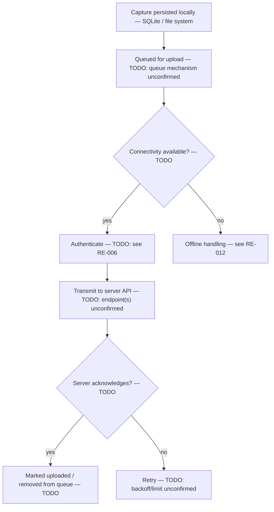

# RE-004 — Upload Pipeline

## 1. Purpose

This document records what is understood about how **captured data is believed to move from local storage to the EmpMonitor server** — queueing, batching, and retry logic. It is written for automation developers who will need to validate Layer 3 (Synchronization) evidence.

## 2. Scope

Covers the path from "data persisted locally" to "data acknowledged/received by the server," including any queueing or batching in between. Does **not** cover:

- Behavior specifically under connectivity loss / offline conditions — see [RE-012](RE-012_Offline_Synchronization.md), authored by a parallel effort
- The wire-level API contract itself (endpoints, methods, payload shape, auth) — see [RE-006](RE-006_API_Flow.md)
- How data is captured or persisted locally in the first place — see [RE-007](RE-007_SQLite_Database.md) and [RE-010](RE-010_Folder_Structure.md)

## 3. Architecture

> **TODO:** No verified architecture exists for the upload pipeline. [HB-002 §4](../docs/handbook/HB-002_Product_Architecture.md) lists "Upload Pipeline" as a component whose role is "Moves captures to server" with Validation Surface "Queue state, retries, API traffic," cross-referencing this document and [RE-012](RE-012_Offline_Synchronization.md).

## 4. Sequence / Flow

The following reflects only the generic, unverified data-flow shape described in [HB-002 §5](../docs/handbook/HB-002_Product_Architecture.md) ("Configure → Capture → Persist → Synchronize → Surface"), narrowed to the Synchronize stage:

> **TODO:** Verify every node above. None of the labels (queue mechanism, retry policy, acknowledgment semantics) are confirmed; they are placeholders describing what must be verified, not what is known.

## 5. Known Behaviour (unverified)

- [HB-001 §6](../docs/handbook/HB-001_Product_Overview.md) defines "Upload Queue" as "The agent-side mechanism holding captures pending transmission" and explicitly marks it **TODO: verify mechanism**.
- [HB-002 §5](../docs/handbook/HB-002_Product_Architecture.md) states the assumed end-to-end path includes a "Synchronize" stage where "the upload pipeline transmits data to the server (with authentication, retries, and offline queuing)" — explicitly flagged as an assumed path requiring per-feature verification.
- [Validation Standard §4](../docs/ADS/validation_standard.md) lists "Upload queue state" as a Layer 3 evidence source with the collector marked **TODO: likely via SQLite/folder monitors — confirm where queue state lives**.

No batching strategy, retry/backoff policy, or acknowledgment protocol is currently known.

## 6. Verified Behaviour (with evidence + version)

> **TODO:** Empty — no upload pipeline behavior has been directly observed yet.

| Claim | Evidence Reference | Product Version | Verified By | Date |
|---|---|---|---|---|
| — | — | — | — | — |

## 7. Configuration Inputs

> **TODO:** Unknown whether upload behavior (frequency, batch size, retry limits) is configurable via `config.js`, `empm.ini`, or dashboard settings. See [RE-005](RE-005_Configuration_Loading.md).

## 8. Known Files

> **TODO:** No file or folder implementing the upload queue is confirmed. Whether the queue lives in SQLite, the file system, or both is unresolved — see [RE-007](RE-007_SQLite_Database.md) and [RE-010](RE-010_Folder_Structure.md).

## 9. Known APIs

> **TODO:** No specific endpoint, method, or payload format is confirmed. See [RE-006](RE-006_API_Flow.md) for the broader API contract this pipeline would use. [Validation Standard §12](../docs/ADS/validation_standard.md) records that the Layer 3 API/network evidence collector is now designed (see [Synchronization Monitor Design](../docs/design/Synchronization_Monitor.md)) but not yet implemented, so Layer 3 API traffic cannot yet be independently observed by automation.

## 10. Storage / SQLite

> **TODO:** Unknown whether pending/uploaded state is tracked in the SQLite database (e.g., a status column or table) or elsewhere. See [RE-007](RE-007_SQLite_Database.md).

## 11. Logs

> **TODO:** Unknown whether upload attempts, successes, or failures are logged, and where. See [RE-008](RE-008_Logging_System.md).

## 12. Failure Modes

> **TODO:** No failure modes observed. Candidate classes for future investigation (unverified): capture persisted but never queued, queued but never transmitted, transmitted but not acknowledged, acknowledged but not reflected on dashboard, queue grows unboundedly under prolonged offline conditions.

## 13. Recovery

> **TODO:** Unknown what retry/backoff behavior exists on transmission failure, and whether queued items are ever dropped/expired. See [RE-011](RE-011_Recovery_Behaviour.md) and [RE-012](RE-012_Offline_Synchronization.md).

## 14. Troubleshooting

> **TODO:** No troubleshooting guidance exists yet.

## 15. Evidence Sources for Automation

Primary Evidence Layer for this document: **Layer 3 — Synchronization** (per [Validation Standard §3](../docs/ADS/validation_standard.md)).

| Evidence Source | Layer | Collector | Notes |
|---|---|---|---|
| Upload queue state | 3 | TODO — likely `framework/monitors/sqlite_monitor.py` and/or `framework/monitors/folder_monitor.py` | Location of queue state is unconfirmed per [Validation Standard §4](../docs/ADS/validation_standard.md) |
| API request/response | 3 | Synchronization Monitor (designed — not yet implemented) | Known gap; see [Validation Standard §12](../docs/ADS/validation_standard.md) |
| SQLite contents | 2/3 | `framework/monitors/sqlite_monitor.py` | Cross-layer if queue state lives in SQLite |
| Log content | 2 | `framework/monitors/log_monitor.py` | Corroborating evidence only; insufficient alone per [Validation Standard §8](../docs/ADS/validation_standard.md) |

## 16. Open Questions / TODO

- What mechanism actually implements the "upload queue" — a SQLite table, a file-system spool directory, an in-memory structure, or something else?
- What triggers an upload attempt — the scheduler (see [RE-003](RE-003_Scheduler.md)), an event, or continuous polling?
- Is data batched before transmission, and if so, by what criteria (size, time, count)?
- What retry policy exists on failure (fixed interval, exponential backoff, retry limit, dead-letter behavior)?
- How is successful upload acknowledged and reflected in local state?
- Where does this pipeline hand off to/overlap with the offline synchronization behavior documented in [RE-012](RE-012_Offline_Synchronization.md)?

## 17. Future Expansion

> **TODO:** Once the API/network evidence collector is implemented (it is now designed — see [Synchronization Monitor Design](../docs/design/Synchronization_Monitor.md); tracked as a known gap in [Validation Standard §12](../docs/ADS/validation_standard.md)), this document should be revisited to describe how it corroborates upload pipeline behavior at Layer 3.

## 18. Version Notes

> **TODO:** No EmpMonitor version has been verified against this document.

## 19. Cross References

- [Reverse Engineering Knowledge Base — Index](README.md)
- [HB-001 — Product Overview](../docs/handbook/HB-001_Product_Overview.md)
- [HB-002 — Product Architecture](../docs/handbook/HB-002_Product_Architecture.md)
- [Validation Standard](../docs/ADS/validation_standard.md)
- [RE-006 — API Flow](RE-006_API_Flow.md)
- [RE-007 — SQLite Database](RE-007_SQLite_Database.md)
- [RE-010 — Folder Structure](RE-010_Folder_Structure.md)
- [RE-011 — Recovery Behaviour](RE-011_Recovery_Behaviour.md)
- [RE-012 — Offline Synchronization](RE-012_Offline_Synchronization.md)

---
**Document Status:** Draft — mechanism unconfirmed; structure established pending evidence
**Owner:** TODO
**Last Updated:** 2026-07-30
