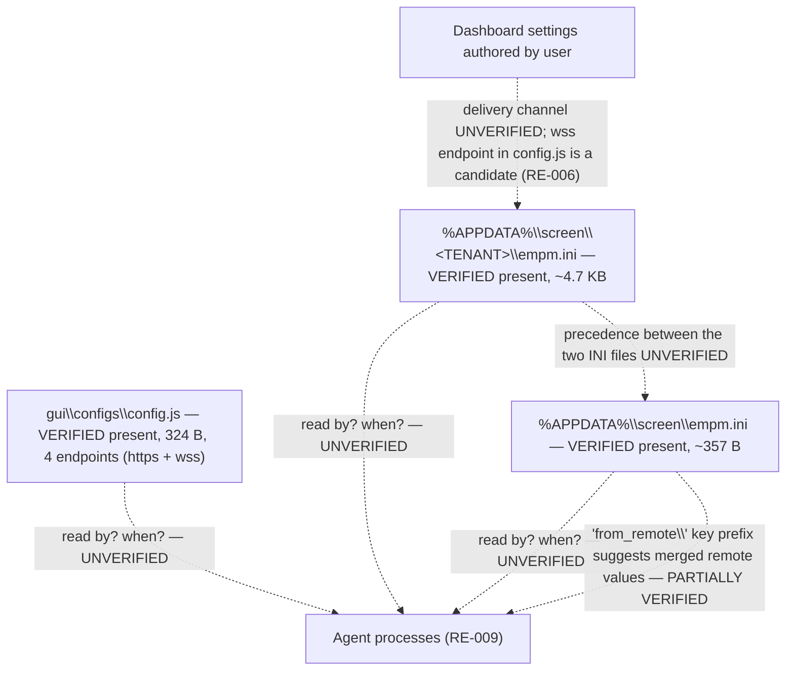

# RE-005 — Configuration Loading

## 1. Purpose

This document records what is understood about how **local configuration** (referenced elsewhere in project documentation as `config.js` and `empm.ini`) and **dashboard-authored settings** are believed to be loaded and applied by the Agent, and what the precedence between local config and dashboard settings is believed to be. It is written for automation developers validating Layer 1 (Configuration) evidence.

## 2. Scope

Covers configuration artifacts that govern Agent behavior and how/when they take effect. Does **not** cover:

- Plugin-level automation configuration (that is framework configuration, not product configuration — see [Configuration Standard](../docs/ADS/configuration_standard.md), referenced from [Plugin Development Guide §8](../docs/ADS/plugin_standard.md))
- How configuration is read specifically at process startup as opposed to reload/apply behavior more generally — see [RE-001](RE-001_Agent_Startup.md) for the startup-specific angle
- Dashboard UI itself as an evidence surface (Layer 4) — this document is about configuration as an *input*, not the dashboard as an observation surface

## 3. Architecture

The *inventory* of configuration artifacts is now **Verified** (§6); the *loading architecture* — who reads what, when, and which wins — remains almost entirely **Hypothesis**.

Four distinct configuration artifacts exist per installation, in three locations across two trees:

| Artifact | Location | Size observed | Apparent role |
|---|---|---|---|
| `config.js` | `<install root>\gui\configs\` (machine-wide) | 324 B / 9 lines | Endpoint/transport configuration — holds 4 endpoint URLs |
| `config_debug.js`, `config_release.js` | same folder | not recorded | Build/environment variants — relationship to `config.js` **unverified** |
| `empm.ini` (root) | `%APPDATA%\screen\` (per user) | **~357 B signed in / 316 B signed out** | Small local/bootstrap config — identity, capture periods, tracking/break state, and credentials **while a user is signed in** (§6.6) |
| `empm.ini` (tenant) | `%APPDATA%\screen\<TENANT>\` (per user, per installation) | **~4.7 KB** | **Likely** the remote/dashboard-synced configuration |

The single most consequential structural finding is that **there are two `empm.ini` files, not one**. Every prior document in this repository — and [HB-002 §4](../docs/handbook/HB-002_Product_Architecture.md)'s "`config.js`, `empm.ini`, dashboard settings" formulation — refers to "`empm.ini`" in the singular. That reference is now **ambiguous**, and any validator that reads "the" `empm.ini` is reading one of two files without saying which. See 5-V12.

The `[appSettings]` section of the root `empm.ini` contains keys prefixed **`from_remote\`** (`from_remote\screenshotPeriodSec`, `from_remote\ADUserInfoSendPerSec`). This naming is the first concrete on-disk evidence that dashboard-authored settings are **merged into the local configuration file itself** and are distinguishable from purely local keys by prefix — see 5-V8, which is the closest thing to a precedence mechanism yet observed.

## 4. Sequence / Flow

> **TODO:** the loading *sequence* remains unverified. No config read, reload, or sync event was observed — the 2026-07-30 pass inspected files at rest. What follows marks the observed artifacts (solid) against the still-assumed mechanics (dotted).

> Only the three file nodes are observed. **Every edge is Hypothesis.** The `from_remote\` prefix (5-V8) is the sole observed hint that remote and local values coexist in one file.

> **Still TODO:** whether dashboard settings reach the Agent via the API/sync pipeline (see [RE-006](RE-006_API_Flow.md)), via the newly-evidenced `wss` channel, via periodic polling, or otherwise — and whether that channel is the same one used for capture upload.

## 5. Known Behaviour (unverified)

- [HB-001 §3](../docs/handbook/HB-001_Product_Overview.md) lists "Local Configuration — Agent-side configuration artifacts (e.g., `config.js`, `empm.ini`)" as part of the EmpMonitor ecosystem.
- [HB-002 §4](../docs/handbook/HB-002_Product_Architecture.md) lists "Local Configuration" with role "Governs agent behavior" and validation surface "`config.js`, `empm.ini`, dashboard settings" — i.e., dashboard settings are treated as part of the same configuration surface as the local files, without a stated mechanism.
- [HB-002 §5](../docs/handbook/HB-002_Product_Architecture.md) states the assumed end-to-end path begins with "Configure — behavior is set via local config and/or dashboard settings," again without specifying precedence.
- [HB-002 §7](../docs/handbook/HB-002_Product_Architecture.md) lists "configuration divergence between local and dashboard" as a *candidate* ecosystem-level failure mode to investigate — this itself implies precedence/divergence is an open question, not that divergence has been observed.

File *locations* and a partial key inventory are now verified (§6). **No reload trigger and no precedence rule is known.** Every statement about *loading* in this document remains Hypothesis.

## 6. Verified Behaviour (with evidence + version)

All claims in this section derive from a single observation pass on **2026-07-30** against one real installation. The [README §6.1](README.md) metadata fields common to every claim are stated once here rather than repeated per row:

| Field | Value |
|---|---|
| `Verified On` | 2026-07-30 |
| `Verified Against Version` | EmpMonitor `gui` components **3.7.4** / `service` component **3.7.3**; host Windows 10 Pro build 10.0.19045 x64 |
| `Verification Method` | Observed by `EM000_EnvironmentValidator` plugin run plus direct filesystem inspection |
| `Reviewer` | TODO — reviewer sign-off ([README §7](README.md) step 4) not yet performed |
| `Last Review Date` | 2026-07-30 |

> **Scope limit:** one host, one installation, one user profile, one point in time. **Every claim below is about configuration files *at rest*.** No configuration was read, reloaded, changed, or synced under observation, so nothing here evidences *loading* behaviour — only what exists to be loaded.

### 6.0 Credential Handling — Read This First

`empm.ini` contains an `[auth]` section holding **`crypto_password`** and **`email`** **while a user is signed in** — the section was later observed to be **absent** after the agent removed it (§6.6, 5-V24). This document records **that these keys exist when present and nothing more**. Their values were **never read into documentation** and must never be. Automation that parses `empm.ini` must assert on **key presence and section structure only**, and must redact or omit `[auth]` values from any report, log, or evidence artifact it produces. The same rule applies to the endpoint URLs in `config.js` (5-V14).

**The section's absence is a state, not a defect** (§6.6) — and it must be reported as "absent", never by dumping the file to prove it. The redaction rule applies identically whether the section is present or not.

### 6.1 `empm.ini` — Location and Structure

| # | Claim | Status | Evidence Source |
|---|---|---|---|
| 5-V1 | `empm.ini` is an **INI-format** file (named sections in `[brackets]` with `key` entries), located per user under `%APPDATA%\screen\`. | **Verified** | EV-002, EV-010 |
| 5-V2 | Section **`[General]`** exists, containing key **`identifier`**. | **Verified** (key exists) | EV-002 |
| 5-V3 | Section **`[appSettings]`** exists, containing keys **`dataSendingPeriodSec`**, **`from_remote\screenshotPeriodSec`**, **`from_remote\ADUserInfoSendPerSec`**, **`screenshotQuality`**. Three further keys in this section were recorded later — see 5-V21, 5-V22. | **Verified** (keys exist) | EV-002 |
| 5-V4 | Section **`[auth]`** exists, containing keys **`crypto_password`** and **`email`**. **Values not read — see §6.0.** | **Deprecated** — was Verified at first observation, but the section was **later observed absent** on the same host. Superseded by **5-V24** (§6.6), which records presence as sign-in-state-dependent rather than unconditional. Retained for history | EV-002 |
| 5-V5 | The sections above are the sections *observed at first inspection*; that they are the **complete** set is **not** claimed — a fourth section, `[settings]`, was recorded later (5-V20), which is itself the proof that this row's caution was warranted — the ~4.7 KB tenant-level `empm.ini` (5-V11) is over ten times larger than the ~357 B root file and its full section list was not enumerated. | **Partially Verified** | EV-002 |
| 5-V6 | What each key *governs*, its value type, units, valid range, or default. The `...PeriodSec` / `...PerSec` suffixes imply seconds-based intervals and `screenshotQuality` implies an image-quality setting, but **no key's semantics were confirmed** and no value was correlated with observed agent behaviour. | **Hypothesis** — inferred from names only | — |
| 5-V7 | That `[appSettings]` interval keys drive the scheduler/capture cadence documented in [RE-003](RE-003_Scheduler.md). | **Hypothesis** — plausible from naming; no timing correlation tested | — |

### 6.2 The `from_remote\` Key Prefix

| # | Claim | Status | Evidence Source |
|---|---|---|---|
| 5-V8 | Two `[appSettings]` keys carry a literal **`from_remote\`** prefix (`from_remote\screenshotPeriodSec`, `from_remote\ADUserInfoSendPerSec`) while others in the same section (`dataSendingPeriodSec`, `screenshotQuality`) do not. | **Verified** | EV-002 |
| 5-V9 | That the prefix marks values originating from the dashboard/server, distinguishing remote-authored from locally-set settings — i.e. that local and remote configuration are **merged into one file with provenance encoded in the key name**. | **Partially Verified** — the naming is unambiguous in intent and is the only provenance signal observed anywhere, but no sync event was observed writing such a key, and the prefix could equally be a Qt `QSettings` nested-group artifact (`\` is Qt's group separator) rather than a semantic marker | EV-002 |
| 5-V10 | That the presence of a `from_remote\` variant *overrides* an equivalently-named local key (i.e. a precedence rule). **No key was observed in both prefixed and unprefixed form**, so there is no evidence of an override relationship at all. | **Hypothesis** | — |

### 6.3 Two `empm.ini` Files Exist

| # | Claim | Status | Evidence Source |
|---|---|---|---|
| 5-V11 | **Two distinct `empm.ini` files exist per installation:** `%APPDATA%\screen\empm.ini` (**~357 B**) and `%APPDATA%\screen\<TENANT>\empm.ini` (**~4.7 KB**), where `<TENANT>` is a 7-character per-installation folder that must be discovered at runtime (see [RE-010](RE-010_Folder_Structure.md)). | **Verified** | EV-002, EV-010 |
| 5-V12 | **Any unqualified reference to "`empm.ini`" in this repository is therefore ambiguous** and should be read as "one of two files". Validators must identify which file they read. | **Verified** (as a consequence of 5-V11) | EV-002, EV-010 |
| 5-V13 | That the larger tenant-scoped file is the **remote/dashboard-synced** configuration and the smaller root file a local bootstrap. | **Partially Verified** — supported by the size difference, the tenant-scoped location, and the `from_remote\` prefix in the root file; **not** supported by any observed sync event. Precedence between the two files is **entirely unestablished** | EV-002, EV-010 |

### 6.4 `config.js`

| # | Claim | Status | Evidence Source |
|---|---|---|---|
| 5-V14 | `config.js` exists at `<install root>\gui\configs\config.js`, is **324 bytes / 9 lines**, and contains **4 endpoint URLs** using the **`https`** and **`wss`** schemes. **The URLs themselves are deliberately not recorded** — they are deployment-specific and must be treated as such. | **Verified** | EV-001, EV-010 |
| 5-V15 | The presence of a **`wss`** endpoint means a **WebSocket channel is configured**. This answers an explicit open question in [RE-006](RE-006_API_Flow.md) and the [Synchronization Monitor design](../docs/design/Synchronization_Monitor.md). | **Partially Verified** — the channel's *existence in configuration* is observed; **no WebSocket connection or traffic was observed**. See [RE-006](RE-006_API_Flow.md) |
| 5-V16 | At 324 bytes over 9 lines, `config.js` is **endpoint configuration only** — it is far too small to carry feature or behavioural settings, which therefore live elsewhere (`empm.ini` and/or dashboard-pushed state). | **Partially Verified** — a sound inference from size, but the file's full key list was not recorded | EV-001 |
| 5-V17 | `config_debug.js` and `config_release.js` exist alongside `config.js` in the same folder. | **Verified** (presence) | EV-010 |
| 5-V18 | That `config.js` is the file actually read at runtime and the `_debug`/`_release` variants are build-time templates (one being copied to `config.js` at install). | **Hypothesis** — no file was observed being read; contents of the variants were not compared | — |
| 5-V19 | Despite the `.js` extension, whether the file is evaluated as JavaScript or merely parsed as text/JSON. | **Hypothesis** — not investigated | — |

### 6.5 What Was *Not* Established

Recorded explicitly so that the verified inventory above is not mistaken for verified *behaviour*:

- **No precedence rule** between the two `empm.ini` files, or between local config and dashboard settings.
- **No reload trigger** — whether changes apply live or require a process/service restart. Note that §6.6 now establishes the agent *does* rewrite `empm.ini` during operation, which is a write observation, not a read/reload one.
- **No effective/merged configuration view** — no artifact was found that exposes resolved configuration.
- **No read event** by any process — the mapping from config file to consuming process ([RE-009](RE-009_Runtime_Components.md)) is unobserved.
- **No dashboard-to-endpoint delivery** observed.
- **No semantics for any key** — including the three added in §6.6 (5-V23).

### 6.6 Feature-Relevant Keys, a Fourth Section, and the `[auth]` State Change

Recorded from a later inspection of the **same** root `empm.ini` on **2026-07-30**, during the feature-profiling pass. Three keys and one whole section are recorded here for the first time; one previously-Verified claim is **corrected**.

| Field | Value |
|---|---|
| `Verified On` | 2026-07-30 |
| `Verified Against Version` | EmpMonitor `gui` **3.7.4** / `service` **3.7.3**, Windows 10 Pro 19045 |
| `Evidence Source` | **EV-002** (`empm.ini` contents), corroborated by **EV-010** (file size/presence) |
| `Verification Method` | Observed by `EM000`/`EM001` plugin runs plus direct inspection |
| `Reviewer` | TODO — sign-off outstanding |
| `Last Review Date` | 2026-07-30 |

#### Newly recorded keys — all in the root `%APPDATA%\screen\empm.ini`

| # | Claim | Status | Evidence Source |
|---|---|---|---|
| 5-V20 | A **fourth section, `[settings]`, exists**, containing key **`data\trackingMode`** — i.e. `settings/data\trackingMode`. This is the **first section beyond `[General]`/`[appSettings]`/`[auth]`** to be recorded, and its key carries the same literal **backslash** seen in the `from_remote\` keys (5-V8), reinforcing the Qt `QSettings` nested-group reading. | **Verified** (section and key exist) | EV-002 |
| 5-V21 | `[appSettings]` contains key **`todayRemainingBreakInSeconds`**, not recorded in 5-V3. | **Verified** (key exists) | EV-002 |
| 5-V22 | `[appSettings]` contains key **`currentDate`**, not recorded in 5-V3. | **Verified** (key exists) | EV-002 |
| 5-V23 | What these three keys **mean**. The names suggest a **tracking-mode setting** (5-V20), **break/idle accounting** (5-V21), and a **current-date marker** (5-V22) — but **no behaviour was observed** for any of them: no tracking mode was changed, no break was taken under observation, and no date rollover was watched. Semantics are inferred from key names alone, exactly as in 5-V6. | **Hypothesis** — names only | — |

The three keys are the Layer 1 anchor for three feature profiles: `settings/data\trackingMode` for **EM013_Attendance** and `appSettings/todayRemainingBreakInSeconds` for **EM014_IdleTime** ([HB-006](../docs/handbook/HB-006_Feature_Specifications.md)). Both profiles are **Partially Verified** precisely because the key exists (5-V20/5-V21, Verified) while its meaning does not (5-V23, Hypothesis) — the key presence is what the profile can assert on; the feature's operation is not.

> **Escaping hazard.** A single backslash inside a JSON string is an escape introducer, so this key must be written `"settings/data\\trackingMode"` in any JSON file. Written with one backslash, `\t` parses to a **tab character** and the key will never match the observed name.

#### The `[auth]` section is no longer present — corrected observation

| # | Claim | Status | Evidence Source |
|---|---|---|---|
| 5-V24 | The **`[auth]` section is NO LONGER PRESENT** in the root `empm.ini`. The sections observed are `[General]`, `[appSettings]`, `[settings]` — **`[auth]` is absent**, and with it `crypto_password` and `email`. **The agent removed the section itself**; no external action touched the file. This is **consistent with a user logout**. The correct generalisation is therefore that **`[auth]` is present only while a user is signed in** — presence is *state*, not structure. Supersedes **5-V4**. | **Verified** (as a state change: the section was present, then absent, on the same file on the same host) | EV-002, EV-010 |
| 5-V25 | Corroboration: the file **shrank from ~357 B to 316 B** across the two observations, and its key count is **8 across 3 sections**. Two independent signals — section list and file size — agree that content was removed rather than merely re-keyed. | **Verified** | EV-002, EV-010 |
| 5-V26 | That the trigger was *specifically* a logout, as opposed to any other agent action that clears credentials (token expiry, re-registration, credential rotation). The logout reading is the most economical explanation but **no logout was observed being performed**, and no log line was correlated with the removal. | **Hypothesis** | — |
| 5-V27 | What the agent does with credentials while signed out — whether they are relocated to the tenant-level `empm.ini` (5-V5, still unenumerated), held only in memory, or discarded. **Not investigated.** The absence of `[auth]` from *this* file is not evidence of absence from the installation. | **Hypothesis** | — |

**No credential value was read at any point**, and none is recorded here or anywhere else. §6.0 applies unchanged.

**Consequences for automation, and they are not minor:**

1. **A Layer 1 check that asserts `[auth]` is present will fail on a signed-out endpoint** — and will fail with a misleading diagnosis, reporting broken configuration where the true state is "no user signed in". Presence must be reported as a **state observation**, never as a pass/fail structural assertion.
2. **`empm.ini` is not a static file.** It was previously described in terms consistent with a config file at rest; it is in fact rewritten by the agent during normal operation. Any validator that caches a parse of it, or that treats a key set as a fixed schema, is reading a snapshot.
3. **Section and key inventories are floors, not ceilings.** 5-V20 added an entire section that a complete-looking inventory had missed one pass earlier. Assert on the presence of keys you need; never assert on the *absence* of keys you have not enumerated.
4. **`[auth]` presence is the closest thing to a sign-in signal yet observed on the endpoint** — a Layer 1 trace of a state that otherwise belongs to the unobserved dashboard. It is recorded here as a configuration observation only; it does **not** constitute a specification of any Login feature, and `EM001_Login` remains unprofiled ([HB-006 §1.1](../docs/handbook/HB-006_Feature_Specifications.md)).

## 7. Configuration Inputs

| Input | Status | Notes |
|---|---|---|
| `config.js` | **Verified** (location, size, presence of 4 https/wss endpoints — 5-V14) | `<install root>\gui\configs\config.js`, 324 B / 9 lines. Endpoint URLs **not recorded** (deployment-specific). Full key list not enumerated. |
| `config_debug.js` / `config_release.js` | **Verified** (presence — 5-V17) | Same folder. Role and relationship to `config.js` **Hypothesis** (5-V18). |
| `empm.ini` (root) | **Verified** (location + sections/keys — 5-V1 … 5-V3, 5-V20 … 5-V22) | `%APPDATA%\screen\empm.ini`, per user; **~357 B signed in / 316 B signed out**, 8 keys across 3 sections when signed out. Sections `[General]`, `[appSettings]`, `[settings]`, plus `[auth]` **only while a user is signed in** (5-V24). **`[auth]` values never read.** |
| `empm.ini` (tenant) | **Verified** (location + size — 5-V11) | `%APPDATA%\screen\<TENANT>\empm.ini`, ~4.7 KB. Section/key list **not** enumerated. Likely remote/synced (**Partially Verified**, 5-V13). |
| Dashboard settings | **Hypothesis** (delivery mechanism) | Treated as part of the Layer 1 surface per [HB-002 §6](../docs/handbook/HB-002_Product_Architecture.md) / [Validation Standard §3](../docs/ADS/validation_standard.md). The `from_remote\` key prefix (5-V8) and the `wss` endpoint (5-V15) are the first on-disk traces of a remote-settings path, but delivery remains unobserved. |

## 8. Known Files

**Verified** locations (metadata block as §6). Full layout in [RE-010](RE-010_Folder_Structure.md).

| Path | Format | Size observed | Notes |
|---|---|---|---|
| `C:\Program Files\EmpMonitor\EmpMonitor\gui\configs\config.js` | `.js` (evaluation vs. parsing unverified) | 324 B, 9 lines | 4 endpoint URLs, `https` + `wss` schemes. URLs not recorded. |
| `...\gui\configs\config_debug.js` | `.js` | not recorded | Variant; role unverified |
| `...\gui\configs\config_release.js` | `.js` | not recorded | Variant; role unverified |
| `%APPDATA%\screen\empm.ini` | INI | ~357 B signed in / **316 B** signed out | `[General] identifier`; `[appSettings] dataSendingPeriodSec`, `from_remote\screenshotPeriodSec`, `from_remote\ADUserInfoSendPerSec`, `screenshotQuality`, **`todayRemainingBreakInSeconds`**, **`currentDate`**; **`[settings] data\trackingMode`**; `[auth] crypto_password`, `email` **only while signed in** (5-V24) (**values not read**) |
| `%APPDATA%\screen\<TENANT>\empm.ini` | INI | ~4.7 KB | Second INI; keys not enumerated. `<TENANT>` = 7-char per-installation token, **discover at runtime** |

Note the install root is **double-nested** (`EmpMonitor\EmpMonitor`), correcting an earlier hypothesis — see [RE-010](RE-010_Folder_Structure.md).

## 9. Known APIs

**Partially Verified — indirectly.** No configuration-delivery API has been observed, but `config.js` demonstrably configures **4 endpoints over `https` and `wss`** (5-V14, 5-V15). The `wss` scheme establishes that a WebSocket channel is configured, which is a **candidate** delivery mechanism for dashboard-pushed settings — a candidate only, since no traffic was observed. Whether configuration delivery shares a channel with capture upload is still unknown. See [RE-006](RE-006_API_Flow.md).

## 10. Storage / SQLite

**Partially Verified — negative result.** The 28-table schema of `local_db20.db` was enumerated (see [RE-007](RE-007_SQLite_Database.md)) and **no table name suggests configuration or settings storage**; the closest is `user_details`. So on current evidence configuration is **not** cached in SQLite and lives in the INI/JS files instead.

This is a **negative inference from table names only** — no row contents were read (privacy: the database holds captured monitoring data), so a settings blob inside an existing table cannot be ruled out.

## 11. Logs

> **TODO / Hypothesis:** no configuration load, reload, or apply event has been correlated with any log entry. Log *locations* are now verified (see [RE-008](RE-008_Logging_System.md)) — `%APPDATA%\screen\empm\logs\<date>.txt`, `<install root>\service\EMP_SERVICE.log`, and others — but **no log contents were read** during the pass, so whether configuration events are logged at all remains unestablished. These files are the place to look.

## 12. Failure Modes

**No failure mode has been observed** — every item below is **Hypothesis**, now stated against real artifacts rather than assumed ones. The first two are *framework* failure modes and are the most likely to bite first:

- **Validator reads the wrong `empm.ini`** of the two that exist (5-V11), producing a config picture that looks valid but is partial or stale. Highest-probability defect in any Layer 1 check written before this finding.
- **Validator hardcodes the tenant folder token**, so tenant-level config resolution silently fails on every installation but the one it was written against.
- **Credential leakage:** a validator that dumps `empm.ini` wholesale writes `[auth] crypto_password` into a report or log. See §6.0 — this is a real risk created by the file's structure, not a hypothetical.
- **`[auth]` absence misdiagnosed as broken configuration** rather than as "no user signed in" (5-V24). A structural assertion on that section will fail on a signed-out endpoint and will point the investigation at the wrong thing.
- **A cached parse of `empm.ini` going stale**, now that the agent is known to rewrite the file during normal operation (5-V24, 5-V25).
- **A key name containing a literal backslash mangled by JSON escaping** — `settings/data\trackingMode` written with one backslash parses to a tab and matches nothing (§6.6).
- **An inventory assumed complete:** `[settings]` existed all along and was missed by a pass that looked exhaustive (5-V20). Asserting the *absence* of a key or section is unsound on this evidence.
- Local config file missing or corrupt; agent behaviour unknown (§13).
- Dashboard setting change never reaches the endpoint — undetectable today, since no delivery channel is confirmed and no timestamp/marker for last-sync was found.
- The two `empm.ini` files diverge and the agent applies the unexpected one; with no precedence rule established (5-V13), divergence cannot currently be adjudicated.
- A `from_remote\`-prefixed key and its unprefixed counterpart disagree — no override rule is established (5-V10).
- Configuration change requires a restart the agent does not perform automatically.
- `config.js` overwritten by `config_debug.js`/`config_release.js` at update time, silently repointing endpoints (5-V18).

## 13. Recovery

> **TODO / Hypothesis:** unknown, and untested by design — no configuration file was removed, corrupted, or modified during the 2026-07-30 pass. Whether the agent falls back to defaults, refuses to start, or recreates a missing file is unestablished, and note that the four-artifact layout (§3) makes the question compound: behaviour may differ for a missing `config.js` versus a missing root `empm.ini` versus a missing tenant `empm.ini`. See [RE-001](RE-001_Agent_Startup.md) and [RE-011](RE-011_Recovery_Behaviour.md).

## 14. Troubleshooting

Configuration-inspection recipe, now that locations are verified. Steps 1–3 exist to prevent the failure modes in §12.

1. **Resolve both `empm.ini` files, and label them.** Read `%APPDATA%\screen\empm.ini` (~357 B) *and* `%APPDATA%\screen\<TENANT>\empm.ini` (~4.7 KB). Never report "empm.ini" without saying which (5-V12).
2. **Discover the tenant folder; do not hardcode it.** Enumerate `%APPDATA%\screen\` and take the 7-character entry that is not `empm`. Record the value in run evidence only, never in documentation or code.
3. **Redact `[auth]`, and treat its presence as state.** Never emit `crypto_password` or `email` values. Report the section as **present** or **absent** — absent is the signed-out state, not a fault (5-V24). Treat the endpoint URLs in `config.js` the same way.
   Expect **four** possible sections in the root file: `[General]`, `[appSettings]`, `[settings]`, and `[auth]` when signed in. Include `settings/data\trackingMode`, `appSettings/todayRemainingBreakInSeconds` and `appSettings/currentDate` in any key inventory (§6.6), and escape the backslash correctly in JSON.
4. **Resolve `%APPDATA%` for the monitored user**, not for the account running automation — the data tree is per user.
5. **Use the double-nested install root** for `config.js`: `C:\Program Files\EmpMonitor\EmpMonitor\gui\configs\config.js`. The single-level path will not resolve.
6. **Sanity-check `config.js` shape:** expect roughly 324 bytes / 9 lines with 4 endpoints across `https` and `wss`. A materially different size or a missing `wss` entry is worth capturing as a signal — though with one observation on record, it is a signal to investigate, not a defect.
7. **Assert on structure, not semantics.** Key *meanings* are Hypothesis (5-V6); check that expected sections and keys exist rather than that any value is "correct".
8. **Do not expect settings in SQLite** (§10) — but do not conclude their absence from table names alone.

Nothing above validates *loading*. Until a reload trigger and precedence rule are established, a passing configuration check proves only that expected files and keys are present on disk.

## 15. Evidence Sources for Automation

Primary Evidence Layer for this document: **Layer 1 — Configuration** (per [Validation Standard §3](../docs/ADS/validation_standard.md)).

| Evidence Source | Layer | Collector | Notes |
|---|---|---|---|
| Configuration file contents | 1 | `framework/validators/configuration.py` | Per [Validation Standard §4](../docs/ADS/validation_standard.md); this validates *product* config, distinct from framework config covered by the [Configuration Standard](../docs/ADS/configuration_standard.md) |
| Dashboard settings state | 1, 4 | `framework/validators/dashboard.py` | Cross-layer per [Validation Standard §4](../docs/ADS/validation_standard.md): authored at Layer 1, observed at Layer 4 |
| File system artifacts (config file presence/location) | 2 | `framework/monitors/folder_monitor.py` | EV-010 — used to *locate* config files, including tenant-folder discovery |

Both validators are empty scaffolds (0 lines). The 2026-07-30 observations in §6 came from the `EM000_EnvironmentValidator` plugin plus direct filesystem inspection, not from `configuration.py`.

**Requirements this document places on `framework/validators/configuration.py`:**

1. Discover the tenant folder at runtime; never accept a hardcoded token (5-V11).
2. Read and report **both** `empm.ini` files as distinct, separately-labelled artifacts (5-V12).
3. **Redact `[auth]` values** — `crypto_password`, `email` — from every output it produces (§6.0), and report the section's presence/absence as a **state observation**, never as a structural pass/fail (5-V24).
4. Treat `config.js` endpoint URLs as deployment-specific secrets; assert on scheme and count, not on URL values.
5. Assert on section/key presence, not on value semantics, until 5-V6 is resolved.
6. **Re-read rather than cache** — the agent rewrites the file during operation (5-V25).
7. **Handle backslash-bearing key names** without JSON- or regex-escaping damage (§6.6), and cover all four sections including `[settings]`.

## 16. Open Questions / TODO

**Answered by the 2026-07-30 pass** (see §6):

- ~~Where do these files live on disk?~~ → `<install root>\gui\configs\config.js` and **two** `empm.ini` files under `%APPDATA%\screen\`. **Verified.** See [RE-010](RE-010_Folder_Structure.md).
- ~~What is the schema of `empm.ini`?~~ → **Partially answered.** Sections `[General]`, `[appSettings]`, `[auth]` and seven keys verified to exist in the root file (5-V2 … 5-V4). What each key **governs** is still Hypothesis (5-V6), and the tenant file's keys are unenumerated (5-V5).

**Also answered, and partly corrected, by the feature-profiling pass** (see §6.6):

- ~~Are `[General]`, `[appSettings]` and `[auth]` the only sections in the root file?~~ → **No.** A fourth section, **`[settings]`**, exists (5-V20), and three further `[appSettings]` keys were recorded (5-V21, 5-V22). **Verified.**
- ~~Is `[auth]` unconditionally present?~~ → **No — corrected.** The section is present only while a user is signed in; the agent removed it (5-V24, superseding 5-V4). **Verified as a state change.**

**Still open:**

- **Which of the two `empm.ini` files takes precedence, and what writes the tenant-level one?** (5-V13.) Now the highest-value question in this document.
- **What exactly triggers `[auth]` removal**, and is a logout the only trigger (5-V26)? Where do credentials live while signed out (5-V27)?
- What do `data\trackingMode`, `todayRemainingBreakInSeconds` and `currentDate` govern (5-V23)? The first two are the Layer 1 anchors for `EM013_Attendance` and `EM014_IdleTime`, so their semantics gate two feature profiles.
- Does the `[settings]` section carry further keys not yet observed, and does the same nested-group backslash convention apply throughout it (5-V20)?
- What does each verified key govern — type, units, valid range, default (5-V6)?
- What are the remaining sections/keys in the ~4.7 KB tenant `empm.ini` (5-V5)?
- Does the `from_remote\` prefix denote server-authored provenance, or is it merely a Qt `QSettings` nested group (5-V9)? Resolving this would either confirm or dismiss the only provenance mechanism observed so far.
- Is there a case where a key exists both prefixed and unprefixed, and which wins (5-V10)?
- By what mechanism do dashboard-authored settings reach the Agent? Is the `wss` endpoint (5-V15) that channel?
- Is configuration reloaded live, or does it require a restart (see [RE-001](RE-001_Agent_Startup.md))?
- Is there any way to observe the **effective** (merged/resolved) configuration, now known to span up to four files?
- Which process reads which file (see [RE-009](RE-009_Runtime_Components.md))?
- What is the relationship between `config.js`, `config_debug.js` and `config_release.js` (5-V18)?
- Is `config.js` evaluated as JavaScript or parsed as data (5-V19)?
- Is `[General] identifier` the endpoint/device identity, and does it relate to the 7-character tenant folder token (see [RE-010](RE-010_Folder_Structure.md))?
- Are configuration events logged (§11)?

## 17. Future Expansion

The inventory pass is done; expansion now means observing *behaviour* rather than files at rest:

- **Change a setting in the dashboard and re-inspect both `empm.ini` files** — the single most informative next experiment. It would resolve precedence (5-V13), the `from_remote\` question (5-V9), and delivery mechanism at once.
- Enumerate the full section/key list of the tenant `empm.ini` (5-V5), with `[auth]`-style redaction applied throughout.
- Diff `config.js` against `config_debug.js` / `config_release.js` (5-V18), reporting shape only.
- Correlate a config change with agent behaviour (e.g. `screenshotPeriodSec` against observed capture cadence) to promote 5-V6/5-V7 out of Hypothesis.
- Remove or corrupt each config artifact in a disposable environment to populate §13.
- Re-run across hosts and versions to promote §6 rows from single-observation to corroborated.

## 18. Version Notes

| Version observed | Date | Notes |
|---|---|---|
| `gui` components **3.7.4**, `service` component **3.7.3** | 2026-07-30 | First version ever verified against for this subject. Host: Windows 10 Pro build 10.0.19045 x64, single user profile. Established the four-artifact configuration layout and the two-`empm.ini` finding. |
| `gui` components **3.7.4**, `service` component **3.7.3** | 2026-07-30 (later pass) | Same host and installation. Added the `[settings]` section and keys `data\trackingMode`, `todayRemainingBreakInSeconds`, `currentDate` (§6.6). **Corrected 5-V4 to Deprecated:** `[auth]` was observed absent, establishing that its presence tracks sign-in state (5-V24). Demonstrates that key/section inventories drift *within* a single version, not only across versions. |

All §6 claims are scoped to the row above. Statements outside §6 remain unversioned. Per [README §7](README.md) step 6, key inventories must be re-checked on version change — configuration keys are added and renamed routinely between releases.

## 19. Cross References

- [Reverse Engineering Knowledge Base — Index](README.md)
- [HB-001 — Product Overview](../docs/handbook/HB-001_Product_Overview.md)
- [HB-002 — Product Architecture](../docs/handbook/HB-002_Product_Architecture.md)
- [Validation Standard](../docs/ADS/validation_standard.md)
- [Plugin Development Guide](../docs/ADS/plugin_standard.md)
- [RE-001 — Agent Startup](RE-001_Agent_Startup.md)
- [RE-006 — API Flow](RE-006_API_Flow.md)
- [RE-010 — Folder Structure](RE-010_Folder_Structure.md)
- [RE-007 — SQLite Database](RE-007_SQLite_Database.md) — no settings table observed (§10)
- [RE-008 — Logging System](RE-008_Logging_System.md) — where config events would be logged, if they are
- [RE-009 — Runtime Components](RE-009_Runtime_Components.md) — the processes that consume these files
- [HB-006 — Feature Specifications](../docs/handbook/HB-006_Feature_Specifications.md) — the feature profiles anchored on the §6.6 keys (`EM013_Attendance`, `EM014_IdleTime`)
- [Evidence Catalog](../docs/Evidence_Catalog.md) — EV-001, EV-002, EV-010
- [HB-005 — Component Inventory](../docs/handbook/HB-005_Component_Inventory.md) — configuration-file inventory rows promoted from these findings

---
**Document Status:** Active — configuration artifact inventory first verified 2026-07-30 (gui 3.7.4 / service 3.7.3): four artifacts across two trees, `empm.ini` sections/keys, and `config.js` shape. **Two `empm.ini` files exist, not one.** A later pass the same day added the **`[settings]`** section and keys `data\trackingMode`, `todayRemainingBreakInSeconds`, `currentDate` (**Verified** present; **meanings Hypothesis**), and **corrected 5-V4 to Deprecated** — the **`[auth]` section is no longer present**, established as sign-in-state-dependent (5-V24). Precedence, reload trigger and delivery mechanism remain unconfirmed; `[auth]` values were never read and must never be recorded. Reviewer sign-off outstanding.
**Owner:** TODO
**Last Updated:** 2026-07-30
