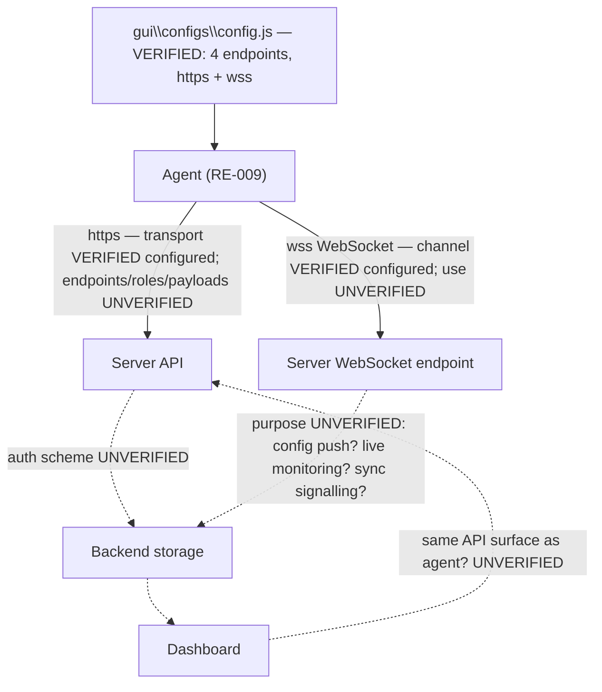

# RE-006 — API Flow

## 1. Purpose

This document records what is understood about the **API contracts between the Agent and the EmpMonitor server**, and between the **Dashboard and the server**, including authentication. It is written for automation developers validating Layer 3 (Synchronization) evidence — the layer this framework currently has the least evidence-collection capability for.

## 2. Scope

Covers the network-facing contract layer: endpoints, request/response shape, and authentication, for both Agent↔server and Dashboard↔server communication. Does **not** cover:

- The local-side queueing/retry logic that decides *when* to call these APIs — see [RE-004](RE-004_Upload_Pipeline.md)
- Offline behavior when no API call can succeed — see [RE-012](RE-012_Offline_Synchronization.md)
- Dashboard UI rendering of the results — that is Layer 4, out of scope for this Layer 3 document

## 3. Architecture

**The first concrete architectural fact for this document is now on record, from configuration rather than from traffic:** `config.js` contains **4 endpoint URLs using two schemes — `https` and `wss`** (§6). This establishes that the agent's server communication is **not** a single HTTP request/response surface: **two transports are configured**, one request/response and one persistent bidirectional socket.

| Property | Status | Detail |
|---|---|---|
| Endpoints are configuration-driven, not hardcoded | **Verified** | 4 URLs in `<install root>\gui\configs\config.js` (324 B / 9 lines) |
| `https` transport configured | **Verified** | Scheme present among the 4 endpoints |
| **`wss` (WebSocket) transport configured** | **Verified** (configured); channel **use** **Partially Verified** | Answers an explicit open question in §16 and in the [Synchronization Monitor design §12](../docs/design/Synchronization_Monitor.md) |
| Endpoint URLs, hosts, paths | **Not recorded** | Deployment-specific; deliberately excluded from documentation (§6.0) |
| Which endpoint serves which purpose | **Hypothesis** | Upload, configuration delivery, authentication, real-time signalling — no endpoint's role was determined |
| Authentication scheme | **Hypothesis** | Unobserved. `empm.ini` has an `[auth]` section with `crypto_password` and `email` keys (values never read — see [RE-005](RE-005_Configuration_Loading.md)), so credential material exists **locally**; how it is presented to the server is unknown |
| Request/response payload shapes, methods, status conventions | **Hypothesis** | Entirely unobserved |

Two corroborating observations from elsewhere strengthen — but do not verify — the WebSocket finding: `Qt5WebSockets.dll` ships in the install tree ([RE-009](RE-009_Runtime_Components.md)), giving the agent a WebSocket implementation; and the agent is a Qt application, making Qt's WebSocket stack the plausible client. Neither is observation of a connection.

## 4. Sequence / Flow

> **TODO:** no request, response, or connection was observed. **No network capture was performed** — the `wss` and `https` facts come from reading a configuration file, not traffic. The diagram marks what is configured (solid) against what remains assumed (dotted).

> **Still TODO:** whether the Agent-facing and Dashboard-facing APIs are the same surface, what authentication each uses, and what the `wss` channel actually carries.

## 5. Known Behaviour (unverified)

- [HB-001 §3](../docs/handbook/HB-001_Product_Overview.md) lists "APIs — Server-side interfaces the agent and dashboard communicate through" as part of the EmpMonitor ecosystem.
- [HB-002 §4](../docs/handbook/HB-002_Product_Architecture.md) lists "APIs" with role "Agent↔server and dashboard↔server contract" and validation surface "Requests/responses, auth."
- [HB-002 §6](../docs/handbook/HB-002_Product_Architecture.md) maps "Authentication, upload queue, APIs, retry logic, offline sync" to Evidence Layer 3.
- [Validation Standard §4](../docs/ADS/validation_standard.md) records "API request/response" as a Layer 3 evidence source with the collector now marked **designed but not yet implemented** (see [Synchronization Monitor Design](../docs/design/Synchronization_Monitor.md)), and cross-references this as a known gap (see §12 below).

No specific endpoint URL, HTTP method, request/response payload, authentication scheme (token, session, certificate, or otherwise), or versioning convention is currently known for either the Agent↔server or Dashboard↔server contract. **The transports are now known (§6); the contract is not.**

## 6. Verified Behaviour (with evidence + version)

All claims in this section derive from a single observation pass on **2026-07-30** against one real installation. The [README §6.1](README.md) metadata fields common to every claim are stated once here rather than repeated per row:

| Field | Value |
|---|---|
| `Verified On` | 2026-07-30 |
| `Verified Against Version` | EmpMonitor `gui` components **3.7.4** / `service` component **3.7.3**; host Windows 10 Pro build 10.0.19045 x64 |
| `Verification Method` | Observed by `EM000_EnvironmentValidator` plugin run plus direct filesystem inspection |
| `Reviewer` | TODO — reviewer sign-off ([README §7](README.md) step 4) not yet performed |
| `Last Review Date` | 2026-07-30 |

> **Scope limit — severe for this document.** **No network traffic was captured. No connection, request, or response was observed.** Every claim below is derived from **reading a configuration file on disk**. This is genuine evidence about what is *configured*; it is not evidence about what the agent *does*. The Layer 3 collector gap (§15) is unchanged.

### 6.0 Endpoint URLs Are Not Recorded

The **4 endpoint URLs found in `config.js` are deliberately not reproduced** in this or any other document. They are deployment-specific (per-tenant/per-region server addresses), and pinning one installation's URLs into a knowledge base would be both misleading for other deployments and an unnecessary disclosure. Automation must **discover endpoints by reading `config.js` at runtime** and must assert on **scheme and count**, not on URL values. The same constraint applies to `[auth]` values in `empm.ini` ([RE-005 §6.0](RE-005_Configuration_Loading.md)).

### 6.1 Configured Endpoints and Transports

| # | Claim | Status | Evidence Source |
|---|---|---|---|
| 6-V1 | `config.js` exists at `<install root>\gui\configs\config.js`, is **324 bytes / 9 lines**, and contains **exactly 4 endpoint URLs**. | **Verified** | EV-001, EV-010 |
| 6-V2 | Those endpoints use **two schemes: `https` and `wss`**. | **Verified** | EV-001 |
| 6-V3 | Server endpoints are therefore **configuration-driven, not hardcoded** — resolving a question this document previously listed as open. | **Verified** | EV-001 |
| 6-V4 | All configured transport is **encrypted** (`https` and `wss`, not `http`/`ws`). | **Verified** (as configured) | EV-001 |
| 6-V5 | The **count** of 4 endpoints, and that at 324 bytes over 9 lines the file carries little beyond those endpoints — i.e. `config.js` is an endpoint-configuration file, not a general settings file. | **Verified** (size/count); the "endpoints only" reading **Partially Verified** — the full key list was not recorded | EV-001 |
| 6-V6 | Which of the 4 endpoints serves upload, configuration delivery, authentication, or real-time signalling. | **Hypothesis** — no endpoint role was determined | — |
| 6-V7 | Whether the Agent-facing and Dashboard-facing APIs are the same surface. | **Hypothesis** — unchanged; `config.js` is agent-side only | — |

### 6.2 The WebSocket Channel

This resolves — to **Partially Verified** — an explicit open question in §16 below and in the [Synchronization Monitor design §12](../docs/design/Synchronization_Monitor.md), both of which asked whether a WebSocket channel exists at all.

| # | Claim | Status | Evidence Source |
|---|---|---|---|
| 6-V8 | **A WebSocket channel exists**, evidenced by at least one **`wss`**-scheme endpoint in `config.js`. | **Partially Verified** | EV-001 |
| 6-V9 | Corroborating: **`Qt5WebSockets.dll`** ships in the install tree, so the agent carries a WebSocket implementation. | **Verified** (the DLL is present) | EV-010 |
| 6-V10 | That the agent **actually opens and uses** the WebSocket connection at runtime. | **Hypothesis** — **no connection or traffic was observed**; a configured endpoint may be unused, legacy, or feature-gated | — |
| 6-V11 | What the channel carries — live monitoring streams, dashboard-pushed configuration, sync/command signalling, heartbeats, or several of these. | **Hypothesis** | — |
| 6-V12 | Whether the WebSocket channel is the delivery mechanism for dashboard-authored settings (cf. the `from_remote\` key prefix in `empm.ini`, [RE-005](RE-005_Configuration_Loading.md) 5-V8). | **Hypothesis** — a strong lead, wholly unobserved | — |
| 6-V13 | Whether a dropped WebSocket is the agent's connectivity-loss detection signal (see [RE-012](RE-012_Offline_Synchronization.md)). | **Hypothesis** | — |
| 6-V14 | WebSocket frame format, subprotocol, authentication on upgrade, or reconnection/backoff behaviour. | **Hypothesis** — entirely unobserved | — |

**Why Partially Verified and not Verified.** The `wss` scheme's presence is unambiguous: a WebSocket endpoint is configured, and the agent ships a WebSocket library. But **existence in configuration is not existence in operation**. Per [README §7](README.md), promotion requires observing the channel in use — a connection, an upgrade handshake, or frames. That requires the network collector this document has always lacked (§15).

**Why it matters.** The [Synchronization Monitor design](../docs/design/Synchronization_Monitor.md) treats "WebSocket lifecycle (if confirmed)" as a conditional sub-metric, and [Evidence Catalog EV-007](../docs/Evidence_Catalog.md) carries the same conditional. That condition is now **partially discharged**: the monitor's observation strategy should assume a WebSocket channel is present and plan to observe it, rather than treating its existence as speculative.

### 6.3 What Was Not Established

Recorded so that a transport-level finding is not mistaken for a contract-level one:

- **No** endpoint path, HTTP method, payload schema, status-code convention, or API version.
- **No** authentication scheme. `empm.ini` carries an `[auth]` section (`crypto_password`, `email` — **values never read**), so credential material is stored locally, but its presentation to the server is unobserved.
- **No** request, response, or error observed — §12's failure modes remain entirely speculative.
- **No** evidence about the Dashboard↔server contract, which `config.js` says nothing about.

## 7. Configuration Inputs

**Verified — this section's question is answered.** API endpoints **are** configurable: 4 URLs live in `<install root>\gui\configs\config.js` (6-V1, 6-V3). They are **not** hardcoded.

| Aspect | Status |
|---|---|
| Endpoints configurable via `config.js` | **Verified** (6-V1, 6-V3) |
| Endpoint values | **Not recorded** — deployment-specific (§6.0) |
| `config_debug.js` / `config_release.js` present alongside | **Verified** (presence); whether they carry alternative endpoints that could replace `config.js` at update time is **Hypothesis** — see [RE-005](RE-005_Configuration_Loading.md) 5-V18 |
| Endpoint override in `empm.ini` | **Hypothesis** — no endpoint key was observed in the root file's verified sections, but the ~4.7 KB tenant `empm.ini` was not fully enumerated |
| Auth material location | **Verified** — `[auth] crypto_password`, `email` exist in `empm.ini`; **values never read** |

See [RE-005](RE-005_Configuration_Loading.md).

## 8. Known Files

Partially applicable now. Client-side files bearing on the API contract:

| Path | Relevance | Status |
|---|---|---|
| `C:\Program Files\EmpMonitor\EmpMonitor\gui\configs\config.js` | Holds the 4 endpoint URLs (`https` + `wss`). 324 B / 9 lines | **Verified** |
| `...\gui\configs\config_debug.js`, `config_release.js` | May hold alternative endpoints | **Verified** (presence); contents not compared |
| `%APPDATA%\screen\empm.ini` → `[auth]` | Local credential material: `crypto_password`, `email` (**values never read**) | **Verified** (keys exist) |
| `%APPDATA%\screen\<TENANT>\empm.ini` | ~4.7 KB, likely remote-synced; may contain API-related state | **Verified** (presence); keys not enumerated |
| `...\gui\Qt5WebSockets.dll`, `Qt5Network.dll` | The agent's HTTP/WebSocket client implementation | **Verified** (presence) |

**No cached-token or session file was identified.** Note the install root is **double-nested** (`EmpMonitor\EmpMonitor`), correcting an earlier hypothesis — see [RE-010](RE-010_Folder_Structure.md).

## 9. Known APIs

**Transport known; contract unknown.** What can be stated:

- **4 endpoints**, configured in `config.js`, across **`https`** and **`wss`** schemes (6-V1, 6-V2). All encrypted (6-V4).
- **A WebSocket channel is configured** (6-V8, **Partially Verified**) and the agent ships `Qt5WebSockets.dll` (6-V9).
- **URLs are not recorded here** by policy (§6.0) — discover them from `config.js` at runtime.

Everything else in this section remains open: **no endpoint path, method, payload schema, status-code convention, versioning scheme, or authentication mechanism is confirmed**, for either the Agent↔server or Dashboard↔server contract. That the transports are now known narrows the problem — the collector must handle both request/response and long-lived socket observation — but does not begin to describe the contract.

## 10. Storage / SQLite

**Partially Verified — negative result.** The 28-table schema of `local_db20.db` was enumerated ([RE-007](RE-007_SQLite_Database.md)) and **no table name suggests auth-token, session, or last-sync-marker storage**. The closest candidate is `user_details`. Two API-adjacent structures do appear:

- The six **`pending_*`** tables — the apparent upload queue ([RE-012](RE-012_Offline_Synchronization.md)), i.e. what *feeds* the API rather than API state itself.
- `event_data` / `sent_event_data` — an apparent sent/unsent split, so *some* transmission state is tracked in the database (**Partially Verified**, from naming only).

This is a **negative inference from table names alone** — no columns and no row contents were read (privacy: the database holds captured monitoring data, [RE-007 §6.0](RE-007_SQLite_Database.md)) — so a token stored in a column of an existing table cannot be ruled out.

## 11. Logs

> **TODO / Hypothesis:** whether API calls are logged client-side is **still unknown** — no log contents were read. What is now known is **where to look** ([RE-008](RE-008_Logging_System.md)): the per-user `%APPDATA%\screen\empm\logs\<date>.txt`; the service-side `EMP_SERVICE.log` / `EMP_SERVICE2.txt` / `CurrentStatus.txt` in the install tree; and the database-resident `tbl_exception_log2`, which by name would be the natural home for failed-request errors. All **Hypothesis** as to content.

## 12. Failure Modes

**None observed** — every item below is **Hypothesis**. The transport findings add a few that were not previously visible:

- Authentication failure or credential expiry not handled gracefully.
- API errors not surfaced anywhere observable; server-side rejection silently dropped.
- Version skew between Agent and server API contract.
- **WebSocket connection never established** despite being configured (6-V10) — the agent may fall back to `https` polling, or may silently lose whatever the channel provides. Indistinguishable from healthy operation today.
- **WebSocket established then dropped without reconnection**, so real-time features stall while HTTPS upload continues — a partial-failure mode that no current evidence source would detect.
- **`config.js` overwritten at update time** by `config_debug.js`/`config_release.js`, silently repointing all 4 endpoints ([RE-005](RE-005_Configuration_Loading.md) 5-V18).
- Endpoint reachable but TLS validation failing; all configured transport is encrypted (6-V4), so certificate problems would break every channel at once.
- **Framework failure modes:** asserting on hardcoded endpoint URLs (they are per-deployment, §6.0); or leaking endpoint URLs or `[auth]` values into reports.

## 13. Recovery

> **TODO / Hypothesis:** unknown. No API error was induced or observed, so retry, backoff and re-authentication behaviour are all unestablished. The transport finding adds a second dimension the section previously lacked: recovery may differ between the **request/response** (`https`) path and the **persistent socket** (`wss`) path — a WebSocket needs reconnection logic that an HTTPS retry does not, and neither was observed. See [RE-004](RE-004_Upload_Pipeline.md) and [RE-011](RE-011_Recovery_Behaviour.md).

## 14. Troubleshooting

Limited but real guidance, all of it configuration-side — **nothing here inspects traffic**, because no collector exists (§15).

1. **Read `config.js` to discover endpoints:** `C:\Program Files\EmpMonitor\EmpMonitor\gui\configs\config.js` (use the **double-nested** root). Expect roughly 324 bytes / 9 lines with **4 URLs across `https` and `wss`**.
2. **Assert on scheme and count, never on URL values** (§6.0). A missing `wss` entry, or a count other than 4, is a signal worth capturing — though with one observation on record it warrants investigation, not a defect verdict.
3. **Flag any `http://` or `ws://` endpoint** as a downgrade from what was observed (6-V4).
4. **Never emit endpoint URLs or `[auth]` values** into reports, logs, or evidence artifacts.
5. **Confirm `Qt5WebSockets.dll` and `Qt5Network.dll` are present** — their absence would contradict the configured transports.
6. **For upload-path problems, use the queue instead of the network.** `pending_*` row counts in SQLite are the only sync signal available today ([RE-012](RE-012_Offline_Synchronization.md) §14). Draining counts indicate rows were consumed locally — **not** that the server accepted them.
7. **Check `tbl_exception_log2`'s row count** as a possible failed-request indicator (count only) — **Hypothesis** as to content.
8. **Do not assert that a WebSocket connection is active.** No connection has ever been observed (6-V10); only that one is configured.

A passing check here proves endpoints are configured with the expected shape. It proves nothing about whether the agent can reach the server.

## 15. Evidence Sources for Automation

Primary Evidence Layer for this document: **Layer 3 — Synchronization** (per [Validation Standard §3](../docs/ADS/validation_standard.md)).

**Known gap:** per [Validation Standard §12](../docs/ADS/validation_standard.md), the API/network evidence collector is now designed (see [Synchronization Monitor Design](../docs/design/Synchronization_Monitor.md)) but not yet implemented anywhere in the framework scaffold. This means Layer 3 cannot be independently evidenced today for *any* feature, and sync defects risk being misattributed to Layer 2 or Layer 4 evidence in the interim. This document does not restate the detail of that gap entry — see the Validation Standard directly — but flags it here because it is the single most consequential blocker to writing a Verified Behaviour section for API Flow.

| Evidence Source | Layer | Collector | Notes |
|---|---|---|---|
| API request/response | 3 | Synchronization Monitor (designed — not yet implemented) | Known gap, see [Validation Standard §12](../docs/ADS/validation_standard.md) |
| Dashboard settings state | 1, 4 | `framework/validators/dashboard.py` | Indirect corroboration only — observes effect, not the API contract itself |
| **Endpoint configuration (`config.js`)** | **1** | `framework/validators/configuration.py` (EV-001) | **New** — the only source that has yielded any API fact to date (§6). Configuration-side: reveals what is configured, never what is transmitted |
| Upload queue depth (`pending_*` row counts) | 3 | `framework/monitors/sqlite_monitor.py` (EV-003) | Indirect: evidences local queue drain, **not** server acceptance. See [RE-012](RE-012_Offline_Synchronization.md) 12-V15 |

**Requirement this document places on the Synchronization Monitor:** its observation strategy must cover **both** transports — request/response over `https` **and** a long-lived `wss` socket (6-V8). WebSocket observation is a materially different problem from HTTP capture (upgrade handshake, framing, connection lifetime), and per 6-V8 the channel's existence is no longer speculative. The design's conditional "WebSocket lifecycle (if confirmed)" should be treated as **confirmed in configuration**.

## 16. Open Questions / TODO

**Answered by the 2026-07-30 pass** (see §6):

- ~~Is the base URL / host convention configurable?~~ → **Yes.** 4 endpoints in `config.js`, `https` + `wss`. **Verified** (6-V1, 6-V3). URL values not recorded by policy (§6.0).
- ~~Does a WebSocket channel exist?~~ → **A `wss` endpoint is configured and the agent ships `Qt5WebSockets.dll`. Partially Verified** (6-V8, 6-V9). Its **use** is still unobserved (6-V10).

**Still open:**

- **What authentication scheme is used** (bearer token, session cookie, client certificate, API key, other)? Is it the same for Agent and Dashboard? Local credential material exists (`[auth] crypto_password`, `email`) but its presentation to the server is unobserved.
- **Which of the 4 endpoints does what** (6-V6) — upload/sync (see [RE-004](RE-004_Upload_Pipeline.md)) versus configuration delivery (see [RE-005](RE-005_Configuration_Loading.md)) versus authentication versus real-time signalling?
- **Is the WebSocket connection actually opened, and what does it carry** (6-V10, 6-V11)? Is it the dashboard-settings delivery path, given the `from_remote\` key prefix (6-V12)? Is a socket drop the connectivity-loss signal (6-V13)?
- What are the WebSocket subprotocol, upgrade authentication, and reconnection/backoff behaviour (6-V14)?
- Are the Agent-facing and Dashboard-facing APIs the same surface (6-V7)?
- Is there an API version negotiated or pinned, and how are breaking changes handled?
- What does an error response look like, and how does the client react (§13)?
- What are the request/response payload shapes and HTTP methods?
- Do `config_debug.js` / `config_release.js` contain different endpoints, and can an update repoint the agent (§7)?
- Is any API state (token, last-sync marker) persisted locally? No table name suggests it (§10), and no token file was found.
- What would the [Synchronization Monitor](../docs/design/Synchronization_Monitor.md) need to capture to satisfy Layer 3 corroboration per [Validation Standard §5](../docs/ADS/validation_standard.md)? Its §6 observation-strategy spike remains the open decision — now with the added requirement of covering a WebSocket channel.

## 17. Future Expansion

This document is no longer entirely TODO, but its central subject — the contract — still is. The near-term work splits by whether it needs a collector:

**Available now, without a network collector:**

- Enumerate `config.js` fully (keys, not values) to attribute roles to the 4 endpoints where naming permits, resolving part of 6-V6.
- Diff `config.js` against `config_debug.js` / `config_release.js`, reporting shape only.
- Enumerate the ~4.7 KB tenant `empm.ini` for API-related keys, with `[auth]`-style redaction throughout.
- Read column definitions (not values) of `event_data` / `sent_event_data` to see whether transmission state is tracked locally.
- Read log contents at the four known locations for API/connection entries (§11).

**Requires the Synchronization Monitor:**

- Observe an `https` request/response pair to establish method, path, payload shape and auth.
- **Observe the WebSocket upgrade and frames** — the experiment that promotes 6-V8 to **Verified** and answers 6-V11 through 6-V14.
- Induce error responses to populate §12 and §13.

This document should be substantially rewritten once the collector exists and a first traffic observation is made; §6 will then gain contract-level content for the first time.

## 18. Version Notes

| Version observed | Date | Notes |
|---|---|---|
| `gui` components **3.7.4**, `service` component **3.7.3** | 2026-07-30 | First version ever verified against for this subject. Host: Windows 10 Pro build 10.0.19045 x64. Established 4 configured endpoints over `https` + `wss`, and the existence of a configured WebSocket channel. **No traffic was captured at this version** — no contract detail is verified. |

All §6 claims are scoped to the row above. Statements outside §6 remain unversioned. Per [README §7](README.md) step 6, endpoint count and schemes must be re-checked on version change.

## 19. Cross References

- [Reverse Engineering Knowledge Base — Index](README.md)
- [HB-001 — Product Overview](../docs/handbook/HB-001_Product_Overview.md)
- [HB-002 — Product Architecture](../docs/handbook/HB-002_Product_Architecture.md)
- [Validation Standard](../docs/ADS/validation_standard.md)
- [RE-004 — Upload Pipeline](RE-004_Upload_Pipeline.md)
- [RE-005 — Configuration Loading](RE-005_Configuration_Loading.md)
- [RE-012 — Offline Synchronization](RE-012_Offline_Synchronization.md)
- [RE-007 — SQLite Database](RE-007_SQLite_Database.md) — no local API-state table observed
- [RE-008 — Logging System](RE-008_Logging_System.md) — where API errors would be logged
- [RE-009 — Runtime Components](RE-009_Runtime_Components.md) — `Qt5WebSockets.dll` / `Qt5Network.dll`
- [RE-010 — Folder Structure](RE-010_Folder_Structure.md) — `config.js` location
- [Evidence Catalog](../docs/Evidence_Catalog.md) — EV-001, EV-003, EV-010
- [Synchronization Monitor Design](../docs/design/Synchronization_Monitor.md) — must now plan for WebSocket observation
- [HB-005 — Component Inventory](../docs/handbook/HB-005_Component_Inventory.md)

---
**Document Status:** Draft — **first API facts recorded 2026-07-30** (gui 3.7.4 / service 3.7.3): 4 configured endpoints over `https` + `wss` in `config.js` (**Verified**), and a configured WebSocket channel (**Partially Verified** — configuration only, use unobserved). Endpoint URLs deliberately not recorded. **No traffic was captured; the contract itself remains unknown** and the absence of a network evidence collector is still the primary blocker. Reviewer sign-off outstanding.
**Owner:** TODO
**Last Updated:** 2026-07-30
