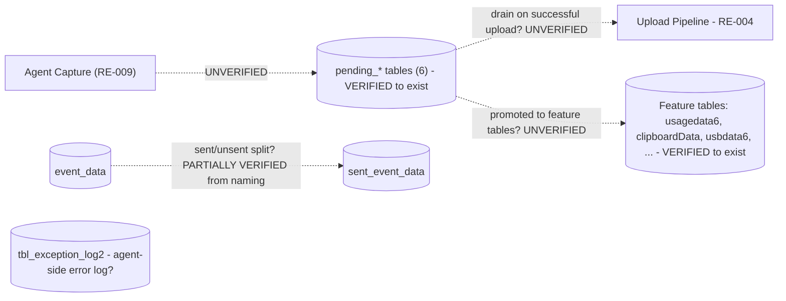

# RE-007 — SQLite Database

## 1. Purpose

This document records what is known and verified about the EmpMonitor Windows Agent's **local SQLite database** — its believed purpose, schema, and table contents — for use by automation developers building Layer 2 (Runtime) validation.

## 2. Scope

Covers the agent-side local SQLite database file(s) only: their believed location, schema, table/column contents, and how they relate to captures produced by the agent. Does **not** cover the automation framework's own reporting/evidence storage (see [Reporting Standard](../docs/ADS/reporting.md)), and does **not** cover server-side storage (see [RE-006](RE-006_API_Flow.md)).

## 3. Architecture

**The database exists and is now enumerated** (§6): a single SQLite file, `local_db20.db`, with **28 tables**, of which **9 held rows**. What the schema *reveals* architecturally:

- **The database is the agent's principal local store, but not its only one.** Flat-file persistence coexists with it: `print_block.json` / `.jsonl` and `print_detection.json` / `.jsonl` sit under `%APPDATA%\screen\empm\` while `PrintBlocking` and `PrintDetection` tables also exist. **Hypothesis:** whether these duplicate, stage for, or are independent of the tables was not established.
- **The schema is organised by feature, with a queue layer alongside it.** Roughly three groups are discernible from table names: feature-data tables (`usagedata6`, `clipboardData`, `usbdata6`, `bluetoothdata`, mail tables, …), six **`pending_*`** tables, and support tables (`user_details`, `tbl_exception_log2`).
- **A queue appears to be modelled in the database itself.** The six `pending_*` tables, plus the `event_data` / `sent_event_data` pair, suggest unsent data is held in dedicated tables rather than in an on-disk staging folder. This is the document's most consequential finding — see §6.3 — and it aligns with the negative result in [RE-010](RE-010_Folder_Structure.md), where **no upload-staging or failed-capture folder was found**.
- **The `6` / `20` / `2` suffixes** (`usagedata6`, `local_db20.db`, `tbl_exception_log2`) look like schema-generation markers. **Hypothesis** — no migration history was inspected. If so, automation must expect suffixes to change between releases.

Which process owns the connection is **unverified**; `Qt5Sql.dll` is present in the install tree, making Qt's SQL layer the likely access path (**Hypothesis** — see [RE-009](RE-009_Runtime_Components.md)).

## 4. Sequence / Flow

> **TODO:** the write/read *sequence* remains unverified. The 2026-07-30 pass read **table names and row counts only** — no row contents, no writes, no observation over time. The flow below is inferred from **table naming**, which is suggestive but is not observation of behaviour.

> Table nodes are **Verified to exist**. **Every edge is Hypothesis** — no row was observed moving, being inserted, or being deleted.

## 5. Known Behaviour (unverified)

- HB-001 and HB-002 identify "Local SQLite Database" as a component of the EmpMonitor ecosystem used for agent-side local persistence (stated by project charter, not independently confirmed). **Now confirmed to exist** (§6) — the charter statement was correct: `local_db20.db`, 28 tables.
- The Validation Standard ([validation_standard.md §4](../docs/ADS/validation_standard.md)) lists "SQLite contents" as a Layer 2 evidence source, implying stakeholders expect captures or activity data to be locally persisted in SQLite before/alongside upload. **Confirmed observable** — schema and row counts were read successfully. Note the privacy constraint in §6.0 on how far this source may be read.

## 6. Verified Behaviour (with evidence + version)

All claims in this section derive from a single observation pass on **2026-07-30** against one real installation. The [README §6.1](README.md) metadata fields common to every claim are stated once here rather than repeated per row:

| Field | Value |
|---|---|
| `Verified On` | 2026-07-30 |
| `Verified Against Version` | EmpMonitor `gui` components **3.7.4** / `service` component **3.7.3**; host Windows 10 Pro build 10.0.19045 x64 |
| `Verification Method` | Observed by `EM000_EnvironmentValidator` plugin run plus direct filesystem inspection |
| `Reviewer` | TODO — reviewer sign-off ([README §7](README.md) step 4) not yet performed |
| `Last Review Date` | 2026-07-30 |

> **Scope limit:** one host, one installation, one user profile, one point in time. Row counts are a single sample and describe *that endpoint's usage history*, not product behaviour.

### 6.0 Privacy Constraint — Read This First

**Only table names and row counts were read. No row contents were read, and none may be recorded.** This database holds captured employee monitoring data — screenshots, clipboard contents, browsing and application activity, email metadata and attachments. Consequences that bind all future work on this document:

- Automation may assert on **schema shape and row counts**. It must **not** extract, log, or store row values.
- Row-count deltas are the sanctioned way to evidence "data was captured" without reading what was captured.
- Any future need to read contents requires an explicit privacy decision recorded outside this document; it is not authorised by this document's existence.

### 6.1 Database File

| # | Claim | Status | Evidence Source |
|---|---|---|---|
| 7-V1 | The agent **does** use SQLite. A single database file, **`local_db20.db`**, was found at `%APPDATA%\screen\<TENANT>\empm\local_db20.db`, size **~1.18 MB**. | **Verified** | EV-003, EV-010 |
| 7-V2 | The path is **per-user and per-installation** — `<TENANT>` is a 7-character token that must be discovered at runtime, never hardcoded (see [RE-010](RE-010_Folder_Structure.md)). | **Verified** | EV-010 |
| 7-V3 | The file was readable (schema queryable) while the agent was running — no exclusive lock prevented reading table names and row counts. | **Verified** | EV-003 |
| 7-V4 | Whether it is the **only** database. Only this one was found, but no exhaustive filesystem-wide search for further `.db` files was performed. | **Partially Verified** | EV-010 |
| 7-V5 | Whether the file or any column is encrypted. It was readable as plain SQLite at schema level, so the **container** is not encrypted; **column-level** encryption cannot be ruled out, since no values were read (§6.0). | **Partially Verified** | EV-003 |

### 6.2 Schema — 28 Tables

**Verified:** exactly **28 tables** exist. Full list, alphabetically as observed:

`PrintBlocking`, `PrintDetection`, `PrivateIp`, `PublicIp`, `UploadBlocking`, `UploadDetection`, `UploadDetectionImage`, `bluetoothdata`, `clipboardData`, `clock_data6`, `data_consumption`, `download_history`, `event_data`, `inbound_emails`, `mail_attachment_data`, `mail_data`, `outbound_emails`, `pending_aduserproperties6`, `pending_bluetoothdata`, `pending_clipboardata`, `pending_screenshots6`, `pending_usagedata6`, `pending_usbdata6`, `sent_event_data`, `tbl_exception_log2`, `usagedata6`, `usbdata6`, `user_details`

| # | Claim | Status | Evidence Source |
|---|---|---|---|
| 7-V6 | The 28 table **names** above are exact and complete for this installation. | **Verified** | EV-003 |
| 7-V7 | **9 of the 28 tables held rows**; the remaining 19 were empty. | **Verified** | EV-003 |
| 7-V8 | **Columns, types, keys, indices and constraints were NOT read** for any table. The schema is verified only at table-name granularity. | **Verified** (as a statement of scope) | EV-003 |
| 7-V9 | Which table corresponds to which product feature. Mappings such as `clipboardData` → clipboard monitoring, `usbdata6` → USB monitoring, `mail_data`/`inbound_emails`/`outbound_emails` → email monitoring (cf. `EmailMonitorSvc.exe`, [RE-009](RE-009_Runtime_Components.md)), `download_history` → download monitoring, `PrivateIp`/`PublicIp` → network identity, `data_consumption` → bandwidth are **suggested by naming only**. | **Hypothesis** — no column or row inspected | — |
| 7-V10 | That the 19 empty tables correspond to features disabled or unused on this endpoint, rather than to dead schema. | **Hypothesis** — configuration was not correlated with row counts | — |
| 7-V11 | `tbl_exception_log2` appears to be an **agent-side error/exception log table** — i.e. the agent logs some errors to the database, not only to files. | **Partially Verified** — the name is explicit, but the table's contents were not read and no error was correlated with it. Cross-referenced in [RE-008](RE-008_Logging_System.md) | EV-003 |
| 7-V12 | `UploadBlocking` / `UploadDetection` / `UploadDetectionImage` and `PrintBlocking` / `PrintDetection` relate to blocking/detection *features* (file-upload and print control), and **not** to the agent's own capture-upload pipeline. Confusing `UploadDetection` with upload-queue state would be an easy and costly error. | **Partially Verified** — supported by the parallel `*Blocking`/`*Detection` naming, by the print flat-files under `%APPDATA%\screen\empm\`, and by the presence of the WinDivert interception driver ([RE-009](RE-009_Runtime_Components.md)); no contents read | EV-003, EV-010 |
| 7-V13 | The numeric suffixes (`6` in `usagedata6`, `20` in `local_db20.db`, `2` in `tbl_exception_log2`) are schema-version/generation markers that may change between releases. | **Hypothesis** | — |

### 6.3 The `pending_*` Tables — Upload Queue Location

This subsection answers a long-standing open question carried in [RE-004](RE-004_Upload_Pipeline.md), [RE-012](RE-012_Offline_Synchronization.md), [HB-001 §6](../docs/handbook/HB-001_Product_Overview.md) and [Validation Standard §4](../docs/ADS/validation_standard.md): **where does upload-queue state live?**

| # | Claim | Status | Evidence Source |
|---|---|---|---|
| 7-V14 | **Six `pending_*` tables exist:** `pending_screenshots6`, `pending_usagedata6`, `pending_usbdata6`, `pending_clipboardata`, `pending_aduserproperties6`, `pending_bluetoothdata`. | **Verified** | EV-003 |
| 7-V15 | **These tables ARE the upload queue** — i.e. the agent-side "Upload Queue" is implemented as per-data-type tables in the local SQLite database rather than as a file system staging folder. | **Partially Verified** | EV-003, EV-010 |
| 7-V16 | Each `pending_*` table pairs with a data type, and four of the six have a non-`pending` counterpart (`usagedata6`, `usbdata6`, `clipboardData`, `bluetoothdata`), suggesting a pending → committed progression. Note `pending_screenshots6` and `pending_aduserproperties6` have **no** non-pending counterpart — screenshots may never be stored locally once sent, or may be stored outside the database. | **Partially Verified** (pairing observed in names); the progression itself **Hypothesis** | EV-003 |
| 7-V17 | `event_data` and `sent_event_data` form a **sent/unsent split** for event data — a second, differently-named expression of the same queueing idea. | **Partially Verified** — from naming only | EV-003 |
| 7-V18 | Row lifecycle: whether rows are **deleted** on successful upload, **moved** to the counterpart table, or **flagged** by a status column. | **Hypothesis** — no column list was read (7-V8) and no upload was observed | — |
| 7-V19 | Whether queue depth is bounded (max rows/age) and what happens when a bound is hit. | **Hypothesis** | — |

**Why this is Partially Verified and not Verified.** The tables demonstrably exist and are named `pending_`. That they *function* as the upload queue is a **strong inference**, corroborated by a second, independent observation — [RE-010](RE-010_Folder_Structure.md) found **no** upload-staging or failed-capture folder on disk, which removes the main competing hypothesis. But no row was observed being enqueued, drained, or deleted, and the tables' columns were never read. Promotion to **Verified** requires observing queue drain across an offline→online transition; see [RE-012](RE-012_Offline_Synchronization.md) §17.

**Why it matters for automation.** `SELECT COUNT(*)` on the six `pending_*` tables is a **schema-only, privacy-safe** queue-depth probe: it evidences upload backlog without reading any captured content (§6.0). That makes EV-003 a viable Layer 3 queue-state source today, partially mitigating the missing Synchronization Monitor ([Validation Standard §12](../docs/ADS/validation_standard.md)).

### 6.4 Populated Tables

| # | Claim | Status | Evidence Source |
|---|---|---|---|
| 7-V20 | **9 of 28 tables were populated; 19 were empty.** Which specific 9 held rows, and their counts, are **run evidence** and are not fixed in this document — they reflect one endpoint's usage history, not product behaviour, and would mislead if read as expected values. | **Verified** (the 9/28 split) | EV-003 |
| 7-V21 | That any particular table being empty indicates a defect. **It does not** — emptiness is expected for unused features (7-V10). A row count must never be used as a pass/fail criterion without a per-feature baseline that does not yet exist. | **Hypothesis** (explicitly rejected as a basis for assertions) | — |

### 6.5 Observed Tables Mapped to Candidate Features

Added during the feature-profiling pass on **2026-07-30**. This subsection refines 7-V9 (previously "Hypothesis — suggested by naming only") for the subset of tables that a **feature profile in `config/features.json`** actually claims, and it is deliberately narrower than a naming-based guess: each row below is claimed by a profile documented in [HB-006](../docs/handbook/HB-006_Feature_Specifications.md), and nothing else has been added.

| Field | Value |
|---|---|
| `Verified On` | 2026-07-30 |
| `Verified Against Version` | EmpMonitor `gui` **3.7.4** / `service` **3.7.3**, Windows 10 Pro 19045 |
| `Evidence Source` | **EV-003** (SQLite schema — table names and row counts only) |
| `Verification Method` | Observed by `EM000`/`EM001` plugin runs plus direct inspection |
| `Reviewer` | TODO — sign-off outstanding |
| `Last Review Date` | 2026-07-30 |

**Read the status column carefully.** In every row the *table's existence* is **Verified** (7-V6) while its *attribution to a feature* is **inferred**. **No row is better than Partially Verified**, because no capture action was correlated with any table, no column was read, and no row content may be read (§6.0).

| Table(s) | Candidate feature | Status of the attribution |
|---|---|---|
| `pending_screenshots6` | **Screenshots** (`EM010_Screenshots`) | **Partially Verified** — table exists and was empty; no screenshot capture or upload was observed |
| `usagedata6`, `pending_usagedata6` | **Application Usage** (`EM017`) and **Website Usage** (`EM018`) | **Partially Verified** — `usagedata6` was populated; the pair is claimed by **two** profiles, so a delta cannot attribute activity to either one |
| `usbdata6`, `pending_usbdata6` | **USB Detection** (`EM019`) | **Partially Verified** — both tables exist, both empty; no USB event was observed |
| `clock_data6` | **Attendance** (`EM013`) and **Idle Time** (`EM014`) | **Partially Verified** — table exists with columns `type`/`mode`/`status`/`reason`/`startDate`/`endDate`; claimed by **two** profiles, so a delta cannot separate attendance from idle time |
| `inbound_emails`, `outbound_emails`, `mail_data`, `mail_attachment_data` | **Email Monitoring** (`EM023`) | **Partially Verified** as an attribution — but this is the **strongest** case in the table: it is corroborated independently by `EmailMonitorSvc.exe` running with six mail-protocol listeners and by observed uploads to `save-email-monitoring-log`, which is why the *feature* is profiled **Verified** while the table-to-feature mapping alone remains Partially Verified |
| `clipboardData` | **clipboard capture** — **NOT keystrokes** | **Partially Verified**. Recorded as an explicit warning: `clipboardData` holds clipboard content. **It must not be attributed to keystroke logging** (`EM016_Keystrokes`), which has **no** table at all |
| `bluetoothdata` (with `pending_bluetoothdata`) | **Bluetooth** monitoring | **Partially Verified** — no Bluetooth feature is profiled in `config/features.json`, so this table is currently claimed by no plugin |
| `PrintBlocking`, `PrintDetection` | **print monitoring** (blocking and detection) | **Partially Verified** — corroborated by the `print_*.json`/`.jsonl` flat files in the same data tree (§8); no print feature is profiled, so no plugin claims these either |
| `download_history` | **downloads**, profiled under **Website Usage** (`EM018`) | **Partially Verified** — name and profile agree; no download was observed |

#### No table was found for five profiled features

Stated explicitly, because a missing table is the single most useful negative result this schema offers:

**No table corresponds to — keystrokes, webcam, face detection, productivity, or timesheet.**

| Feature | Consequence |
|---|---|
| `EM016_Keystrokes` | No table, no config key, no log pattern. Whether the feature exists in this build is **unknown**. `clipboardData` is not a substitute. |
| `EM020_Webcam` | No table, process, key or log pattern identified. |
| `EM021_FaceDetection` | No artifact identified; presumed to depend on webcam capture. |
| `EM022_Productivity` | No dedicated table; profiled against the shared `usagedata6`. Plausibly a dashboard-side classification rather than an agent-side capture. |
| `EM015_Timesheet` | No dedicated table; profiled against the shared `clock_data6` and `usagedata6`. Plausibly a dashboard-side aggregation. |

Two things follow, and neither is a defect finding:

1. **Absence of a table is not absence of a feature.** Screen recordings have no table either (§10) while `esr.exe` demonstrably runs, so this schema is known to under-represent at least one capture path. Data may be held in flat files, in memory, or in a table whose name does not suggest its contents.
2. **Shared tables cannot carry per-feature conclusions.** `usagedata6` is claimed by three profiles and `clock_data6` by two. A row-count delta on a shared table evidences *that something was captured*, never *which feature captured it* — and per §6.0 the contents that would disambiguate it may not be read. Per-feature attribution therefore needs a column-level read (names only) or correlation with a deliberately induced single action (§17), not a bigger count.

## 7. Configuration Inputs

**Partially Verified.** The database's *location* is determined by the per-user data root and the tenant folder (7-V2), neither of which was found to be configuration-driven: no key observed in `empm.ini`'s verified sections sets a path, and `config.js` (324 B, endpoints only) does not either. See [RE-005](RE-005_Configuration_Loading.md).

- Whether database **retention/size limits** are configurable: **Hypothesis**. No such key was observed, and the ~1.18 MB file size gives no evidence either way.
- Whether the file **name** `local_db20.db` is fixed or version-derived: **Hypothesis** (7-V13).
- Conversely, **no configuration appears to be stored in the database** — no table name suggests settings storage, the closest being `user_details`. Recorded as a negative inference from names only in [RE-005 §10](RE-005_Configuration_Loading.md).

## 8. Known Files

**Verified** (metadata block as §6).

| Path | Kind | Observed size |
|---|---|---|
| `%APPDATA%\screen\<TENANT>\empm\local_db20.db` | SQLite database — 28 tables | ~1.18 MB |

Where `<TENANT>` is a **7-character per-installation token that must be discovered at runtime** (7-V2). No sidecar `-wal` or `-shm` file is recorded here — their presence was not noted during the pass, so the journal mode is unknown.

Related **flat-file** persistence in the same data tree, which may overlap with the `PrintBlocking` / `PrintDetection` tables (**Hypothesis**): `%APPDATA%\screen\empm\print_block.json`, `print_block.jsonl`, `print_detection.json`, `print_detection.jsonl`. See [RE-010](RE-010_Folder_Structure.md).

## 9. Known APIs

Not applicable to this subject — the SQLite database is local, endpoint-side storage; it is not an API surface. See [RE-006](RE-006_API_Flow.md) for API contracts.

## 10. Storage / SQLite

Consolidated status of the five items this section previously listed as unknown:

| Item | Status | Detail |
|---|---|---|
| Database file name(s) and count | **Verified** / **Partially Verified** | One file, `local_db20.db`, ~1.18 MB (7-V1). That it is the *only* database is Partially Verified — no exhaustive search was made (7-V4). |
| Schema: table names | **Verified** | Exactly 28 tables, listed in §6.2 (7-V6). |
| Schema: columns, types, keys, indices | **Not established** | **Never read** (7-V8). This is the largest remaining gap in this document. |
| Table-to-capture-type mapping | **Hypothesis** in general (7-V9); **Partially Verified** for the nine table groups claimed by a feature profile (§6.5) | Suggested by naming only. §6.5 maps the profiled subset and records the two traps: `clipboardData` is **not** keystrokes, and shared tables (`usagedata6` ×3 profiles, `clock_data6` ×2) cannot carry per-feature conclusions. **No table exists for keystrokes, webcam, face detection, productivity or timesheet.** Note `pending_screenshots6` is the only screenshot-named table; no table name suggests **screen recordings** at all — where recordings are persisted is an open question (cf. `esr.exe`, [RE-009](RE-009_Runtime_Components.md)). |
| Row lifecycle | **Hypothesis** | Not observed (7-V18). The `pending_*` and `event_data`/`sent_event_data` naming implies a queue/committed split (§6.3) but no transition was seen. |
| Encryption / access restriction | **Partially Verified** | Container not encrypted — schema was readable while the agent ran (7-V3, 7-V5). Column-level encryption not ruled out. |

The **upload-queue location** finding (§6.3) is the principal storage result: queue state appears to live **in this database**, in six `pending_*` tables, rather than in a file system staging area — a conclusion supported by the absence of any staging folder in [RE-010](RE-010_Folder_Structure.md).

## 11. Logs

Not a primary section for this subject, with one substantive exception now on record: **`tbl_exception_log2` appears to be an agent-side error/exception log stored in the database rather than in a file** (7-V11, **Partially Verified**). If confirmed, agent error history is split across at least two media — log files and this table — and log-file inspection alone would be an incomplete error picture. Cross-referenced in [RE-008](RE-008_Logging_System.md).

Whether database operations themselves (opens, writes, corruption) are logged to files is unestablished; no log contents were read.

## 12. Failure Modes

**None observed** — every item below is **Hypothesis**, now stated against the real schema. The first three are *framework* failure modes:

- **Tenant token hardcoded**, so the database path fails to resolve on any other installation (7-V2).
- **Row contents read** in violation of §6.0, leaking captured monitoring data into reports.
- **Row count used as a pass/fail criterion** without a baseline, producing false failures on tables that are legitimately empty (7-V21) — 19 of 28 were empty on a healthy endpoint.
- **`UploadDetection` mistaken for upload-queue state** (7-V12); it appears to concern the file-upload *blocking feature*, not the agent's own uploads.
- Database file missing, or present but with an unexpected tenant path.
- Database locked by the agent when automation attempts access (not encountered — schema reads succeeded while running, 7-V3 — but write-path or long-read contention is untested).
- Database corrupted; unknown whether the agent detects or repairs this (§13).
- Table set differs from the 28 recorded, or numeric suffixes change after an update (7-V13) — a schema assertion pinned to `usagedata6` would break.
- **`pending_*` tables growing without draining** — the signature of a stalled upload pipeline, and now the most directly checkable sync-failure symptom (§6.3, [RE-012](RE-012_Offline_Synchronization.md)).
- `pending_*` rows never written despite capture occurring — the opposite failure, indistinguishable from "no activity" without a baseline.
- `tbl_exception_log2` accumulating rows, indicating internal agent errors that are otherwise invisible.

## 13. Recovery

> **TODO / Hypothesis:** unknown and untested — the database was not deleted, locked, or corrupted during the 2026-07-30 pass, and no write was attempted. Whether the agent recreates a missing `local_db20.db`, rebuilds a corrupt one, or fails silently is unestablished. Two schema observations make the question sharper: if the `pending_*` tables are the upload queue (§6.3), then **database loss is queue loss** — any not-yet-uploaded capture would be unrecoverable, since no on-disk staging copy exists ([RE-010](RE-010_Folder_Structure.md)). That raises the stakes of this section considerably. See [RE-011](RE-011_Recovery_Behaviour.md).

## 14. Troubleshooting

Inspection recipe, now that location and schema are verified. Step 1 is a hard constraint, not advice.

1. **Read schema and counts only. Never row contents** (§6.0). This database holds employee monitoring data.
2. **Resolve the path by discovery:** enumerate `%APPDATA%\screen\` for the *monitored user*, take the 7-character entry that is not `empm`, then append `\empm\local_db20.db`. Never hardcode the token.
3. **Assert table presence against the 28-name list in §6.2.** Treat a differing set as a version-drift signal to investigate, not automatically a defect (7-V13).
4. **Queue-depth probe:** `SELECT COUNT(*)` across the six `pending_*` tables. Rising counts over successive samples with no drain is the clearest available indicator of a stalled upload path. Falling counts indicate drain. Both are privacy-safe.
5. **Check `tbl_exception_log2`'s row count** as an agent-internal-error indicator (count only).
6. **Do not treat empty tables as failures** — 19 of 28 were empty on a healthy endpoint (7-V20, 7-V21).
7. **Do not use `UploadBlocking`/`UploadDetection`/`UploadDetectionImage` as upload-pipeline evidence** — they appear to belong to the upload-*blocking* feature (7-V12).
8. **Do not expect a screen-recording table** — none is named; where recordings are persisted is unknown.
9. Reading schema while the agent runs was fine (7-V3); still open the database **read-only** to avoid any chance of write contention.

A passing schema check proves the store exists with the expected shape. It does **not** prove data flows through it — that requires row-count deltas over time, and ultimately the queue-drain observation in §17.

## 15. Evidence Sources for Automation

| Source | Layer | Collector | Status |
|---|---|---|---|
| SQLite file presence | 2 | `framework/monitors/sqlite_monitor.py` | Scaffolded, unimplemented (0 lines) |
| SQLite schema/contents | 2 | `framework/monitors/sqlite_monitor.py` | Scaffolded, unimplemented (0 lines) |
| Cross-layer corroboration | 2 | `framework/validators/evidence.py` | Scaffolded, unimplemented (0 lines) |

| Upload queue state (queue depth) | 3 | `framework/monitors/sqlite_monitor.py` | **New capability established by §6.3** — `pending_*` row counts serve EV-003 as a Layer 3 queue-state source. See [RE-012](RE-012_Offline_Synchronization.md) |

`framework/monitors/sqlite_monitor.py` and `framework/validators/evidence.py` exist in the repository scaffold but currently contain no implementation. They are the intended observation/validation points for this subject; no behaviour should be assumed from their names alone. The 2026-07-30 observations in §6 came from the `EM000_EnvironmentValidator` plugin plus direct filesystem inspection, not from `sqlite_monitor.py`.

**Requirements this document places on `framework/monitors/sqlite_monitor.py`:**

1. Discover the tenant folder at runtime; never accept a hardcoded token (7-V2).
2. Open the database **read-only**.
3. **Never read, log, or store row contents** — schema and aggregate counts only (§6.0). This is a privacy constraint, not a performance preference.
4. Expose `pending_*` row counts as a first-class queue-depth metric for Layer 3 (§6.3).
5. Report the table set against the 28-name baseline in §6.2, flagging drift rather than failing on it.

## 16. Open Questions / TODO

**Answered by the 2026-07-30 pass** (see §6):

- ~~Does the agent use SQLite at all, or is this an assumption from the project charter?~~ → **It does.** `local_db20.db`, 28 tables. **Verified.**
- ~~Where is the database file located on disk?~~ → `%APPDATA%\screen\<TENANT>\empm\local_db20.db`. **Verified.**
- ~~Is there one database or several?~~ → One found. **Partially Verified** (7-V4 — no exhaustive search).
- ~~What is the schema?~~ → **Partially answered.** 28 table **names** Verified (§6.2); **columns, types and keys were never read** (7-V8) and remain fully open.
- ~~How does the upload pipeline consume/mark rows?~~ → **Partially answered.** Queue state appears to live in six `pending_*` tables (7-V15, **Partially Verified**); the consume/mark **mechanism** — delete, move, or status flag — is still Hypothesis (7-V18).

**Still open:**

- **What are the columns, types and keys of each table?** The single largest gap; nearly every Hypothesis in this document depends on it, and column names can be read without reading values.
- **Do the `pending_*` tables actually drain on upload?** Confirming this promotes 7-V15 to Verified and closes the queue-location question across four documents.
- Is row lifecycle delete-on-success, move-to-counterpart, or status-flag (7-V18)?
- Why do `pending_screenshots6` and `pending_aduserproperties6` have no non-pending counterpart (7-V16)? Are screenshots discarded locally after upload, or stored outside the database?
- **Where are screen recordings persisted?** No table name suggests recordings, and no on-disk capture folder was found ([RE-010](RE-010_Folder_Structure.md)) — yet `esr.exe` runs with a ~424 MB working set.
- Is queue depth bounded, and what happens at the bound (7-V19)?
- Which of the 28 tables map to which features (7-V9), and does the 19-empty/9-populated split track feature configuration (7-V10)? **Partially answered for the profiled subset in §6.5**; still open for `PrivateIp`, `PublicIp`, `data_consumption`, `event_data`/`sent_event_data`, `UploadBlocking`/`UploadDetection`/`UploadDetectionImage`, `pending_aduserproperties6`, `pending_clipboardata` and `user_details`, none of which any feature profile claims.
- **Which feature owns `bluetoothdata` and the `Print*` tables?** Both are named unambiguously (§6.5) yet no feature profile claims them — either the feature catalog is incomplete or these are dead schema.
- **Does a keystroke, webcam, face-detection, productivity or timesheet capture path exist at all?** No table serves any of them (§6.5). Answering this decides whether five profiles are validatable on this build.
- What does `tbl_exception_log2` contain, and does it duplicate or complement file-based logs (7-V11)?
- Do `PrintBlocking`/`PrintDetection` duplicate the `print_*.json`/`.jsonl` flat files, or serve a different purpose?
- Do the numeric suffixes encode schema generation, and is there a migration mechanism (7-V13)?
- Is the database ever purged, rotated, or size-limited? Is ~1.18 MB steady-state or growing?
- Is any column encrypted (7-V5)?
- Which process owns the connection, and is `Qt5Sql` the access path (see [RE-009](RE-009_Runtime_Components.md))?
- What journal mode is in use (no `-wal`/`-shm` sidecar was noted)?

## 17. Future Expansion

The schema pass is done at table granularity; expansion means going one level deeper and then watching behaviour:

- **Read column definitions** for all 28 tables (`PRAGMA table_info` / `sqlite_master` DDL). This reads *structure*, not values, so it is compatible with §6.0 and is the highest-value next step.
- **Observe queue drain across an offline→online transition** — sample `pending_*` counts while offline, restore connectivity, re-sample. This is the specific experiment that promotes 7-V15 from Partially Verified to **Verified** and answers 7-V18. See [RE-012](RE-012_Offline_Synchronization.md).
- Correlate a known capture action (one screenshot, one USB insertion) with row-count deltas to establish per-feature table mappings (7-V9) without reading values.
- Track file size and row counts over days to establish retention/purge behaviour.
- Re-run across hosts and versions; record whether the 28-table set and its numeric suffixes hold, and document any versioning/migration behaviour observed across releases. Demote to **Deprecated** with a pointer if the schema changes.

## 18. Version Notes

| Version observed | Date | Notes |
|---|---|---|
| `gui` components **3.7.4**, `service` component **3.7.3** | 2026-07-30 | First version ever verified against for this subject. Host: Windows 10 Pro build 10.0.19045 x64, single user profile. Established `local_db20.db`, the 28-table set, the 9-populated/19-empty split, and the `pending_*` upload-queue finding. |

All §6 claims are scoped to the row above. Statements outside §6 remain unversioned. Per [README §7](README.md) step 6, the table set must be re-checked on version change — the `20` in `local_db20.db` and the `6`/`2` table suffixes suggest schema generations have already turned over more than once (7-V13), so drift here should be expected rather than treated as surprising.

## 19. Cross References

- [Knowledge Base Index](README.md)
- [HB-001 — Product Overview](../docs/handbook/HB-001_Product_Overview.md)
- [HB-002 — Product Architecture](../docs/handbook/HB-002_Product_Architecture.md)
- [Validation Standard](../docs/ADS/validation_standard.md)
- [RE-004 — Upload Pipeline](RE-004_Upload_Pipeline.md)
- [RE-005 — Configuration Loading](RE-005_Configuration_Loading.md)
- [RE-009 — Runtime Components](RE-009_Runtime_Components.md)
- [RE-010 — Folder Structure](RE-010_Folder_Structure.md)
- [RE-008 — Logging System](RE-008_Logging_System.md) — `tbl_exception_log2` as a database-resident error log
- [RE-012 — Offline Synchronization](RE-012_Offline_Synchronization.md) — the `pending_*` queue-location finding
- [HB-006 — Feature Specifications](../docs/handbook/HB-006_Feature_Specifications.md) — the feature profiles whose table expectations §6.5 maps
- [Evidence Catalog](../docs/Evidence_Catalog.md) — EV-003, EV-010
- [HB-005 — Component Inventory](../docs/handbook/HB-005_Component_Inventory.md) — database object inventory rows promoted from these findings

---
**Document Status:** Active — database and table-level schema first verified 2026-07-30 (gui 3.7.4 / service 3.7.3): `local_db20.db`, 28 tables, 9 populated. The six `pending_*` tables appear to be the upload queue (**Partially Verified**), answering a question carried in RE-004 and RE-012. **§6.5 maps observed tables to candidate features — every attribution is Partially Verified at best, and no table exists for keystrokes, webcam, face detection, productivity or timesheet.** Columns/types/keys were never read; **no row contents were read and none may be recorded** (§6.0). Reviewer sign-off outstanding.
**Owner:** TODO
**Last Updated:** 2026-07-30
