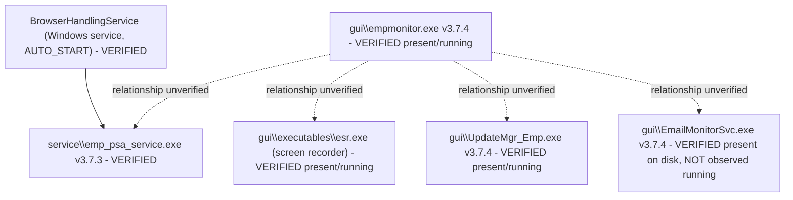

# RE-009 — Runtime Components

## 1. Purpose

This document records what is known and verified about the **processes and Windows service(s)** believed to comprise the EmpMonitor Windows Agent runtime, for use by automation developers building Layer 2 (Runtime) validation.

## 2. Scope

Covers the agent's runtime footprint on the endpoint: process(es), Windows service(s), and their relationship to each other (e.g., a service hosting a process, or multiple independent processes). Does not cover the scheduler's own timed-task behaviour (see [RE-003](RE-003_Scheduler.md)) or the suspected self-recovery mechanism in detail (see [RE-002](RE-002_Watchdog_Behaviour.md)), though both may be implemented as runtime components documented here once verified.

## 3. Architecture

The agent's runtime footprint is now **observed to be multi-process** rather than monolithic (see §6). Four EmpMonitor-owned processes were running concurrently on the observed host, split across two on-disk trees under the install root (`gui\` and `service\`), with one of them registered as a Windows service:

| Observed process | On-disk tree | Apparent role | Role status |
|---|---|---|---|
| `empmonitor.exe` | `gui\` | Agent GUI / main process | **Partially Verified** — the binary's location and name evidence the role; the role itself is inferred from naming and resource profile |
| `emp_psa_service.exe` | `service\` | Backing Windows service (`BrowserHandlingService`) | **Verified** — service-to-pid association observed |
| `esr.exe` | `gui\executables\` | Screen recorder | **Partially Verified** — inferred from name, co-located ffmpeg/x264/x265 DLLs, and a very large working set (~424 MB) |
| `UpdateMgr_Emp.exe` | `gui\` | Updater | **Partially Verified** — inferred from name; no update activity observed |

**Still Hypothesis:** how these processes communicate with one another (shared files, the SQLite database, local sockets, Qt signals across process boundaries, or the WinDivert driver) was not observed. Which process owns the SQLite connection, which performs uploads, and which reads which configuration file are all unestablished. A dedicated watchdog process was **not** identified — see [RE-002](RE-002_Watchdog_Behaviour.md), where watchdog existence remains **Hypothesis** notwithstanding the presence of `UpdateMgr_Emp.exe`.

The agent is a **Qt application**: Qt5 runtime DLLs (`Qt5Core`, `Qt5Gui`, `Qt5Network`, `Qt5Sql`, `Qt5WebSockets` and others) are distributed throughout the install tree (**Verified**, §6). The presence of `Qt5WebSockets` is consistent with the `wss` endpoint scheme found in `config.js` — see [RE-006](RE-006_API_Flow.md).

## 4. Sequence / Flow

> **TODO / Hypothesis:** the startup and shutdown *sequence* of these components is still unestablished — the observation pass was a point-in-time snapshot of an already-running installation, not a start/stop trace. Which process launches which, and whether the service starts the GUI process or vice-versa, was not observed. See [RE-001](RE-001_Agent_Startup.md) for agent initialization, which this document should align with once both are verified.

> Solid edges are observed. Dotted edges are **Hypothesis** — the four processes were observed running concurrently, but no parent/child or control relationship between them was established.

## 5. Known Behaviour (unverified)

- HB-001 and HB-002 identify "Runtime Processes" and "Windows Services" as separate components of the EmpMonitor ecosystem backing the agent (stated by project charter, not independently confirmed). **This is now corroborated in substance** by §6 — both a service and multiple processes exist — though the charter's intended decomposition was never stated in enough detail to say it matched.
- The Validation Standard ([validation_standard.md §4](../docs/ADS/validation_standard.md)) lists "Process presence/state", "Windows service state", and "Resource usage (CPU/RAM)" as Layer 2 evidence sources, implying stakeholders expect the agent's runtime footprint to be independently observable. **Confirmed observable** — all three were read successfully during the 2026-07-30 pass.
- HB-001's terminology table flags a "Watchdog" as a suspected agent self-recovery mechanism whose existence is unverified ([HB-001 §6](../docs/handbook/HB-001_Product_Overview.md)). **Still Hypothesis** — no process or service observed identifies itself as a watchdog.

## 6. Verified Behaviour (with evidence + version)

All claims in this section derive from a single observation pass on **2026-07-30** against one real installation. The [README §6.1](README.md) metadata fields that are common to every claim are stated once here rather than repeated per row:

| Field | Value |
|---|---|
| `Verified On` | 2026-07-30 |
| `Verified Against Version` | EmpMonitor `gui` components **3.7.4** / `service` component **3.7.3**; host Windows 10 Pro build 10.0.19045 x64 |
| `Verification Method` | Observed by `EM000_EnvironmentValidator` plugin run plus direct filesystem inspection |
| `Reviewer` | TODO — reviewer sign-off ([README §7](README.md) step 4) not yet performed |
| `Last Review Date` | 2026-07-30 |

> **Scope limit on all rows below:** a single host, a single installation, a single point in time. Nothing here is yet corroborated across hosts, users, or EmpMonitor versions.

### 6.1 Windows Service

| # | Claim | Status | Evidence Source |
|---|---|---|---|
| 9-V1 | A Windows service with short name **`BrowserHandlingService`** and display name **`Browser Handling Service`** exists. The name does not contain "Emp" or "EmpMonitor" — automation must not discover the service by name substring. | **Verified** | EV-005 |
| 9-V2 | The service was in state **RUNNING** with start type **AUTO_START (2)**. | **Verified** | EV-005 |
| 9-V3 | The service's pid matched a running **`emp_psa_service.exe`**, establishing that this service hosts that binary. | **Verified** | EV-005, EV-011 |
| 9-V4 | Windows failure/recovery actions **are configured** on the service and are readable via `sc qfailure`. The *content* of those actions is not recorded here. | **Verified** | EV-005 |
| 9-V5 | That the configured recovery actions constitute (or substitute for) a watchdog mechanism. | **Hypothesis** | — (no recovery event was induced or observed; see [RE-002](RE-002_Watchdog_Behaviour.md)) |

### 6.2 Executables, Versions and Signatures

All binaries below live under the install root recorded in [RE-010](RE-010_Folder_Structure.md) (`C:\Program Files\EmpMonitor\EmpMonitor`). All had a **Valid** Authenticode signature.

| # | Executable (relative to install root) | File version | Signature | Status | Evidence Source |
|---|---|---|---|---|---|
| 9-V6 | `gui\empmonitor.exe` | 3.7.4 | Valid | **Verified** | EV-010, EV-013 |
| 9-V7 | `gui\UpdateMgr_Emp.exe` — **not previously documented anywhere in this repository** | 3.7.4 | Valid | **Verified** | EV-010, EV-013 |
| 9-V8 | `gui\EmailMonitorSvc.exe` — **not previously documented anywhere in this repository**. Despite the `Svc` suffix it was **not** observed registered as a Windows service, and was **not** observed running. | 3.7.4 | Valid | **Verified** (presence, version, signature) | EV-010, EV-013 |
| 9-V9 | `gui\Uninstaller.exe` | not recorded | not recorded | **Verified** (presence only) | EV-010 |
| 9-V10 | `gui\compress_decompress_test.exe` | not recorded | not recorded | **Verified** (presence only) | EV-010 |
| 9-V11 | `gui\executables\esr.exe` — the screen recorder. Its **version resource was not readable**, so no version can be attributed to it. | unreadable | Valid | **Verified** (presence, signature); version **unverified** | EV-010, EV-013 |
| 9-V12 | `service\emp_psa_service.exe` | **3.7.3** | Valid | **Verified** | EV-010, EV-013 |
| 9-V13 | **Version skew exists within a single installation:** the `service` binary is at 3.7.3 while every readable `gui` binary is at 3.7.4. | **Verified** | EV-013 |
| 9-V14 | Whether 9-V13 is intentional (independent release cadences for service vs. GUI) or the residue of a partial update is **not** established. | **Hypothesis** | — |

### 6.3 Correction to an Earlier Hypothesis — `ffmpeg.exe`

| # | Claim | Status | Evidence Source |
|---|---|---|---|
| 9-V15 | **CORRECTION.** Earlier project material posed the recorder binary as "`ffmpeg.exe` OR `esr.exe`". **`ffmpeg.exe` does not exist** in this installation. ffmpeg ships as **DLLs only** — `avcodec-61.dll`, `avformat-61.dll`, `avfilter-10.dll`, `avutil-59.dll`, `swscale-8.dll`, plus `libx264-164.dll` and `libx265-215.dll` — under `gui\executables\`. **`esr.exe` is the only recorder executable.** The earlier "`ffmpeg.exe`" branch is **Deprecated**, superseded by this row. | **Verified** | EV-010 |
| 9-V16 | That `esr.exe` links those ffmpeg/x264/x265 DLLs to perform encoding. | **Partially Verified** — strong inference from co-location and the recorder's ~424 MB working set; no import table or runtime module list was read | EV-010, EV-011 |

### 6.4 Framework and Driver Components

| # | Claim | Status | Evidence Source |
|---|---|---|---|
| 9-V17 | The agent is a **Qt5 application**: `Qt5Core`, `Qt5Gui`, `Qt5Network`, `Qt5Sql`, `Qt5WebSockets` and further Qt5 DLLs are present throughout the install tree. | **Verified** | EV-010 |
| 9-V18 | **`WinDivert.dll` and `WinDivert64.sys` are present in `gui\`.** WinDivert is a user-mode network-packet interception library with a kernel driver component. | **Verified** (presence) | EV-010 |
| 9-V19 | That the agent actively intercepts, inspects, or blocks network traffic via WinDivert at runtime — and that this is the mechanism behind the `UploadBlocking` / `UploadDetection` / `PrintBlocking` tables in [RE-007](RE-007_SQLite_Database.md). | **Hypothesis** — the driver's presence is observed; no interception activity was observed, and the driver's load state was not checked | — |
| 9-V20 | That `Qt5Sql` is the access path to the local SQLite database ([RE-007](RE-007_SQLite_Database.md)) and `Qt5WebSockets` the implementation of the `wss` channel ([RE-006](RE-006_API_Flow.md)). | **Hypothesis** — consistent with both observations, but neither linkage was observed | — |

### 6.5 Process and Resource Footprint

Point-in-time snapshot of one host. These figures are **not** a validated baseline — they are a single sample and must not be used as pass/fail thresholds until corroborated across hosts and idle/active states.

| # | Process | Working set | Threads | Handles | Status | Evidence Source |
|---|---|---|---|---|---|---|
| 9-V21 | `empmonitor.exe` | ~56 MB | 20 | 581 | **Verified** (running, single sample). Notable **high accumulated CPU time**. | EV-011 |
| 9-V22 | `emp_psa_service.exe` | ~12 MB | 15 | 304 | **Verified** (running, single sample) | EV-005, EV-011 |
| 9-V23 | `esr.exe` | **~424 MB** — by far the largest footprint of the four; a plausible resource-consumption risk worth its own investigation | 14 | not recorded | **Verified** (running, single sample) | EV-011 |
| 9-V24 | `UpdateMgr_Emp.exe` | ~16 MB | 2 | not recorded | **Verified** (running, single sample) — i.e. the updater runs **continuously**, not only during an update | EV-011 |
| 9-V25 | That the four processes above constitute the *complete* runtime set for all feature configurations. | **Hypothesis** — `EmailMonitorSvc.exe` exists on disk but was not running, showing the running set is configuration- or feature-dependent | — |
| 9-V26 | What "normal" resource usage is (i.e. a baseline with tolerances). | **Hypothesis** — one sample is not a baseline | — |

## 7. Configuration Inputs

**Partially Verified.** Configuration artifacts that plausibly govern which components run and how hard they work now have confirmed locations — `gui\configs\config.js` and two `empm.ini` files under `%APPDATA%\screen` (see [RE-005](RE-005_Configuration_Loading.md) and [RE-010](RE-010_Folder_Structure.md)). Two specific linkages are worth recording as leads rather than facts:

- `empm.ini` `[appSettings]` carries `screenshotPeriodSec`, `screenshotQuality` and `dataSendingPeriodSec` — keys whose values would be expected to influence the runtime cost of the capture/upload path. **Hypothesis:** no correlation between any key's value and observed process behaviour was tested.
- `EmailMonitorSvc.exe` being present but not running suggests a configuration or licensing gate on optional components. **Hypothesis** — the gate was not located.

> **Still TODO:** whether any resource limit, process-set selection, or component enable/disable flag is expressed in local configuration versus pushed from the dashboard.

## 8. Known Files

**Verified** (metadata block as §6). Install root: `C:\Program Files\EmpMonitor\EmpMonitor` — note the **double nesting**, corrected in [RE-010](RE-010_Folder_Structure.md).

| Path (relative to install root) | Kind | Version | Signature |
|---|---|---|---|
| `gui\empmonitor.exe` | Executable — agent GUI / main process | 3.7.4 | Valid |
| `gui\UpdateMgr_Emp.exe` | Executable — updater | 3.7.4 | Valid |
| `gui\EmailMonitorSvc.exe` | Executable — email monitoring component | 3.7.4 | Valid |
| `gui\Uninstaller.exe` | Executable — uninstaller | not recorded | not recorded |
| `gui\compress_decompress_test.exe` | Executable — apparent test/utility binary | not recorded | not recorded |
| `gui\executables\esr.exe` | Executable — screen recorder | **version resource unreadable** | Valid |
| `service\emp_psa_service.exe` | Executable — service binary for `BrowserHandlingService` | **3.7.3** | Valid |
| `gui\WinDivert.dll`, `gui\WinDivert64.sys` | Network-packet interception library + kernel driver | not recorded | not recorded |
| `Qt5Core.dll`, `Qt5Gui.dll`, `Qt5Network.dll`, `Qt5Sql.dll`, `Qt5WebSockets.dll` and further Qt5 DLLs | Qt5 runtime, distributed throughout the tree | not recorded | not recorded |
| `gui\executables\avcodec-61.dll`, `avformat-61.dll`, `avfilter-10.dll`, `avutil-59.dll`, `swscale-8.dll`, `libx264-164.dll`, `libx265-215.dll` | ffmpeg / x264 / x265 encoder libraries — **no `ffmpeg.exe` exists** | not recorded | not recorded |

For the full install and per-user data layout (including `gui\configs\`, `gui\translations\`, `gui\plugins\`, and the service-side log/status files), see [RE-010](RE-010_Folder_Structure.md).

## 9. Known APIs

Not applicable to this subject as a primary section — runtime components are local process/service state, not an API surface. If a runtime component exposes a local IPC or diagnostic API, document it here once verified; see [RE-006](RE-006_API_Flow.md) for server-facing API contracts.

## 10. Storage / SQLite

Not applicable to this subject as a primary section — cross-reference [RE-007](RE-007_SQLite_Database.md) if a specific runtime component is confirmed to own the SQLite connection.

## 11. Logs

Not applicable to this subject as a primary section, but component-to-log ownership is now partly established: the `service\` tree contains `EMP_SERVICE.log`, `EMP_SERVICE2.txt`, `CurrentStatus.txt` and `UpdateProgress.txt` alongside `emp_psa_service.exe`, and a dated agent log was found under `%APPDATA%\screen\empm\logs\`. Co-location is **Verified**; that `emp_psa_service.exe` is the *writer* of the service-side files is **Hypothesis**. See [RE-008](RE-008_Logging_System.md).

## 12. Failure Modes

Candidate classes can now be named against real components, but **none has been observed** — every item below is **Hypothesis** and is listed as an investigation target, not as behaviour:

- `BrowserHandlingService` not installed, or installed but not RUNNING.
- Service RUNNING but no `emp_psa_service.exe` pid associated (or a stale/mismatched pid).
- Service RUNNING while `empmonitor.exe` is absent — the two were observed independently and no supervision relationship between them is established, so this state may be reachable.
- `esr.exe` working set growing beyond the observed ~424 MB (memory leak in the recorder), or `esr.exe` absent while recording is configured on.
- `UpdateMgr_Emp.exe` absent — since it was observed running continuously, its absence is a candidate signal rather than a normal state.
- Version skew widening (cf. 9-V13: service 3.7.3 vs. gui 3.7.4) or a partial update leaving mismatched binaries.
- Authenticode signature invalid on any binary that was observed Valid — a tamper indicator.
- Multiple conflicting instances of any of the four processes.
- WinDivert driver present but not loadable, blocking whatever feature depends on it.

## 13. Recovery

**Partially Verified.** Windows-level failure/recovery actions **are configured** on `BrowserHandlingService` and are readable via `sc qfailure` (9-V4), so an OS-driven restart path for `emp_psa_service.exe` demonstrably exists in configuration. What has **not** been established:

- The actual content of those actions (restart? delay? reset period? run-program?) — not recorded.
- Whether they ever fire, and whether firing restores working state — no failure was induced.
- Whether any recovery path exists for `empmonitor.exe`, `esr.exe`, or `UpdateMgr_Emp.exe`, none of which is a Windows service.
- Whether `UpdateMgr_Emp.exe`, which runs continuously, performs any supervision role. **Hypothesis** — see [RE-002](RE-002_Watchdog_Behaviour.md).

See [RE-011](RE-011_Recovery_Behaviour.md) and [RE-002](RE-002_Watchdog_Behaviour.md).

## 14. Troubleshooting

First-pass guidance, now that names are verified. Every step is an *observation* recipe; none asserts what a given reading means for product health, since no baseline is established.

1. **Service check.** Query the service by its exact short name `BrowserHandlingService` — **not** by an "Emp" name substring, which will not match it. Confirm state RUNNING and start type AUTO_START.
2. **Process check.** Expect `empmonitor.exe`, `emp_psa_service.exe`, `esr.exe` and `UpdateMgr_Emp.exe`. `EmailMonitorSvc.exe` may legitimately be absent (it was present on disk but not running on the observed host).
3. **Service-to-process link.** Compare the service pid against the `emp_psa_service.exe` pid; a mismatch is a signal worth capturing.
4. **Version check.** Read file versions from the binaries in §8. Expect `gui` at 3.7.4 and `service` at 3.7.3 on a 3.7.4-era install; `esr.exe` has **no readable version resource**, so a missing version there is normal, not a fault.
5. **Signature check.** All signed binaries observed Valid; treat an invalid signature as a tamper/corruption signal.
6. **Do not look for `ffmpeg.exe`.** It does not exist (9-V15). Check for the ffmpeg DLLs under `gui\executables\` instead.
7. **Resource check.** `esr.exe` at several hundred MB is *consistent with the single observation on record* and should not on its own be reported as anomalous.

## 15. Evidence Sources for Automation

| Source | Layer | Collector | Status |
|---|---|---|---|
| Process presence/state | 2 | `framework/monitors/runtime_monitor.py` | Scaffolded, unimplemented (0 lines) |
| Windows service state | 2 | `framework/monitors/runtime_monitor.py` | Scaffolded, unimplemented (0 lines) |
| Resource usage (CPU/RAM) | 2 | `framework/monitors/runtime_monitor.py` | Scaffolded, unimplemented (0 lines) |
| Environment/precondition checks | 2 | `framework/validators/environment.py` | Scaffolded, unimplemented (0 lines) |
| Executable file metadata (version resource, Authenticode) | 2 | EV-013 — see [Evidence Catalog](../docs/Evidence_Catalog.md) | Exercised by the `EM000_EnvironmentValidator` plugin |
| Host OS / platform identification | 2 | EV-012 — see [Evidence Catalog](../docs/Evidence_Catalog.md) | Exercised by the `EM000_EnvironmentValidator` plugin |

`framework/monitors/runtime_monitor.py` and `framework/validators/environment.py` exist in the repository scaffold but currently contain no implementation. They are the intended observation/validation points for this subject; no behaviour should be assumed from their names alone. The 2026-07-30 observations in §6 were produced by the `EM000_EnvironmentValidator` plugin plus direct filesystem inspection, not by these monitors.

## 16. Open Questions / TODO

**Answered by the 2026-07-30 pass** (see §6):

- ~~How many processes and/or Windows services does the agent comprise?~~ → Four processes observed running, one Windows service. **Verified** for this host/configuration; the *complete* set across all feature configurations remains open (9-V25).
- ~~What are their names/identifiers?~~ → `empmonitor.exe`, `emp_psa_service.exe`, `esr.exe`, `UpdateMgr_Emp.exe` (running); `EmailMonitorSvc.exe` on disk only; service `BrowserHandlingService`. **Verified.**
- ~~Does a single service host multiple processes, or is each independent?~~ → Partly answered: the one service hosts exactly one binary (`emp_psa_service.exe`, 9-V3). The other three processes are **not** service-hosted. Whether they are *independent* or supervised by something else is still open.

**Still open:**

- How do runtime components communicate with each other? (Shared files, SQLite, local sockets, the WinDivert driver — nothing observed. 9-V20 records the Qt-based hypotheses.)
- Which process owns the SQLite connection, and which performs uploads?
- Does a watchdog process exist? Still **Hypothesis** — no watchdog-named component found; `UpdateMgr_Emp.exe` running continuously is an adjacent observation, not confirmation. See [RE-002](RE-002_Watchdog_Behaviour.md).
- What is normal/expected CPU and RAM usage? Still **Hypothesis** — §6.5 is one sample, not a baseline. Multi-host, idle-vs-active sampling is required.
- Why is `esr.exe`'s working set so large (~424 MB), and is it stable or growing?
- Why does `esr.exe` have no readable version resource, and how should automation version-check it?
- Is the 3.7.3-vs-3.7.4 skew intentional or a partial-update artifact (9-V14)?
- Under what condition does `EmailMonitorSvc.exe` run? What gates it?
- Is the WinDivert driver actually loaded, and which feature depends on it (9-V19)?
- Is the service name `BrowserHandlingService` stable across versions and installs? An unbranded name is a real automation risk if it changes.
- What is the process start/stop sequence and inter-process startup ordering (§4)?

## 17. Future Expansion

The first observation pass is done; expansion now means widening it rather than starting it:

- Re-run on additional hosts, Windows versions, and EmpMonitor versions to promote §6 rows from single-host observations to genuinely corroborated claims.
- Capture a start/stop trace to fill §4.
- Establish a real resource baseline (multiple samples, idle vs. active capture) so §6.5 can support thresholds.
- Record whether `BrowserHandlingService`, the double-nested install root, and the version-skew pattern persist across releases; demote to **Deprecated** with a pointer if any changes.

## 18. Version Notes

| Version observed | Date | Notes |
|---|---|---|
| `gui` components **3.7.4**, `service` component **3.7.3** | 2026-07-30 | First version ever verified against for this subject. Host: Windows 10 Pro build 10.0.19045 x64. Intra-install version skew recorded as 9-V13. `esr.exe` version resource unreadable, so its version is unknown even on this build. |

All §6 claims are scoped to the row above. Statements outside §6 remain unversioned. Per [README §7](README.md) step 6, these claims must be re-checked when a new EmpMonitor version is encountered.

## 19. Cross References

- [Knowledge Base Index](README.md)
- [HB-001 — Product Overview](../docs/handbook/HB-001_Product_Overview.md)
- [HB-002 — Product Architecture](../docs/handbook/HB-002_Product_Architecture.md)
- [Validation Standard](../docs/ADS/validation_standard.md)
- [RE-001 — Agent Startup](RE-001_Agent_Startup.md)
- [RE-002 — Watchdog Behaviour](RE-002_Watchdog_Behaviour.md)
- [RE-003 — Scheduler](RE-003_Scheduler.md)
- [RE-010 — Folder Structure](RE-010_Folder_Structure.md)
- [RE-011 — Recovery Behaviour](RE-011_Recovery_Behaviour.md)
- [RE-006 — API Flow](RE-006_API_Flow.md) — `Qt5WebSockets` and the `wss` endpoint scheme
- [RE-007 — SQLite Database](RE-007_SQLite_Database.md) — `Qt5Sql` and the local database
- [RE-008 — Logging System](RE-008_Logging_System.md) — service-side log/status files
- [Evidence Catalog](../docs/Evidence_Catalog.md) — EV-005, EV-010, EV-011, EV-012, EV-013
- [HB-005 — Component Inventory](../docs/handbook/HB-005_Component_Inventory.md) — inventory rows promoted from these findings

---
**Document Status:** Active — runtime topology first verified 2026-07-30 (gui 3.7.4 / service 3.7.3); service, processes, binaries, versions and signatures Verified; inter-process communication, watchdog existence and resource baseline still Hypothesis. Reviewer sign-off outstanding.
**Owner:** TODO
**Last Updated:** 2026-07-30
