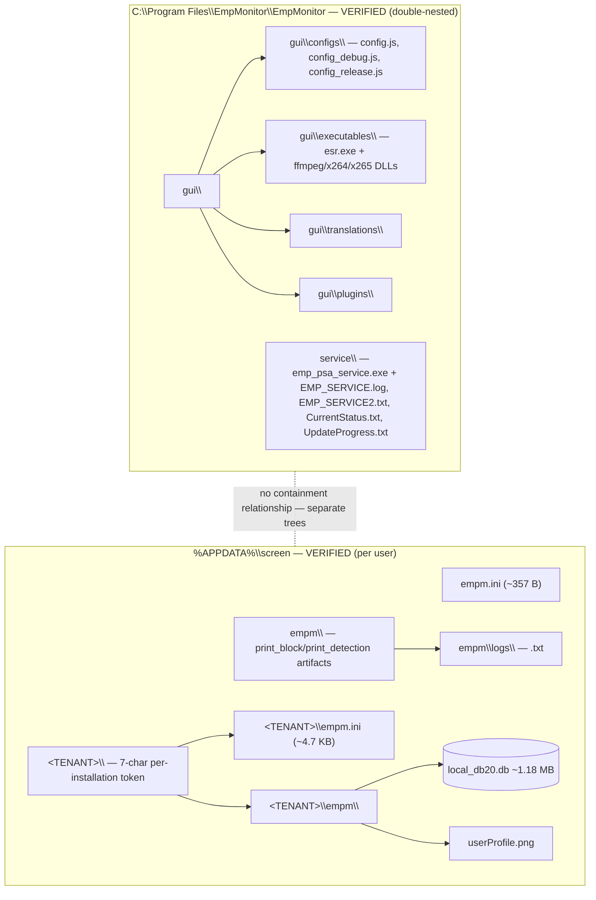

# RE-010 — Folder Structure

## 1. Purpose

This document records what is known and verified about the **believed on-disk install/data folder layout** for the EmpMonitor Windows Agent, for use by automation developers building Layer 2 (Runtime) validation of file system artifacts.

## 2. Scope

Covers the agent's on-disk directory layout on the monitored endpoint: install directory, data directory, log directory, and capture storage directory (screenshots/recordings, if stored on disk rather than solely in SQLite). Does not cover the internal schema of the SQLite database itself (see [RE-007](RE-007_SQLite_Database.md)) or log file content/format (see [RE-008](RE-008_Logging_System.md)) — only where these artifacts are believed to live on disk.

## 3. Architecture

**Verified** (metadata block in §6). The layout is **two disjoint trees**, not one — a machine-wide install tree under Program Files, and a **per-user** data tree under `%APPDATA%`. The data tree is *not* a subfolder of the install tree.

| Tree | Root | Scope | Holds |
|---|---|---|---|
| Install | `C:\Program Files\EmpMonitor\EmpMonitor` | Machine-wide | Binaries, Qt5/ffmpeg libraries, the WinDivert driver, `config.js`, translations, plugins, service-side log/status files |
| Data | `%APPDATA%\screen` (i.e. `C:\Users\<user>\AppData\Roaming\screen`) | **Per user** | `empm.ini`, agent logs, print-detection artifacts, and a per-installation tenant folder holding the SQLite database |

Two structural properties are worth calling out because both defeat naive path construction:

1. **The install root is double-nested** — `EmpMonitor\EmpMonitor` (see the correction in §6.1).
2. **The data root is named `screen`, not `EmpMonitor` or `empm`** — nothing in the data root's own name identifies the product. Below it, an `empm` subfolder and a **7-character per-installation tenant folder** appear as siblings, and the tenant folder's name cannot be predicted.

See [RE-009](RE-009_Runtime_Components.md) for the runtime components that read/write these folders — note that which process writes which folder is **Hypothesis**, not observed.

## 4. Sequence / Flow

> **TODO / Hypothesis:** folder *creation* timing was not observed. The 2026-07-30 pass was a point-in-time inspection of an installation that was already running and had already been in use; it establishes which folders **exist**, not when they were created (install time, first run, or lazily per capture type), nor whether the agent recreates a folder that has been deleted. No folder was deleted or renamed during the pass.

> Containment shown inside each subgraph is **Verified**. The relationship *between* the two trees is only that they are disjoint; no read/write flow between them was observed.

## 5. Known Behaviour (unverified)

- HB-001 and HB-002 identify "File System" as a component of the EmpMonitor ecosystem, holding capture/config/log artifacts (stated by project charter, not independently confirmed). **Now corroborated in substance** — config and log artifacts were both found on disk (§6); on-disk *capture* artifacts were **not** (see 10-V16).
- The Validation Standard ([validation_standard.md §4](../docs/ADS/validation_standard.md)) lists "File system artifacts" as a Layer 2 evidence source, implying stakeholders expect folder/file state to be independently observable. **Confirmed observable** — both trees were enumerated successfully.

## 6. Verified Behaviour (with evidence + version)

All claims in this section derive from a single observation pass on **2026-07-30** against one real installation, on one Windows user profile. The [README §6.1](README.md) metadata fields common to every claim are stated once here rather than repeated per row:

| Field | Value |
|---|---|
| `Verified On` | 2026-07-30 |
| `Verified Against Version` | EmpMonitor `gui` components **3.7.4** / `service` component **3.7.3**; host Windows 10 Pro build 10.0.19045 x64 |
| `Verification Method` | Observed by `EM000_EnvironmentValidator` plugin run plus direct filesystem inspection |
| `Reviewer` | TODO — reviewer sign-off ([README §7](README.md) step 4) not yet performed |
| `Last Review Date` | 2026-07-30 |

> **Scope limit on all rows below:** one host, one installation, one user profile, one point in time. No path here is yet corroborated across hosts, users, Windows versions, or EmpMonitor versions. In particular, whether any path is *fixed* or merely *the default* is unestablished.

### 6.1 Install Root — Correction to an Earlier Hypothesis

| # | Claim | Status | Evidence Source |
|---|---|---|---|
| 10-V1 | **CORRECTION.** The install root is `C:\Program Files\EmpMonitor\EmpMonitor` — **double-nested**. The earlier hypothesis of a single-level `C:\Program Files\EmpMonitor` is **Deprecated**: that path is only the outer container, and every binary and configuration artifact sits one level deeper. Automation that builds paths from the single-level assumption will miss every file. | **Verified** | EV-010 |
| 10-V2 | Whether the double nesting is intentional product design, an installer artifact, or configurable at install time. | **Hypothesis** — not investigated | — |
| 10-V3 | The install tree divides into two top-level subfolders: **`gui\`** and **`service\`**. | **Verified** | EV-010 |

### 6.2 Install Tree Contents

| # | Path (relative to install root) | Contents | Status | Evidence Source |
|---|---|---|---|---|
| 10-V4 | `gui\` | `empmonitor.exe`, `UpdateMgr_Emp.exe`, `EmailMonitorSvc.exe`, `Uninstaller.exe`, `compress_decompress_test.exe`, plus `WinDivert.dll` and `WinDivert64.sys`. Binary versions/signatures are recorded in [RE-009 §8](RE-009_Runtime_Components.md), not duplicated here. | **Verified** | EV-010, EV-013 |
| 10-V5 | `gui\configs\` | **`config.js`** — the agent configuration file — alongside **`config_debug.js`** and **`config_release.js`**. | **Verified** | EV-001, EV-010 |
| 10-V6 | That `config.js` is the active file and the `_debug`/`_release` variants are build-time templates or fallbacks selected from. | **Hypothesis** — the three files' relationship (which is read, whether one is copied over another at install) was not observed. See [RE-005](RE-005_Configuration_Loading.md). | — |
| 10-V7 | `gui\executables\` | **`esr.exe`** (screen recorder) plus ffmpeg/x264/x265 DLLs. | **Verified** | EV-010 |
| 10-V8 | **CORRECTION.** There is **no `ffmpeg.exe`** anywhere in the install tree. ffmpeg is present as DLLs only (`avcodec-61.dll`, `avformat-61.dll`, `avfilter-10.dll`, `avutil-59.dll`, `swscale-8.dll`, `libx264-164.dll`, `libx265-215.dll`). `esr.exe` is the only recorder executable. The earlier "`ffmpeg.exe` OR `esr.exe`" framing is **Deprecated**. | **Verified** | EV-010 |
| 10-V9 | `gui\translations\` | Directory exists. Contents not enumerated. | **Verified** (existence only) | EV-010 |
| 10-V10 | `gui\plugins\` | Directory exists. Contents not enumerated. **Note:** this is an *EmpMonitor product* plugin folder and has nothing to do with this repository's `plugins/` automation folder — do not conflate them. | **Verified** (existence only) | EV-010 |
| 10-V11 | `service\` | **`emp_psa_service.exe`** plus the service-side log/status files **`EMP_SERVICE.log`**, **`EMP_SERVICE2.txt`**, **`CurrentStatus.txt`**, **`UpdateProgress.txt`**. See [RE-008](RE-008_Logging_System.md). | **Verified** | EV-010 |
| 10-V12 | That log/status files live *inside Program Files* — i.e. the product writes runtime state into its own install directory, which normally requires elevation. This is an unusual and automation-relevant property. | **Verified** (the files are present there); **Hypothesis** that they are actively written there at runtime | EV-010 |
| 10-V13 | Qt5 runtime DLLs are distributed **throughout** the install tree (not confined to one folder). | **Verified** | EV-010 |

### 6.3 Per-User Data Tree

| # | Path | Contents | Status | Evidence Source |
|---|---|---|---|---|
| 10-V14 | `%APPDATA%\screen` | The data root. Named **`screen`** — no product name in the path. | **Verified** | EV-010 |
| 10-V15 | The data root is **per-user** (under `AppData\Roaming`), so a multi-user endpoint has one such tree per profile. | **Partially Verified** — the location implies per-user scope, but only one profile was inspected; multi-user behaviour was not observed | EV-010 |
| 10-V16 | **No "failed screenshots" or "failed recordings" folder existed**, and no on-disk capture-output or staging folder was identified at all. Folder names for such artifacts remain **UNVERIFIED**. Their earlier hypothesised names must not be treated as facts. Absence here is also *not* proof they never exist — they may be created only on failure, a condition not induced during the pass. | **Hypothesis** (their existence and names); the *absence at observation time* is **Verified** | EV-010 |
| 10-V17 | `%APPDATA%\screen\empm.ini` | The user configuration file, **~357 bytes**. Sections/keys in [RE-005](RE-005_Configuration_Loading.md). | **Verified** | EV-002, EV-010 |
| 10-V18 | `%APPDATA%\screen\empm\logs\` | The agent log folder. Contained a **date-named** log file, `2026-07-30.txt` — i.e. one file per day. | **Verified** | EV-004, EV-010 |
| 10-V19 | That the date-named pattern implies daily rotation with retention. | **Partially Verified** — the naming convention is observed and strongly implies per-day files, but only a single day's file was present, so rotation/retention behaviour over time is not established. See [RE-008](RE-008_Logging_System.md). | EV-010 |
| 10-V20 | `%APPDATA%\screen\empm\` | Also holds `print_block.json`, `print_block.jsonl`, `print_detection.json`, `print_detection.jsonl`, `print_detection.log`. Both a `.json` and a `.jsonl` variant exist for each of `print_block` and `print_detection`. | **Verified** | EV-010 |
| 10-V21 | That the `.json` files are state/config and the `.jsonl` files append-only event streams (the conventional split), and that these correspond to the `PrintBlocking` / `PrintDetection` tables in [RE-007](RE-007_SQLite_Database.md). | **Hypothesis** — no file contents were read | — |

### 6.4 The Tenant Folder

| # | Claim | Status | Evidence Source |
|---|---|---|---|
| 10-V22 | `%APPDATA%\screen\<TENANT>\` — a **7-character tenant/organisation-specific folder** exists as a sibling of `empm\`. The observed value was a random-looking token and is **deliberately not recorded in this document**: it is per-installation and must be **discovered at runtime, never hardcoded**. Automation should enumerate `%APPDATA%\screen\` and select the 7-character entry that is not `empm`. | **Verified** (that such a folder exists and is per-installation) | EV-010 |
| 10-V23 | That the token encodes a tenant/organisation identity, and that it is derived from or correlates with `[General] identifier` or `[auth] email` in `empm.ini`. | **Hypothesis** — the token's origin and meaning were not established | — |
| 10-V24 | `%APPDATA%\screen\<TENANT>\empm\local_db20.db` — the local SQLite database, **~1.18 MB**. Schema in [RE-007](RE-007_SQLite_Database.md). | **Verified** | EV-003, EV-010 |
| 10-V25 | `%APPDATA%\screen\<TENANT>\empm.ini` — a **second, larger `empm.ini`** (~4.7 KB, versus ~357 bytes at the data root). **Two `empm.ini` files exist per installation.** | **Verified** | EV-002, EV-010 |
| 10-V26 | That the larger tenant-level `empm.ini` is the remote/dashboard-synced configuration and the small root-level one the local bootstrap. | **Partially Verified** — the size difference and the tenant-scoped location make this a strong inference, but no sync event was observed and precedence between the two files is **unestablished**. This is a significant open risk for Layer 1 validation: reading "the" `empm.ini` is ambiguous. See [RE-005](RE-005_Configuration_Loading.md). | EV-002, EV-010 |
| 10-V27 | `%APPDATA%\screen\<TENANT>\empm\userProfile.png` — present. | **Verified** | EV-010 |

## 7. Configuration Inputs

**Partially Verified.** Configuration files have confirmed locations (10-V5, 10-V17, 10-V25), but **whether folder locations are themselves configurable is still unestablished**:

- No key observed in `empm.ini`'s verified sections (`[General]`, `[appSettings]`, `[auth]` — see [RE-005](RE-005_Configuration_Loading.md)) sets a path.
- `config.js` was observed to be 324 bytes / 9 lines containing 4 endpoint URLs; no path-setting key was recorded in it.
- Whether the install root was selectable at install time is **Hypothesis** (10-V2).

The one location that is demonstrably **not** fixed is the tenant folder name (10-V22), which varies per installation and must be discovered.

## 8. Known Files

**Verified** paths (metadata block as §6). Versions/signatures for binaries are in [RE-009 §8](RE-009_Runtime_Components.md).

### 8.1 Install Tree — `C:\Program Files\EmpMonitor\EmpMonitor` (double-nested)

| Path | Kind |
|---|---|
| `gui\empmonitor.exe` | Agent GUI / main process (3.7.4) |
| `gui\UpdateMgr_Emp.exe` | Updater (3.7.4) |
| `gui\EmailMonitorSvc.exe` | Email monitoring component (3.7.4) |
| `gui\Uninstaller.exe` | Uninstaller |
| `gui\compress_decompress_test.exe` | Test/utility binary |
| `gui\WinDivert.dll`, `gui\WinDivert64.sys` | Network-packet interception library + kernel driver |
| `gui\configs\config.js` | **Agent configuration file** |
| `gui\configs\config_debug.js`, `gui\configs\config_release.js` | Configuration variants (relationship to `config.js` unverified) |
| `gui\executables\esr.exe` | Screen recorder (version resource unreadable) |
| `gui\executables\avcodec-61.dll`, `avformat-61.dll`, `avfilter-10.dll`, `avutil-59.dll`, `swscale-8.dll`, `libx264-164.dll`, `libx265-215.dll` | ffmpeg / x264 / x265 libraries — **no `ffmpeg.exe`** |
| `gui\translations\` | Directory (contents not enumerated) |
| `gui\plugins\` | Directory (contents not enumerated) — product plugins, unrelated to this repo's `plugins/` |
| `service\emp_psa_service.exe` | Service binary for `BrowserHandlingService` (3.7.3) |
| `service\EMP_SERVICE.log` | Service log |
| `service\EMP_SERVICE2.txt` | Service log/status (secondary) |
| `service\CurrentStatus.txt` | Service status file |
| `service\UpdateProgress.txt` | Update progress file |
| Qt5 DLLs (`Qt5Core`, `Qt5Gui`, `Qt5Network`, `Qt5Sql`, `Qt5WebSockets`, others) | Distributed throughout the tree |

### 8.2 Data Tree — `%APPDATA%\screen` (per user)

| Path | Kind | Observed size |
|---|---|---|
| `empm.ini` | User configuration file | ~357 B |
| `empm\logs\<date>.txt` | Agent log, one per day (observed: `2026-07-30.txt`) | — |
| `empm\print_block.json`, `empm\print_block.jsonl` | Print-blocking state / event stream | — |
| `empm\print_detection.json`, `empm\print_detection.jsonl`, `empm\print_detection.log` | Print-detection state / event stream / log | — |
| `<TENANT>\` | Per-installation tenant folder, **7-character token — discover at runtime, never hardcode** | — |
| `<TENANT>\empm.ini` | **Second** `empm.ini`, likely remote/synced config | ~4.7 KB |
| `<TENANT>\empm\local_db20.db` | Local SQLite database | ~1.18 MB |
| `<TENANT>\empm\userProfile.png` | User profile image | — |

**Not found:** any "failed screenshots" / "failed recordings" folder, or any other on-disk capture-output or upload-staging folder (10-V16). Those names remain **Hypothesis**.

## 9. Known APIs

Not applicable to this subject — folder structure is local file system layout, not an API surface.

## 10. Storage / SQLite

**Verified.** The database file resides **in the data tree, not the install tree**: `%APPDATA%\screen\<TENANT>\empm\local_db20.db`, ~1.18 MB (10-V24). Consequences for automation:

- The path is **per-user and per-installation** — it cannot be constructed without first discovering the tenant token (10-V22).
- The database is *not* under Program Files, so reading it does not require elevation, unlike the service-side log files (10-V12).

Schema (28 tables, 9 populated) and the `pending_*` upload-queue finding are in [RE-007](RE-007_SQLite_Database.md). Only table names and row counts were read during the pass — **no row contents**, since this database holds captured monitoring data.

## 11. Logs

**Verified.** Logs appear in **two locations across both trees**:

| Location | Tree | Files |
|---|---|---|
| `%APPDATA%\screen\empm\logs\` | Data (per user) | Date-named, e.g. `2026-07-30.txt` (10-V18) |
| `<install root>\service\` | Install (machine-wide, inside Program Files) | `EMP_SERVICE.log`, `EMP_SERVICE2.txt`, `CurrentStatus.txt`, `UpdateProgress.txt` (10-V11) |

Additionally `%APPDATA%\screen\empm\print_detection.log` is a feature-specific log outside the `logs\` folder (10-V20) — so "the log folder" is not a complete description of where the product logs. Log format, levels, and rotation behaviour are **not** established here; see [RE-008](RE-008_Logging_System.md).

## 12. Failure Modes

Candidate classes can now be named against real paths, but **none has been observed** — every item below is **Hypothesis**, listed as an investigation target:

- Install root assumed single-level (`C:\Program Files\EmpMonitor`) rather than double-nested — this is a *framework* failure mode as much as a product one, and is the most likely cause of spurious "agent not installed" findings (10-V1).
- Tenant folder token hardcoded from one installation, so path resolution fails on every other install (10-V22).
- The **wrong `empm.ini` read** of the two that exist, yielding a config picture that is valid-looking but incomplete or stale (10-V25, 10-V26).
- Data root absent or empty for a given user profile on a multi-user endpoint, while the machine-wide install is healthy (10-V15).
- Service-side log/status files under Program Files not writable due to permissions/elevation (10-V12).
- More than one 7-character sibling under `%APPDATA%\screen\`, making tenant-folder discovery ambiguous — not observed, but the discovery heuristic in 10-V22 would break.
- Log folder present but not growing despite agent activity; database present but not growing.
- Capture artifacts accumulating in an as-yet-unidentified folder without cleanup — cannot be checked, since no capture-output folder has been located (10-V16).

## 13. Recovery

> **TODO / Hypothesis:** nothing about folder recovery was observed. No folder was deleted, renamed, or permission-stripped during the pass, so whether the agent recreates a missing folder, fails silently, or fails loudly is entirely unestablished. Note that 10-V16 makes this harder rather than easier to reason about: the absence of a "failed captures" folder could equally mean such folders are created lazily on failure, or that they do not exist in this version. See [RE-011](RE-011_Recovery_Behaviour.md).

## 14. Troubleshooting

Path-resolution recipe, now that both roots are verified. Steps 1–3 are the ones that most commonly go wrong.

1. **Install root — use the double-nested path.** Check `C:\Program Files\EmpMonitor\EmpMonitor`. If only `C:\Program Files\EmpMonitor` is checked, it will appear to exist while every file lookup beneath it fails. Confirm `gui\` and `service\` are both present.
2. **Data root — check `%APPDATA%\screen`.** Resolve `%APPDATA%` for the *monitored user*, not the account running the automation; the tree is per-user (10-V15).
3. **Tenant folder — discover, never hardcode.** Enumerate `%APPDATA%\screen\` and take the 7-character entry that is not `empm`. Record the discovered value in run evidence, not in documentation or code.
4. **Two `empm.ini` files.** Read both: the ~357 B file at the data root and the ~4.7 KB file in the tenant folder. Report them as distinct artifacts; do not merge or assume precedence (10-V26).
5. **Database.** `%APPDATA%\screen\<TENANT>\empm\local_db20.db`. Read schema and row counts only — not row contents.
6. **Do not search for `ffmpeg.exe`** (10-V8) and **do not expect a "failed screenshots"/"failed recordings" folder** (10-V16). Neither exists; treating their absence as a fault produces false findings.
7. **Logs are in two trees.** Check both `%APPDATA%\screen\empm\logs\` and `<install root>\service\`, plus `print_detection.log`.
8. **Elevation.** Expect to need elevation for the install tree, not for the data tree.

## 15. Evidence Sources for Automation

| Source | Layer | Collector | Status |
|---|---|---|---|
| Folder/file presence | 2 | `framework/monitors/folder_monitor.py` | Scaffolded, unimplemented (0 lines) |
| Folder/file content | 2 | `framework/monitors/folder_monitor.py` | Scaffolded, unimplemented (0 lines) |
| Executable file metadata (version resource, Authenticode) | 2 | EV-013 — see [Evidence Catalog](../docs/Evidence_Catalog.md) | Exercised by the `EM000_EnvironmentValidator` plugin |

`framework/monitors/folder_monitor.py` exists in the repository scaffold but currently contains no implementation. It is the intended observation point for this subject; no behaviour should be assumed from its name alone. The 2026-07-30 observations in §6 were produced by the `EM000_EnvironmentValidator` plugin plus direct filesystem inspection, not by this monitor.

**Requirement this document places on the collector:** because the tenant folder name is per-installation (10-V22) and two `empm.ini` files exist (10-V25), `folder_monitor.py` must implement *path discovery*, not fixed-path lookup, and must report the two INI files as distinct artifacts.

## 16. Open Questions / TODO

**Answered by the 2026-07-30 pass** (see §6):

- ~~Where is the agent installed?~~ → `C:\Program Files\EmpMonitor\EmpMonitor` (**double-nested**; corrects the earlier hypothesis). **Verified.**
- ~~Where does the agent store its working/data files?~~ → `%APPDATA%\screen`, per user, with a per-installation tenant subfolder. **Verified.**
- ~~Where are logs written?~~ → `%APPDATA%\screen\empm\logs\<date>.txt`, plus service-side files in `<install root>\service\` and `print_detection.log`. **Verified.** See [RE-008](RE-008_Logging_System.md).

**Still open:**

- **Where (if anywhere) are captures stored on disk versus solely in SQLite?** No capture-output folder was found (10-V16). This is now the single largest gap in this document: either captures live only in the database, or in a folder created lazily under conditions not reproduced.
- What are the real names of the "failed screenshots" / "failed recordings" folders, if they exist at all? Still **Hypothesis** — do not use the previously assumed names.
- What determines the 7-character tenant token, and can more than one exist per endpoint (10-V23)?
- Which of the two `empm.ini` files takes precedence, and is the tenant-level one written by a sync process (10-V26)?
- Why is the install root double-nested, and is it configurable (10-V2)?
- What is the relationship between `config.js`, `config_debug.js` and `config_release.js` (10-V6)?
- What is in `gui\translations\` and `gui\plugins\` (10-V9, 10-V10)?
- Are folder paths consistent across EmpMonitor versions and Windows versions? Unknown — one host, one version.
- Is the data root always named `screen`, or is that a legacy/obfuscation choice that could change?
- Does the agent enforce disk space limits or cleanup routines on any directory? Not observed; the ~1.18 MB database and single-day log file give no evidence either way.
- Does the product actually write to its own install directory at runtime (10-V12), and how does it obtain the necessary rights?

## 17. Future Expansion

The first observation pass is done; expansion now means widening it rather than starting it:

- Re-run across additional hosts, Windows versions, EmpMonitor versions, and **multiple user profiles on one endpoint** to promote §6 rows from single-observation to corroborated.
- Run a capture cycle (screenshot, recording) with monitoring active and re-enumerate, specifically to resolve 10-V16 — whether an on-disk capture/staging folder ever appears.
- Induce an upload failure to determine whether "failed captures" folders are created lazily.
- Watch the data tree over several days to establish log rotation/retention (10-V19) and database growth.
- Record whether the double-nested root, the `screen` data root, and the tenant-folder scheme persist across releases; demote to **Deprecated** with a pointer if any changes.

## 18. Version Notes

| Version observed | Date | Notes |
|---|---|---|
| `gui` components **3.7.4**, `service` component **3.7.3** | 2026-07-30 | First version ever verified against for this subject. Host: Windows 10 Pro build 10.0.19045 x64, single user profile. Established the double-nested install root (correcting the prior single-level hypothesis) and the absence of `ffmpeg.exe`. |

All §6 claims are scoped to the row above. Statements outside §6 remain unversioned. Per [README §7](README.md) step 6, these paths must be re-checked when a new EmpMonitor version is encountered — path layout is exactly the kind of fact a product update silently breaks.

## 19. Cross References

- [Knowledge Base Index](README.md)
- [HB-001 — Product Overview](../docs/handbook/HB-001_Product_Overview.md)
- [HB-002 — Product Architecture](../docs/handbook/HB-002_Product_Architecture.md)
- [Validation Standard](../docs/ADS/validation_standard.md)
- [RE-005 — Configuration Loading](RE-005_Configuration_Loading.md)
- [RE-007 — SQLite Database](RE-007_SQLite_Database.md)
- [RE-008 — Logging System](RE-008_Logging_System.md)
- [RE-009 — Runtime Components](RE-009_Runtime_Components.md)
- [RE-004 — Upload Pipeline](RE-004_Upload_Pipeline.md) — no on-disk staging folder was found (10-V16)
- [RE-012 — Offline Synchronization](RE-012_Offline_Synchronization.md) — queue state appears to be in SQLite, not on disk
- [Evidence Catalog](../docs/Evidence_Catalog.md) — EV-001, EV-002, EV-003, EV-004, EV-010, EV-013
- [HB-005 — Component Inventory](../docs/handbook/HB-005_Component_Inventory.md) — folder inventory rows promoted from these findings

---
**Document Status:** Active — install and data layout first verified 2026-07-30 (gui 3.7.4 / service 3.7.3). Two corrections recorded: install root is double-nested `EmpMonitor\EmpMonitor`, and `ffmpeg.exe` does not exist. Capture-output/failed-capture folders remain unverified. Reviewer sign-off outstanding.
**Owner:** TODO
**Last Updated:** 2026-07-30
