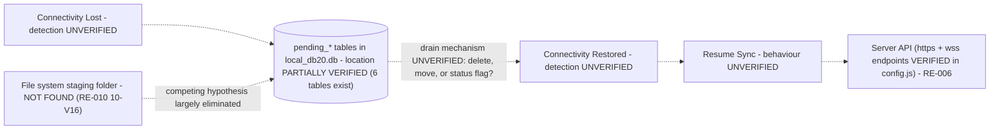

# RE-012 — Offline Synchronization

## 1. Purpose

This document records what is known and verified about the EmpMonitor Windows Agent's **believed behavior when the endpoint has no connectivity** — whether/how captures queue locally and resume syncing once connectivity returns — for use by automation developers building Layer 3 (Synchronization) validation.

## 2. Scope

Covers the agent's connectivity-loss handling specifically: detection of offline state, local queuing of unsynced captures during the offline period, and resumption behaviour once connectivity is restored. Does not cover the general upload pipeline mechanics while online (see [RE-004](RE-004_Upload_Pipeline.md)) or the API request/response contract itself (see [RE-006](RE-006_API_Flow.md)), though this document depends on both.

## 3. Architecture

**One structural question is now largely answered: where queue state lives.** The 2026-07-30 observation pass found **six `pending_*` tables** in the local SQLite database and **no upload-staging or failed-capture folder anywhere on disk**. Together these make a **SQLite-resident queue** the strongly-favoured answer, recorded as **Partially Verified** in §6.

| Question | Status | Answer as it stands |
|---|---|---|
| Where is queue state held? | **Partially Verified** | Six `pending_*` tables in `%APPDATA%\screen\<TENANT>\empm\local_db20.db` — **not** a file system queue |
| Is it a file system queue instead? | **Partially Verified (negative)** | No staging or "failed captures" folder was found ([RE-010](RE-010_Folder_Structure.md) 10-V16) |
| How is connectivity loss detected? | **Hypothesis** | Unestablished. A `wss` endpoint exists in `config.js` ([RE-006](RE-006_API_Flow.md)), and a dropped WebSocket would be a natural detection signal — but this is inference, not observation |
| Does the queue have a size/time limit? | **Hypothesis** | Unestablished |
| How is a row's sync status tracked? | **Hypothesis** | Unestablished — no table columns were read |

What has **not** changed: **no offline period was induced and no sync activity was observed.** This document still contains no verified *behaviour*. It now contains a verified *structure* within which that behaviour presumably happens.

## 4. Sequence / Flow

> **TODO:** the offline/resume *sequence* remains unverified. Connectivity was never interrupted during the observation pass. HB-001's "Upload Queue — the agent-side mechanism holding captures pending transmission, TODO: verify mechanism" ([HB-001 §6](../docs/handbook/HB-001_Product_Overview.md)) can now be answered as to **location** but not as to **mechanism**.

> Only the `pending_*` tables and the configured endpoints are observed. **Every edge remains Hypothesis** — no row was seen enqueued or drained, and no offline transition occurred.

## 5. Known Behaviour (unverified)

- HB-001 and HB-002 identify "End-to-End Synchronization" as an ecosystem component and describe the assumed capture-to-dashboard path as: Configure → Capture → Persist → Synchronize → Surface, with "Synchronize" explicitly including "offline queuing" ([HB-002 §5](../docs/handbook/HB-002_Product_Architecture.md)), stated by project charter, not independently confirmed.
- HB-001's terminology table defines "Upload Queue" as the agent-side mechanism believed to hold captures pending transmission, with an explicit note that the mechanism itself is unverified.
- The Validation Standard ([validation_standard.md §4](../docs/ADS/validation_standard.md)) lists "Upload queue state" as a Layer 3 evidence source, with an accompanying note that where queue state actually lives (SQLite vs. folder monitor) is unconfirmed — see also [validation_standard.md §12](../docs/ADS/validation_standard.md), which records that the API/network evidence collector is now designed (see [Synchronization Monitor Design](../docs/design/Synchronization_Monitor.md)) but not yet implemented, a known gap affecting Layer 3 validation generally.

## 6. Verified Behaviour (with evidence + version)

All claims in this section derive from a single observation pass on **2026-07-30** against one real installation. The [README §6.1](README.md) metadata fields common to every claim are stated once here rather than repeated per row:

| Field | Value |
|---|---|
| `Verified On` | 2026-07-30 |
| `Verified Against Version` | EmpMonitor `gui` components **3.7.4** / `service` component **3.7.3**; host Windows 10 Pro build 10.0.19045 x64 |
| `Verification Method` | Observed by `EM000_EnvironmentValidator` plugin run plus direct filesystem inspection |
| `Reviewer` | TODO — reviewer sign-off ([README §7](README.md) step 4) not yet performed |
| `Last Review Date` | 2026-07-30 |

> **Scope limit — critical for this document.** **No offline period was induced, no connectivity was interrupted, and no sync activity was observed.** Every claim below concerns the *static structures* that queueing appears to use. **No offline behaviour whatsoever has been verified.**

### 6.1 Where Upload-Queue State Lives

This resolves — to **Partially Verified** — the question carried in this document's §16, in [RE-004](RE-004_Upload_Pipeline.md), in [HB-001 §6](../docs/handbook/HB-001_Product_Overview.md) ("Upload Queue … TODO: verify mechanism"), and in [Validation Standard §4](../docs/ADS/validation_standard.md) (whose note that queue-state location is "unconfirmed — SQLite vs. folder monitor" can now be answered in favour of SQLite).

| # | Claim | Status | Evidence Source |
|---|---|---|---|
| 12-V1 | Six **`pending_*`** tables exist in `local_db20.db`: `pending_screenshots6`, `pending_usagedata6`, `pending_usbdata6`, `pending_clipboardata`, `pending_aduserproperties6`, `pending_bluetoothdata`. | **Verified** | EV-003 |
| 12-V2 | **These tables ARE the upload queue** — queue state is held in **SQLite**, in per-data-type tables, rather than in a file system staging area. | **Partially Verified** | EV-003, EV-010 |
| 12-V3 | **No upload-staging, capture-output, "failed screenshots" or "failed recordings" folder exists** anywhere in the install or data tree. The previously hypothesised folder names remain **unverified and must not be used**. See [RE-010](RE-010_Folder_Structure.md) 10-V16. | **Verified** (absence at observation time) | EV-010 |
| 12-V4 | `event_data` and `sent_event_data` form a **sent/unsent split** — a second expression of the same queueing idea, for event data. | **Partially Verified** — from table naming only | EV-003 |
| 12-V5 | The queue is therefore **per-user and per-installation**, since the database is at `%APPDATA%\screen\<TENANT>\empm\local_db20.db` — one queue per Windows profile, and the tenant token must be discovered at runtime. | **Verified** | EV-003, EV-010 |

**Why Partially Verified and not Verified.** The tables demonstrably exist and are named `pending_`. That they *function* as the upload queue is a **strong inference** with two independent supports: the naming (EV-003) and the **absence** of any file system queue (EV-010), which eliminates the main competing hypothesis. But per [README §7](README.md), promotion to **Verified** requires observing the mechanism in operation — and **no row was seen enqueued or drained, no offline period occurred, and the tables' columns were never read**. The specific promoting experiment is in §17.

**Why absence of a folder is weaker evidence than it looks.** 12-V3 records absence at a moment when the endpoint was online and healthy. A failed-capture folder created *only on failure* would not have appeared. Absence-based signals are Low confidence and admissible only as corroboration ([Validation Standard §7 rule 4](../docs/ADS/validation_standard.md)) — which is exactly how it is used here.

### 6.2 What Remains Unverified About Queue Behaviour

Listed explicitly so the structural finding above is not over-read:

| # | Claim | Status |
|---|---|---|
| 12-V6 | How a row's sync status is tracked — status column, deletion on success, or move to the counterpart table. **No table columns were read.** | **Hypothesis** |
| 12-V7 | That `pending_*` rows actually drain when connectivity is available. | **Hypothesis** |
| 12-V8 | How the agent detects connectivity loss and restoration. | **Hypothesis** |
| 12-V9 | Whether the queue is bounded by size, age or row count, and what is dropped at the bound. | **Hypothesis** |
| 12-V10 | Whether resume is immediate, scheduled, throttled, or restart-triggered; and the ordering of a backlog drain. | **Hypothesis** |
| 12-V11 | Whether duplicate uploads can occur on resume, and whether anything deduplicates them. | **Hypothesis** |
| 12-V12 | Where **screen recordings** queue. No `pending_` table names recordings, and no on-disk capture folder exists — yet `esr.exe` runs with a ~424 MB working set ([RE-009](RE-009_Runtime_Components.md)). **The recording path is unaccounted for in the queue model.** | **Hypothesis** — an actual gap, not merely undocumented detail |
| 12-V13 | Why `pending_screenshots6` and `pending_aduserproperties6` have **no** non-pending counterpart, while the other four `pending_*` tables do. | **Hypothesis** |

### 6.3 A Usable Queue-Depth Probe (Practical Consequence)

| # | Claim | Status | Evidence Source |
|---|---|---|---|
| 12-V14 | `SELECT COUNT(*)` over the six `pending_*` tables yields a **queue-depth metric** that is readable today, requires no network capture, and is **privacy-safe** — it reads no captured content ([RE-007 §6.0](RE-007_SQLite_Database.md)). | **Verified** (the measurement is available); its *interpretation* as queue depth inherits 12-V2's **Partially Verified** status | EV-003 |
| 12-V15 | This **partially mitigates** the Layer 3 collector gap ([Validation Standard §12](../docs/ADS/validation_standard.md)): queue *depth* and *drain* become observable via EV-003 without the unimplemented Synchronization Monitor. It does **not** close the gap — request/response evidence, latency and retry behaviour still require that collector. | **Partially Verified** | EV-003 |

## 7. Configuration Inputs

**Partially Verified — negative result.** No configuration key governing offline/queue behaviour was observed:

- The verified sections of the root `empm.ini` (`[General]`, `[appSettings]`, `[auth]` — see [RE-005](RE-005_Configuration_Loading.md)) contain **no** retry-interval, queue-size, or queue-age key. `[appSettings] dataSendingPeriodSec` governs a *sending period* by name, which may relate to upload cadence — but its semantics are **Hypothesis** and it says nothing about retry or queue bounds.
- `config.js` is 324 bytes of endpoint configuration only.
- The **~4.7 KB tenant-level `empm.ini` was not fully enumerated**, so retry/queue keys may exist there. This is the place to look.

Whether offline behaviour is configurable at all is therefore **Hypothesis**.

## 8. Known Files

**Verified.** The queue is **not** file-based (12-V2, 12-V3). The relevant artifact is a database file:

| Path | Role | Observed size |
|---|---|---|
| `%APPDATA%\screen\<TENANT>\empm\local_db20.db` | Holds the six `pending_*` tables — the apparent upload queue | ~1.18 MB |

`<TENANT>` is a 7-character per-installation token that **must be discovered at runtime** ([RE-010](RE-010_Folder_Structure.md)).

**Explicitly not found:** any upload-staging folder, capture-output folder, "failed screenshots" folder, or "failed recordings" folder (12-V3). Those names remain **Hypothesis** and must not be used in automation. See [RE-007](RE-007_SQLite_Database.md) for the schema and [RE-010](RE-010_Folder_Structure.md) for the full layout.

## 9. Known APIs

**Partially Verified — a first concrete fact, from configuration rather than traffic.** `config.js` contains **4 endpoint URLs using the `https` and `wss` schemes** ([RE-005](RE-005_Configuration_Loading.md) 5-V14). The **`wss` scheme confirms a WebSocket channel is configured**, which is directly relevant here: a persistent WebSocket is a natural mechanism both for detecting connectivity loss (socket drop) and for resume signalling.

Both remain **Hypothesis**: **no connection, traffic, or endpoint role was observed**, and the URLs are deliberately not recorded (deployment-specific). Which endpoint serves upload versus configuration versus real-time signalling is unknown. See [RE-006](RE-006_API_Flow.md).

The Validation Standard's recorded gap still stands: the API/network evidence collector is designed ([Synchronization Monitor Design](../docs/design/Synchronization_Monitor.md)) but not implemented ([validation_standard.md §12](../docs/ADS/validation_standard.md)) — though 12-V15 notes that queue depth is now partially observable without it.

## 10. Storage / SQLite

**Answered to Partially Verified.** Queued-but-unsynced captures **are** represented as rows in the local SQLite database — specifically in the six `pending_*` tables (12-V1, 12-V2). This section's former premise, that it was unknown whether SQLite was involved at all, is superseded.

**How a row's sync status is tracked remains Hypothesis** (12-V6). The three candidate mechanisms, none observed:

1. **Delete on success** — rows removed from `pending_*` once acknowledged.
2. **Move to counterpart** — rows migrate from `pending_usagedata6` to `usagedata6`, etc. Four of the six `pending_*` tables have such a counterpart; two do not (12-V13), which complicates this reading.
3. **Status flag** — a column marks sync state and rows persist in place.

Distinguishing these requires reading **column definitions** (structure, not values — permitted under [RE-007 §6.0](RE-007_SQLite_Database.md)) and watching counts across a sync cycle. See [RE-007](RE-007_SQLite_Database.md).

## 11. Logs

> **TODO / Hypothesis:** whether connectivity loss/restoration or queue/retry activity is logged is **still unknown** — no log contents were read. What is now known is **where to look**, which was not known before. Four locations exist ([RE-008](RE-008_Logging_System.md)): the per-user `%APPDATA%\screen\empm\logs\<date>.txt`; the service-side `EMP_SERVICE.log` / `EMP_SERVICE2.txt` / `CurrentStatus.txt` in the install tree; feature logs in `%APPDATA%\screen\empm\`; and the database-resident `tbl_exception_log2`. `CurrentStatus.txt` is the most promising candidate for a connectivity/state indicator on name alone, and `tbl_exception_log2` for failed-upload errors — both **Hypothesis**.

## 12. Failure Modes

**None observed** — every item below is **Hypothesis**. What has changed is that most are now *checkable*, because queue depth is measurable (12-V14):

- **Connectivity loss not detected** — no detection mechanism is known, so this cannot yet be distinguished from correct behaviour.
- **Captures not queued during an offline period (data loss)** — would appear as `pending_*` counts failing to rise while the endpoint is offline and active. Now measurable.
- **Queue grows unbounded** during extended offline periods — rising `pending_*` counts with no bound. Now measurable; no bound is known to exist (12-V9).
- **Queue not resumed after connectivity restored** — `pending_*` counts staying flat after reconnection. Now measurable, and the clearest single sync-failure signature available.
- **Partial resume** — some counts drain, others do not.
- **Duplicate uploads on resume** (12-V11) — not detectable locally; needs server-side or network evidence.
- **Database loss is queue loss.** Because the queue lives only in `local_db20.db` and no on-disk copy exists (12-V2, 12-V3), a corrupted or deleted database would destroy all un-uploaded captures with no recovery path. This risk is a *consequence* of the architecture finding and did not previously appear in this document. See [RE-007 §13](RE-007_SQLite_Database.md).
- **Screen recordings silently unqueued** (12-V12) — no `pending_` table covers recordings and no on-disk folder exists, so a recording that fails to upload may have nowhere to wait. Unaccounted-for path, worth prioritising.
- **Framework failure mode:** automation looking for a file system staging folder finds nothing and reports "no queue mechanism" or "no backlog" — a false conclusion, since the queue is in SQLite (12-V3).
- **Framework failure mode:** `UploadBlocking` / `UploadDetection` / `UploadDetectionImage` mistaken for upload-queue tables. They appear to belong to the file-upload *blocking feature*, not the agent's own upload path ([RE-007](RE-007_SQLite_Database.md) 7-V12).

## 13. Recovery

> **TODO / Hypothesis:** backlog recovery behaviour is unobserved — no offline period was induced, so batch versus throttled resume, prioritisation order, and retry/backoff are all unestablished. Two findings sharpen the question: the queue is per-data-type across six tables (12-V1), so drain **order across types** is a real variable; and `emp_psa_service.exe` has Windows recovery actions configured ([RE-009](RE-009_Runtime_Components.md)), so a service restart mid-backlog is plausible and its effect on queue state is unknown. See [RE-011](RE-011_Recovery_Behaviour.md) and [RE-004](RE-004_Upload_Pipeline.md).

## 14. Troubleshooting

Queue-inspection recipe. It is genuinely usable today — a change from this section's previous state — but it observes **queue depth**, not sync correctness.

1. **Look in SQLite, not on disk.** The queue is in `%APPDATA%\screen\<TENANT>\empm\local_db20.db`. **Do not** search for a staging or "failed captures" folder; none exists (12-V3), and its absence is not a fault.
2. **Discover the tenant token at runtime** (enumerate `%APPDATA%\screen\`, take the 7-character entry that is not `empm`), resolving `%APPDATA%` for the *monitored user*. Never hardcode it.
3. **Probe queue depth:** `SELECT COUNT(*)` on `pending_screenshots6`, `pending_usagedata6`, `pending_usbdata6`, `pending_clipboardata`, `pending_aduserproperties6`, `pending_bluetoothdata`. Open the database read-only.
4. **Sample repeatedly — a single count means nothing.** Depth is only interpretable as a *trend*: rising while offline, falling after reconnection. One reading cannot distinguish a healthy queue from a stalled one.
5. **Also count `event_data` versus `sent_event_data`** (12-V4) as a second, independent queue signal.
6. **Never read row contents** ([RE-007 §6.0](RE-007_SQLite_Database.md)) — counts only. This database holds captured monitoring data.
7. **Do not treat zero as failure.** Empty `pending_*` tables are the expected steady state on a healthy, online endpoint — 19 of 28 tables were empty on the observed host.
8. **Check `tbl_exception_log2`'s row count** for upload errors, and `CurrentStatus.txt` for possible connectivity state — both **Hypothesis** as to content ([RE-008](RE-008_Logging_System.md)).
9. **Expect nothing about recordings.** No queue location is known for screen recordings (12-V12); their absence from `pending_*` is not evidence of a fault.

**What this recipe cannot do:** confirm that data actually reached the server, measure latency or retries, or detect duplicates. Those need the unimplemented Synchronization Monitor ([Validation Standard §12](../docs/ADS/validation_standard.md)). Draining counts evidence that *something consumed the rows* — not that the server received them.

## 15. Evidence Sources for Automation

| Source | Layer | Collector | Status |
|---|---|---|---|
| API request/response evidence | 3 | Synchronization Monitor (designed — not yet implemented) | Recorded as a known gap in [validation_standard.md §12](../docs/ADS/validation_standard.md) |
| Upload queue state | 3 | **`framework/monitors/sqlite_monitor.py`** (EV-003) — queue location now **Partially Verified** as the six `pending_*` tables | Monitor is scaffolded, unimplemented (0 lines). `folder_monitor.py` is **no longer** a candidate for queue state — no file system queue exists (12-V3) |

**One of the two gaps in this subject has narrowed.** The physical location of upload-queue state was previously unconfirmed; it is now **Partially Verified** as SQLite-resident (12-V2), which makes `sqlite_monitor.py` the responsible collector and removes the SQLite-versus-folder ambiguity that [Validation Standard §4](../docs/ADS/validation_standard.md) records.

The other gap stands: the API/network evidence collector is designed ([Synchronization Monitor Design](../docs/design/Synchronization_Monitor.md)) but not implemented ([validation_standard.md §12](../docs/ADS/validation_standard.md)).

**What this means for corroboration** under [Validation Standard §5](../docs/ADS/validation_standard.md): queue depth via EV-003 is now a *usable single source*, sufficient for **Partially Verified** findings about backlog. It is **not** sufficient to conclude data reached the server — draining counts show rows were consumed locally, not accepted remotely. Offline-sync validation still needs the Layer 3 collector for corroboration.

**Requirement this document places on `framework/monitors/sqlite_monitor.py`:** expose `pending_*` (and `event_data`/`sent_event_data`) row counts as a **time series**, not a point reading — a single count is uninterpretable (§14 step 4).

## 16. Open Questions / TODO

**Answered by the 2026-07-30 pass** (see §6):

- ~~Where are unsynced captures held while offline (SQLite, file system, in-memory only)?~~ → **In SQLite**, in six `pending_*` tables in `local_db20.db`. **Partially Verified** (12-V2), corroborated by the absence of any file system queue (12-V3). This was the long-standing question carried here, in [RE-004](RE-004_Upload_Pipeline.md), in [HB-001 §6](../docs/handbook/HB-001_Product_Overview.md) and in [Validation Standard §4](../docs/ADS/validation_standard.md).
- ~~Are offline periods and queue/resume events **observable**?~~ → **Partially answered.** Queue *depth* is observable today via `pending_*` row counts (12-V14). Whether offline *events* are logged is still unknown (§11).

**Still open:**

- **Do the `pending_*` tables actually drain on reconnection?** The experiment that promotes 12-V2 to **Verified** (§17).
- How is a row's sync status tracked — delete, move, or status flag (12-V6, §10)?
- How does the agent detect it has lost/regained connectivity (12-V8)? Is the `wss` channel involved (§9)?
- Is there a maximum queue size, age, or count before captures are dropped (12-V9)?
- Does resume happen immediately, on a schedule, throttled, or at next agent restart (12-V10)?
- In what order are the six queues drained, and can one starve another?
- Are duplicate uploads possible on resume, and is anything deduplicating them (12-V11)?
- **Where do screen recordings queue?** No `pending_` table and no on-disk folder covers them (12-V12) — the most conspicuous gap in the queue model.
- Why do `pending_screenshots6` and `pending_aduserproperties6` lack non-pending counterparts (12-V13)?
- Are retry interval or queue bounds configurable — specifically, is there such a key in the unenumerated ~4.7 KB tenant `empm.ini` (§7)?
- Are connectivity transitions recorded in any of the four log locations, or in `CurrentStatus.txt` (§11)?
- What happens to queue state if the service restarts mid-backlog, given its configured Windows recovery actions (§13)?
- What is the recovery path if `local_db20.db` is lost while a backlog exists (§12)? On current evidence there is none.

## 17. Future Expansion

The structural question is answered; the behavioural work is now well-specified and unblocked:

- **The promoting experiment.** Sample `pending_*` row counts while online; sever connectivity; generate activity; sample again (counts should rise); restore connectivity; sample again (counts should fall). This single controlled cycle would promote 12-V2 to **Verified**, answer 12-V6 and 12-V7, and give a first measurement of resume timing (12-V10). It requires only the read-only SQLite access already demonstrated — **no network collector**.
- Read **column definitions** of the six `pending_*` tables (`PRAGMA table_info` — structure, not values) to distinguish the three status-tracking mechanisms in §10.
- Extend the offline period to probe for queue bounds (12-V9).
- Read log contents across the transition to establish whether offline events are recorded (§11).
- Investigate the recording path (12-V12) — where does an un-uploaded recording wait?
- Re-run across versions; record whether the `pending_*` table set persists, and demote to **Deprecated** with a pointer if it changes.
- Revisit once the API/network collector gap ([validation_standard.md §12](../docs/ADS/validation_standard.md)) is closed, so local queue drain can be corroborated against server-side acceptance.

## 18. Version Notes

| Version observed | Date | Notes |
|---|---|---|
| `gui` components **3.7.4**, `service` component **3.7.3** | 2026-07-30 | First version ever verified against for this subject. Host: Windows 10 Pro build 10.0.19045 x64, single user profile, **online and healthy throughout**. Established the `pending_*` queue location (Partially Verified) and the absence of any file system queue. **No offline period was induced at this version** — no offline behaviour is verified. |

All §6 claims are scoped to the row above. Statements outside §6 remain unversioned. Per [README §7](README.md) step 6, the `pending_*` table set must be re-checked on version change.

## 19. Cross References

- [Knowledge Base Index](README.md)
- [HB-001 — Product Overview](../docs/handbook/HB-001_Product_Overview.md)
- [HB-002 — Product Architecture](../docs/handbook/HB-002_Product_Architecture.md)
- [Validation Standard](../docs/ADS/validation_standard.md)
- [RE-004 — Upload Pipeline](RE-004_Upload_Pipeline.md)
- [RE-005 — Configuration Loading](RE-005_Configuration_Loading.md)
- [RE-006 — API Flow](RE-006_API_Flow.md)
- [RE-007 — SQLite Database](RE-007_SQLite_Database.md)
- [RE-011 — Recovery Behaviour](RE-011_Recovery_Behaviour.md)
- [RE-008 — Logging System](RE-008_Logging_System.md) — where offline/queue events would be logged
- [RE-009 — Runtime Components](RE-009_Runtime_Components.md) — service recovery actions and the process set
- [RE-010 — Folder Structure](RE-010_Folder_Structure.md) — 10-V16, the absent file system queue
- [Evidence Catalog](../docs/Evidence_Catalog.md) — EV-003, EV-010
- [Synchronization Monitor Design](../docs/design/Synchronization_Monitor.md) — the still-unimplemented Layer 3 collector
- [HB-005 — Component Inventory](../docs/handbook/HB-005_Component_Inventory.md)

---
**Document Status:** Draft — **queue location answered 2026-07-30** (gui 3.7.4 / service 3.7.3): the six `pending_*` tables in `local_db20.db` appear to be the upload queue (**Partially Verified**), and no file system queue exists. Queue depth is now measurable via EV-003. **No offline period was induced — no offline behaviour is verified.** Reviewer sign-off outstanding.
**Owner:** TODO
**Last Updated:** 2026-07-30
