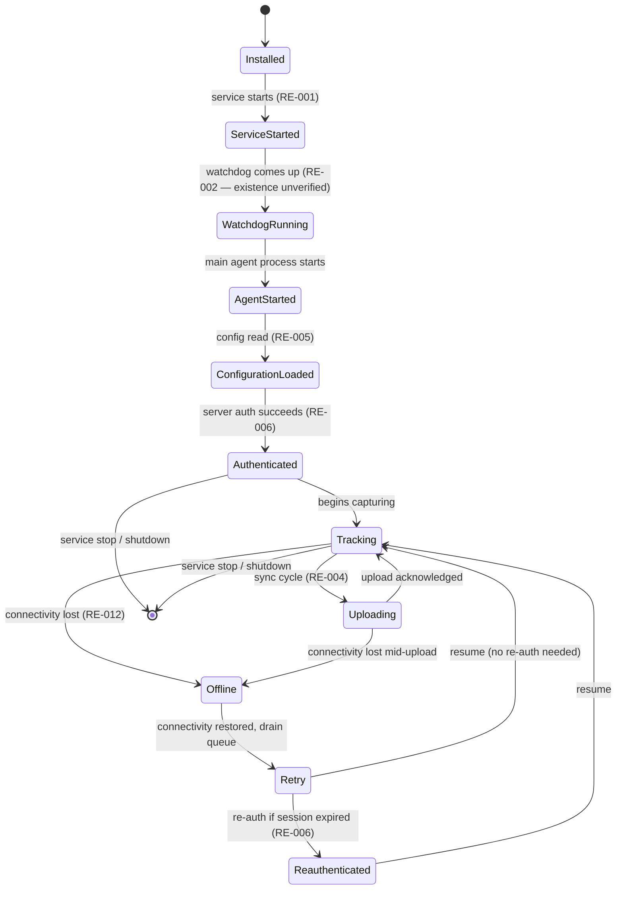

# RE-013 — Agent State Machine

## 1. Purpose

This document models the **expected lifecycle of the EmpMonitor Windows Agent** as a state machine, so that automation can reason about *which state the agent should be in* and *what evidence corroborates that state*. A state machine is the natural backbone for validation: a failure is, precisely, the agent being in a state it should not be in, or failing a transition it should have made.

It complements the linear startup view in [RE-001](RE-001_Agent_Startup.md) by covering the full operational lifecycle (including offline/retry cycles), not just boot.

## 2. Scope

Covers the agent's macro-level operational states and the transitions between them. Does **not** cover:
- The internal boot sequence in isolation — see [RE-001](RE-001_Agent_Startup.md)
- Watchdog mechanics — see [RE-002](RE-002_Watchdog_Behaviour.md)
- Per-feature capture behavior — see [HB-006](../docs/handbook/HB-006_Feature_Specifications.md)

**Every state and transition below is Hypothesis status** ([knowledge_base README §6](README.md)) — assembled from charter-level statements in HB-001/HB-002, not from observation. Nothing here is Verified. The machine's *shape* is a modeling aid; its *accuracy* is unconfirmed.

## 3. Architecture

The states below are grouped into three phases: **Bring-up** (Installed → Authenticated), **Steady operation** (Tracking ⇄ Uploading), and **Disruption/recovery** (Offline → Retry → Reauthenticated → back to Tracking).

## 4. Sequence / Flow

> **TODO — assumed, not verified.** Conceptual model only; states, transitions, and their names are a modeling hypothesis to be confirmed against a real installation.

## 5. State Definitions

For each state: **Purpose**, **Entry Conditions**, **Exit Conditions**, **Expected Processes**, **Expected Logs**, **Expected Configuration**, **Expected Evidence** (by [Evidence Catalog](../docs/Evidence_Catalog.md) ID), **Possible Failures**, **Recovery**. All values are **Hypothesis** unless a Verified entry is later added.

### 5.1 Installed
- **Purpose:** Agent binaries/services are present on the endpoint but not necessarily running.
- **Entry Conditions:** Installation completed. TODO — verify installer end-state ([RE-001](RE-001_Agent_Startup.md)).
- **Exit Conditions:** Service start initiated.
- **Expected Processes:** None required yet. TODO.
- **Expected Logs:** Possibly an install log. TODO ([RE-008](RE-008_Logging_System.md)).
- **Expected Configuration:** `config.js` / `empm.ini` present on disk. TODO location ([RE-005](RE-005_Configuration_Loading.md)).
- **Expected Evidence:** EV-010 (file system), EV-001/EV-002 (config presence).
- **Possible Failures:** Incomplete install; missing config. TODO.
- **Recovery:** Reinstall/repair. TODO ([RE-011](RE-011_Recovery_Behaviour.md)).

### 5.2 Service Started
- **Purpose:** The backing Windows service(s) are running.
- **Entry Conditions:** SCM starts the service. TODO service name(s) ([RE-009](RE-009_Runtime_Components.md)).
- **Exit Conditions:** Watchdog/main process launched, or service stops.
- **Expected Processes:** Service host process. TODO.
- **Expected Logs:** Service start entry. TODO.
- **Expected Configuration:** N/A beyond §5.1.
- **Expected Evidence:** EV-005 (Windows service state).
- **Possible Failures:** Service fails to start / disabled. TODO.
- **Recovery:** Service recovery settings / manual start. TODO.

### 5.3 Watchdog Running
- **Purpose:** The self-recovery mechanism is active and able to restart the agent.
- **Entry Conditions:** Watchdog process/service up. **TODO — watchdog existence itself is unverified** ([RE-002](RE-002_Watchdog_Behaviour.md)).
- **Exit Conditions:** Shutdown, or watchdog itself fails.
- **Expected Processes:** Watchdog process (if separate). TODO.
- **Expected Logs:** Watchdog activity log. TODO.
- **Expected Evidence:** EV-005 (if a service), EV-005/EV-011 (if a process), EV-004 (logs).
- **Possible Failures:** Watchdog absent, or present but not monitoring.
- **Recovery:** N/A — this *is* the recovery mechanism; its own failure is a [RE-011](RE-011_Recovery_Behaviour.md) concern.

### 5.4 Agent Started
- **Purpose:** The main agent workload process is running.
- **Entry Conditions:** Launched by service/watchdog.
- **Exit Conditions:** Config load begins; or crash → §5.3 recovery.
- **Expected Processes:** Main agent process. TODO name ([RE-009](RE-009_Runtime_Components.md)).
- **Expected Evidence:** EV-005, EV-011 (process/resource), EV-004 (logs).
- **Possible Failures:** Starts then exits; hangs before config load.
- **Recovery:** Watchdog restart ([RE-002](RE-002_Watchdog_Behaviour.md)).

### 5.5 Configuration Loaded
- **Purpose:** The agent has read and applied its configuration.
- **Entry Conditions:** Config files read successfully. TODO which keys ([RE-005](RE-005_Configuration_Loading.md)).
- **Exit Conditions:** Proceeds to authentication.
- **Expected Configuration:** `config.js`, `empm.ini`, possibly dashboard-synced settings.
- **Expected Evidence:** EV-001, EV-002, EV-008 (authored settings), EV-004.
- **Possible Failures:** Missing/malformed config; local vs. dashboard divergence.
- **Recovery:** TODO — does the agent fail fast or run on defaults?

### 5.6 Authenticated
- **Purpose:** The agent has established an authenticated session with the server.
- **Entry Conditions:** Auth handshake succeeds. TODO mechanism ([RE-006](RE-006_API_Flow.md)).
- **Exit Conditions:** Begins tracking; or session lost → §5.10.
- **Expected Evidence:** EV-007 (synchronization — auth outcome), EV-004.
- **Possible Failures:** Auth rejected, network unreachable, credential/token invalid.
- **Recovery:** Retry / re-authenticate (§5.11).

### 5.7 Tracking
- **Purpose:** Steady-state — the agent is actively capturing endpoint activity per its enabled features.
- **Entry Conditions:** Authenticated and features enabled.
- **Exit Conditions:** Upload cycle begins (§5.8), connectivity lost (§5.9), or shutdown.
- **Expected Processes:** Main agent + any capture subsystems. TODO ([HB-006](../docs/handbook/HB-006_Feature_Specifications.md)).
- **Expected Evidence:** EV-003 (SQLite rows appearing), EV-010 (capture files), EV-011.
- **Possible Failures:** Running but not capturing (the classic false-healthy — see [Validation Standard §11](../docs/ADS/validation_standard.md) anti-patterns).
- **Recovery:** TODO.

### 5.8 Uploading
- **Purpose:** Transmitting captured data to the server.
- **Entry Conditions:** Sync cycle triggered (scheduled or threshold). TODO trigger ([RE-004](RE-004_Upload_Pipeline.md)).
- **Exit Conditions:** Upload acknowledged → back to Tracking; failure → Offline/Retry.
- **Expected Evidence:** EV-007 (sync activity, latency, retries), EV-003 (rows cleared/marked), EV-004.
- **Possible Failures:** Transmission failure, server error, retry exhaustion.
- **Recovery:** Retry per policy (§5.11); queue if offline (§5.9).

### 5.9 Offline
- **Purpose:** Connectivity lost; captures accumulate locally instead of transmitting.
- **Entry Conditions:** Connectivity loss detected. TODO detection mechanism ([RE-012](RE-012_Offline_Synchronization.md)).
- **Exit Conditions:** Connectivity restored → Retry (§5.11).
- **Expected Evidence:** EV-007 (queue depth rising), EV-003/EV-010 (queue growth), EV-004.
- **Possible Failures:** Loss not detected; captures not queued (data loss); unbounded queue growth.
- **Recovery:** Drain on reconnect (§5.11).

### 5.10 Retry
- **Purpose:** Connectivity restored; drain the accumulated offline queue.
- **Entry Conditions:** Connectivity restored after Offline.
- **Exit Conditions:** Queue drained → Tracking; session expired → Reauthenticated (§5.12).
- **Expected Evidence:** EV-007 (queue draining, offline→online transition), EV-003/EV-010 (queue shrinking).
- **Possible Failures:** Queue not drained, partial drain (silent loss), duplicate uploads on resume.
- **Recovery:** TODO — batch vs. throttled resume ([RE-012](RE-012_Offline_Synchronization.md)).

### 5.11 Reauthenticated
- **Purpose:** Re-establish an expired session before resuming sync.
- **Entry Conditions:** Session found invalid during Retry.
- **Exit Conditions:** Re-auth succeeds → Tracking.
- **Expected Evidence:** EV-007 (auth outcome), EV-004.
- **Possible Failures:** Re-auth fails → stuck offline / silent stop.
- **Recovery:** Continued retry; escalation. TODO.

> **Note on the "Tracking" endpoint of the cycle:** the task brief lists a second "Tracking" after Reauthenticated. That is the *same* Tracking state (§5.7) re-entered, not a distinct state — the machine is cyclic. It is not duplicated here.

## 6. Verified Behaviour (with evidence + version)

> **TODO:** Empty. No state or transition has completed the [verification workflow](README.md) yet. Any row added here must carry all six §6.1 metadata fields from the knowledge base README.

| Claim | Status | Verified On | Version | Evidence (EV) | Method | Reviewer | Last Review |
|---|---|---|---|---|---|---|---|
| — | — | — | — | — | — | — | — |

## 7. Configuration Inputs
See [RE-005](RE-005_Configuration_Loading.md). States §5.5–§5.6 are the primary configuration-dependent transitions.

## 8. Known Files
> **TODO:** See [RE-010](RE-010_Folder_Structure.md).

## 9. Known APIs
> **TODO:** Authentication and upload endpoints gate transitions §5.6, §5.8, §5.11 — all undocumented, see [RE-006](RE-006_API_Flow.md).

## 10. Storage / SQLite
Queue/capture state (§5.7–§5.10) is expected to manifest in SQLite and/or the file system — see [RE-007](RE-007_SQLite_Database.md), [RE-012](RE-012_Offline_Synchronization.md).

## 11. Logs
> **TODO:** State transitions are the highest-value thing the agent could log for validation. What it actually logs is unverified — [RE-008](RE-008_Logging_System.md).

## 12. Failure Modes
Each state's "Possible Failures" (§5) is a candidate failure mode. Collectively they map to the failure classification in [Validation Standard §9](../docs/ADS/validation_standard.md): config-load failures → Configuration Defect; tracking-without-capture → Capture/Runtime Defect; upload/offline/retry failures → Synchronization Defect.

## 13. Recovery
The Offline→Retry→Reauthenticated→Tracking cycle *is* the agent's expected self-recovery path for connectivity loss. Process-death recovery is the watchdog's job ([RE-002](RE-002_Watchdog_Behaviour.md), [RE-011](RE-011_Recovery_Behaviour.md)).

## 14. Troubleshooting
> **TODO:** Populate once states are Verified. A troubleshooting guide keyed by "agent stuck in state X" is the intended future form.

## 15. Evidence Sources for Automation
Primary: EV-005/EV-011 (bring-up states), EV-003/EV-010 (tracking/queue states), EV-007 (auth/upload/offline/retry states), EV-004 (all, corroborating). See [Evidence Catalog](../docs/Evidence_Catalog.md).

## 16. Open Questions / TODO
- Are these the real states, and are the transition triggers correct?
- Is there a distinct first-run vs. steady-run path (RE-001)?
- Does the agent expose its own state anywhere observable (a status file, a log line, an API)?
- What is the true offline-detection and queue-drain behavior (RE-012)?

## 17. Future Expansion
> **TODO:** Once Verified, this machine becomes the reference model a runtime validator checks the live agent against (expected-state vs. observed-state). That validator is a future component.

## 18. Version Notes
> **TODO:** No EmpMonitor version verified. Entire machine is unversioned Hypothesis.

## 19. Cross References
- [Knowledge Base Index](README.md)
- [RE-001 — Agent Startup](RE-001_Agent_Startup.md)
- [RE-002 — Watchdog Behaviour](RE-002_Watchdog_Behaviour.md)
- [RE-004 — Upload Pipeline](RE-004_Upload_Pipeline.md)
- [RE-006 — API Flow](RE-006_API_Flow.md)
- [RE-011 — Recovery Behaviour](RE-011_Recovery_Behaviour.md)
- [RE-012 — Offline Synchronization](RE-012_Offline_Synchronization.md)
- [Validation Standard](../docs/ADS/validation_standard.md)
- [Evidence Catalog](../docs/Evidence_Catalog.md)
- [HB-003 — Agent Architecture](../docs/handbook/HB-003_Agent_Architecture.md)

---
**Document Status:** Draft — full lifecycle modeled as Hypothesis; no state verified
**Owner:** TODO
**Last Updated:** 2026-07-30
